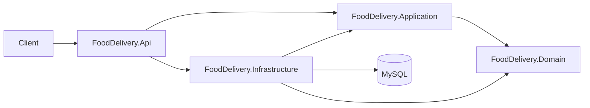

# Backend Architecture Overview

## 1. Architectural goals

### Context

Backend là nền tảng multi-tenant cho hệ thống đặt đồ ăn. Business sẽ thay đổi, nhưng dependency direction, transaction ownership và tenant isolation phải ổn định.

### Senior reasoning

Base tốt không phải base có nhiều pattern nhất. Base tốt giữ những invariant kỹ thuật khó sửa về sau, đồng thời để business module được thêm dần mà không sửa ngược toàn hệ thống.

### Decision

Dùng `Modular Monolith` trên một ASP.NET Core process và một MySQL database.



### Problem solved

- Business rule không phụ thuộc HTTP, EF Core hay MySQL.
- Use case không biết cách technical adapter được khởi tạo.
- Một deployment và một transaction local giữ vận hành đơn giản.
- Module tương lai có boundary rõ nhưng chưa trả chi phí distributed system.

### Trade-off and upgrade

Modular Monolith không tự ngăn coupling giữa module. Khi có module thật, enforce dependency bằng project/module boundary và review. Chỉ tách microservice khi có bằng chứng về scale, team ownership hoặc release cycle độc lập.

## 2. Project responsibilities

| Project | Sở hữu | Không đặt tại đây |
|---|---|---|
| `Domain` | Business state, invariant, Entity, Value Object, Aggregate, Domain Event | EF, HTTP, Dapper, configuration |
| `Application` | Use case orchestration và port mà use case cần | MySQL implementation, middleware, controller |
| `Infrastructure` | EF/Dapper, transaction, dispatcher, external adapter | Business decision, HTTP response |
| `Api` | HTTP boundary, middleware, authentication wiring, DI composition | Business invariant, SQL |

## 3. Dependency Rule

Dependency hướng vào policy ổn định hơn:

```text
API ───────────────▶ Application ───────────────▶ Domain
 │                         ▲
 └────▶ Infrastructure ────┘
              └───────────────────────────────▶ Domain
```

`Domain` không reference project nào. `Application` chỉ reference `Domain`. `Infrastructure` implement port của `Application`. `API` là composition root nên được phép biết cả ba.

## 4. Foundation versus business

Ví dụ `DonHang` cần chống chuyển trạng thái sai là business invariant, đặt trong Domain khi module Ordering xuất hiện. `ConcurrencyToken` giải quyết lost update cho mọi Aggregate, nên thuộc foundation. Không tạo trước `DonHangService`, `IShopRepository` hoặc controller rỗng chỉ để thể hiện kiến trúc.

## 5. Decision checklist

1. Đây là business policy hay technical mechanism?
2. Ai sử dụng contract?
3. Detail nào cần được đảo dependency?
4. Invariant nào được bảo vệ?
5. Failure path là gì?
6. Có consumer hiện tại hoặc chắc chắn gần hạn không?
7. Native framework đã giải quyết chưa?
8. Khi nào thiết kế hiện tại hết giới hạn?
