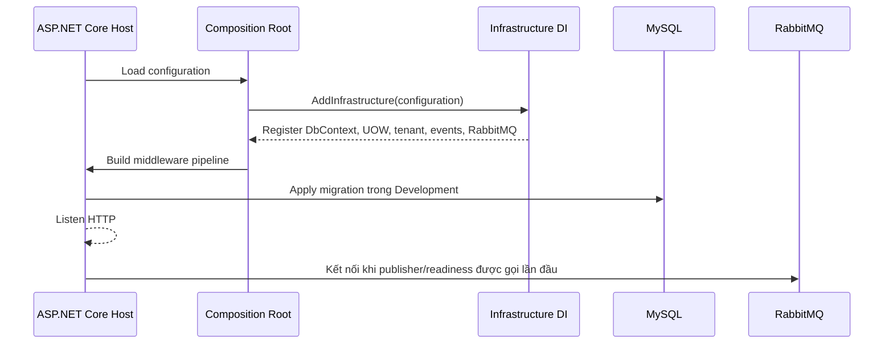
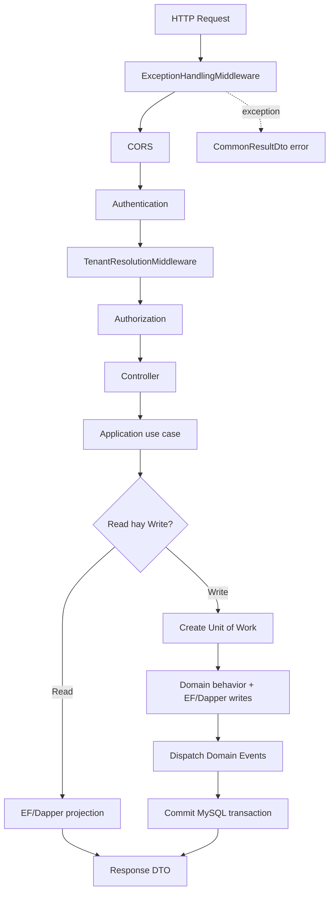
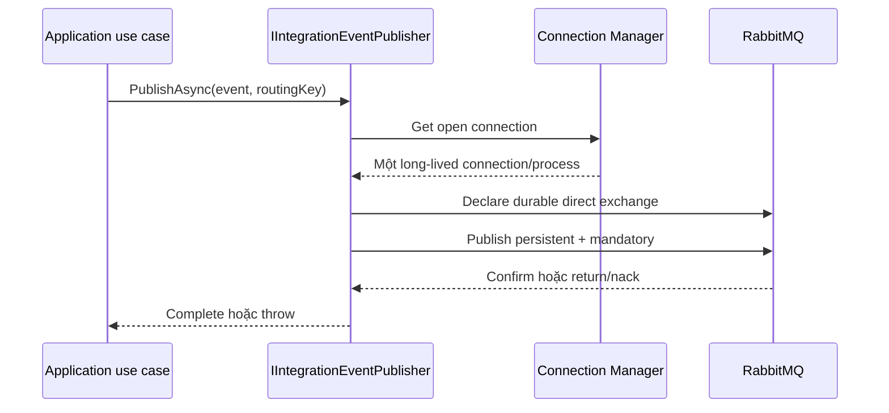
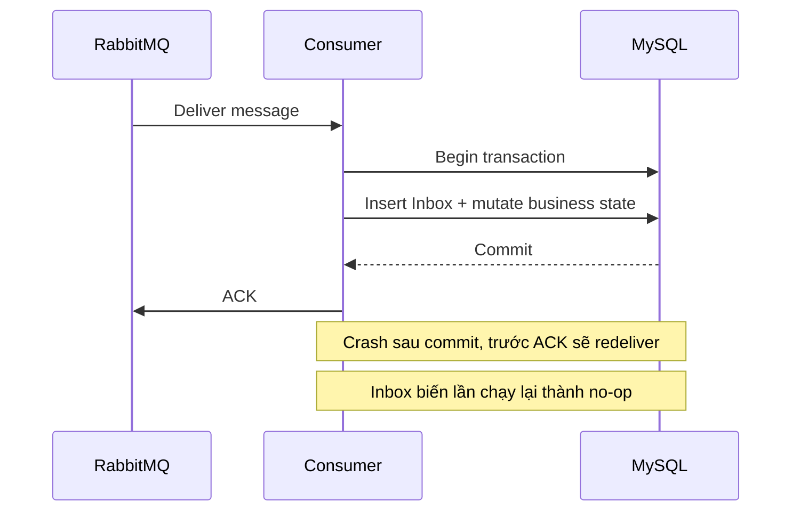

# Backend Runtime Flow

## 1. Startup



`Program.cs` là composition root. Domain và Application không resolve concrete service, không đọc connection string và không biết broker client. RabbitMQ connection được tạo lazy; deployment dùng `/health/ready` để xác định instance có giao tiếp được với broker hay không.

Development có thể tự apply migration để chạy base nhanh. Production nên chạy migration trong deployment step riêng, tránh nhiều instance cùng migrate và giữ rollback có kiểm soát.

## 2. HTTP request



Authenticated request trên shared host ưu tiên `TenantId` đã được server xác thực từ current user. Public tenant site resolve tenant từ subdomain. Giá trị `TenantId` do client tự gửi không phải bằng chứng authorization.

## 3. Read và write

Read chỉ gồm một statement hoặc chấp nhận eventual view không cần mở write transaction. Query lớn dùng projection và no-tracking. Dapper phù hợp với report/read model có SQL rõ ràng; EF Core phù hợp khi query gắn với entity relationship.

```csharp
await using var uow = await factory.CreateAsync(cancellationToken);
// Load state, gọi Domain behavior, thực hiện EF/Dapper writes.
await uow.CommitAsync(cancellationToken);
```

EF Core và Dapper trong cùng Unit of Work sử dụng cùng `DbConnection` và `DbTransaction`. Dispose trước commit sẽ rollback. Domain Event nội bộ được dispatch trước commit; external call không chạy trong transaction.

Khi business commit bắt buộc kéo theo Integration Event, write flow mục tiêu là:

```text
business mutation + Outbox insert
             └── cùng MySQL transaction
commit
Outbox dispatcher → RabbitMQ Publisher Confirm
```

Production base chưa có business Outbox table vì chưa có use case sở hữu nó. Direct publisher không được đặt sau business commit rồi gọi là reliable dual-write.

## 4. RabbitMQ publish flow hiện tại



Publisher giữ một confirm-enabled channel và serialize publish bằng `SemaphoreSlim`. Đây là baseline có ownership đơn giản và an toàn. Chỉ tạo channel pool khi đo được confirm throughput không đáp ứng target.

## 5. Consumer flow mục tiêu

Consumer production chưa được thêm trong phase hiện tại. Khi có business handler, thứ tự an toàn là:



ACK trước commit có thể làm mất business effect. Commit trước ACK có thể tạo redelivery, vì vậy Inbox và business mutation phải ở cùng transaction.

## 6. Error mapping

| Error | Boundary xử lý | HTTP outcome |
|---|---|---|
| Invalid request model | ASP.NET API behavior | `400` |
| Resource không thuộc tenant/current scope | Use case/API mapping | `404` |
| Domain invariant conflict | DomainException middleware | `409` |
| Optimistic concurrency conflict | Application mapping | `409`, reload hoặc bounded retry |
| Authentication/authorization | ASP.NET Core | `401/403` |
| RabbitMQ unavailable khi synchronous publish | Application policy | Thường `503`, tùy use case |
| Unexpected exception | Exception middleware | `500`, log server-side |

Không trả stack trace, broker credential hoặc database error cho client.
