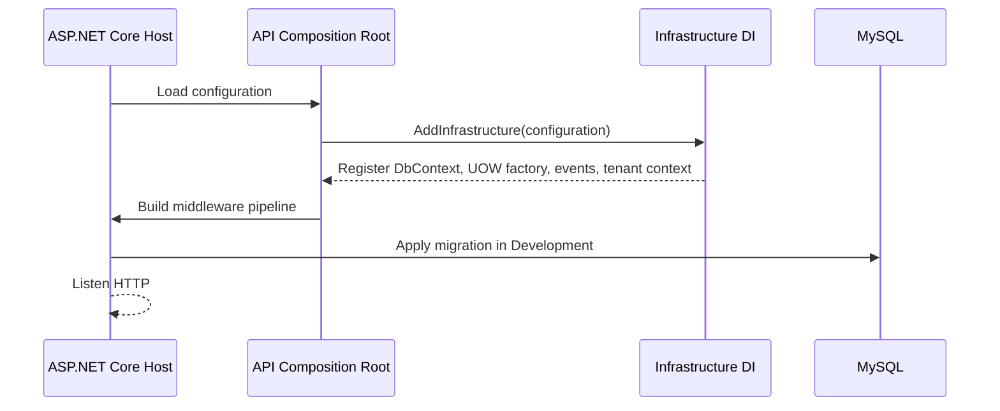
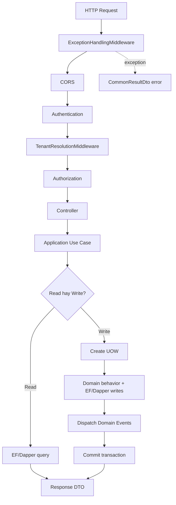

# Backend Runtime Flow

## 1. Startup flow



### Senior reasoning

`Program.cs` là composition root: nơi duy nhất được phép nối concrete implementation vào abstractions. Domain/Application không tự resolve service và không đọc configuration.

Development migration giúp base chạy nhanh. Production nên chạy migration trong deployment step riêng để tránh nhiều instance cùng migrate và để rollback được kiểm soát.

## 2. Request flow



## 3. Tenant resolution

Authenticated shared-host request ưu tiên `TenantId` đã được server xác thực từ current user. Public tenant website resolve bằng subdomain. Client-supplied `TenantId` không phải bằng chứng authorization.

Nếu không resolve được active Tenant, middleware kết thúc bằng `404`. Việc không trả chi tiết “Tenant khác tồn tại” giảm information disclosure.

## 4. Read flow

Read không cần mở explicit transaction nếu chỉ cần một statement hoặc eventual view. Dùng projection và no-tracking khi query lớn. Dapper phù hợp với report/read model có SQL rõ; EF phù hợp với query gắn entity relationship.

Không dùng UOW write transaction cho mọi GET vì transaction dài hơn, giữ snapshot lâu hơn và tăng chi phí MVCC.

## 5. Write flow

```csharp
await using var uow = await factory.CreateAsync(cancellationToken);
// Load state, call Domain behavior, execute EF/Dapper writes.
await uow.CommitAsync(cancellationToken);
```

Dispose khi chưa commit sẽ rollback. External HTTP/email không chạy trong transaction; khi nhu cầu chắc chắn xuất hiện, ghi Outbox rồi xử lý sau commit.

## 6. Error flow

| Error | Boundary xử lý | HTTP outcome |
|---|---|---|
| Invalid request model | ASP.NET API behavior | `400` |
| Resource không thuộc tenant/current scope | Use case/API mapping | `404` |
| Domain invariant conflict | DomainException middleware | `409` |
| Optimistic concurrency conflict | Application mapping | `409` và yêu cầu reload/retry có kiểm soát |
| Authentication/authorization | ASP.NET Core | `401/403` |
| Unexpected exception | Exception middleware | `500`, log server-side |

Không trả stack trace hoặc database error cho client.
