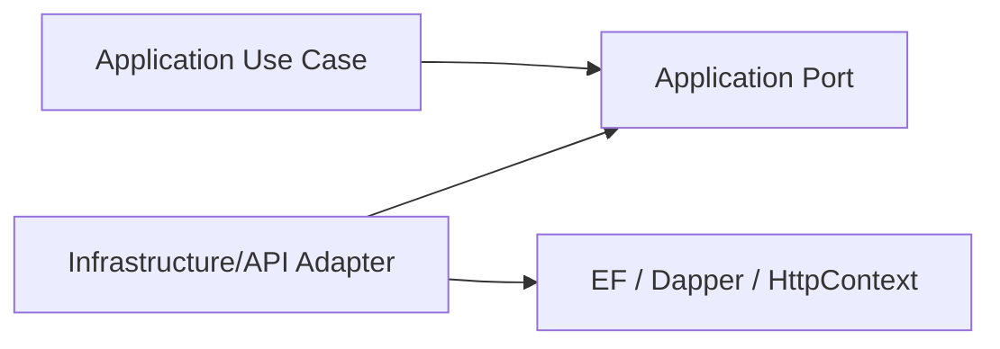
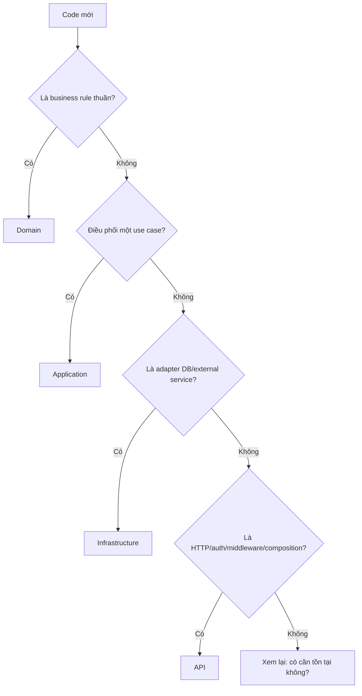

# DDD Layering and Code Placement

## 1. Vì sao abstractions nằm trong Application?

### Context

`IUnitOfWork`, `IUnitOfWorkFactory`, `ICurrentUser`, `ITenantContext` và `IDomainEventDispatcher` nằm trong `Application`, còn implementation nằm trong `Infrastructure` hoặc `API`.

### Senior reasoning

Abstraction không mặc định thuộc project của implementation. Contract thuộc nơi **cần capability** và định nghĩa policy sử dụng nó. Application cần “commit một use case”, “biết current tenant” và “dispatch event”; Application không cần biết MySQL, `HttpContext` hay DI reflection.

### Decision



Điều này là Dependency Inversion: high-level policy sở hữu contract; low-level detail implement contract.

### Problem solved

Nếu đặt `IUnitOfWork` trong Infrastructure, Application phải reference Infrastructure để compile, làm dependency quay ra ngoài. Khi đó use case bị kéo theo persistence package và composition detail.

### Trade-off

Không phải interface nào cũng đưa vào Application. Interface có đúng một implementation và không tạo dependency ngược thường là abstraction thừa. `IUnitOfWorkFactory` tồn tại vì việc tạo connection → transaction → DbContext có lifecycle/failure path thật.

## 2. Decision tree đặt code



## 3. Case placement

| Case minh họa | Nơi đặt | Tại sao |
|---|---|---|
| `DonHang.XacNhan()` | Domain | Bảo vệ state transition, không phụ thuộc transport |
| `Money`, `DiaChiGiaoHang` | Domain Value Object | Identity đến từ value và giữ invariant cục bộ |
| `TaoDonHangHandler` | Application | Điều phối đọc menu, gọi Domain và commit |
| `ITenantContext` | Application | Mọi use case tenant-aware cần contract này |
| `IUnitOfWorkFactory` | Application | Use case yêu cầu atomic boundary, không yêu cầu MySQL |
| `ApplicationDbContext` | Infrastructure | EF Core là persistence detail |
| `HangHoaConfiguration` | Infrastructure | Mapping table/index là database concern |
| Dapper SQL report | Infrastructure | SQL và schema là adapter detail |
| `TenantResolutionMiddleware` | API | Host/claim/request pipeline là HTTP concern |
| Controller/DTO HTTP | API | Mapping protocol, status code và serialization |

## 4. Domain Service đặt ở đâu?

Domain Service chứa business rule thuần nhưng không thuộc tự nhiên về một Entity/Value Object.

Ví dụ sau này tính phí có thể cần nhiều Domain object:

```csharp
public sealed class ChinhSachTinhPhiDomainService
{
    public Money TinhPhi(Shop shop, DiaChiGiaoHang diaChi, Money tongTien) { ... }
}
```

Nó thuộc Domain nếu không query database, không gọi HTTP và kết quả là business decision. Nếu class chỉ gọi repository rồi gửi email, đó là Application Service/handler, không phải Domain Service.

## 5. Application dùng EF types có sai không?

Hiện `IApplicationDbContext` expose `DbSet<Tenant>`, nên Application reference EF Core. Đây là pragmatic coupling: giảm repository boilerplate nhưng Application biết query abstraction của EF.

Nó chấp nhận được khi EF là persistence strategy ổn định. Nếu cần Application hoàn toàn độc lập EF hoặc module có query đặc thù, tạo port theo use case (`ITenantReader`), không bọc toàn bộ EF bằng Generic Repository.

## 6. Naming

- Technical keywords dùng English: `Entity`, `AggregateRoot`, `Command`, `Handler`, `Factory`.
- Business types dùng tiếng Việt không dấu: `HangHoa`, `DonHang`, `ChiTietDonHang`.
- `Tenant` và `Shop` giữ nguyên vì là product vocabulary đã thống nhất.
- Không suffix `Entity` cho mọi Domain type; tên business đã đủ thể hiện ý nghĩa.
