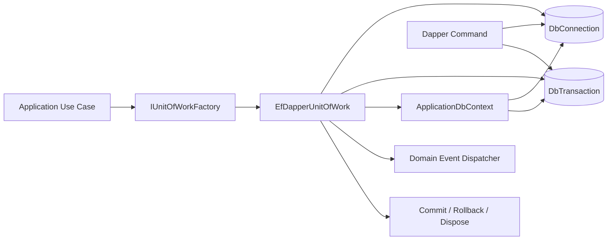
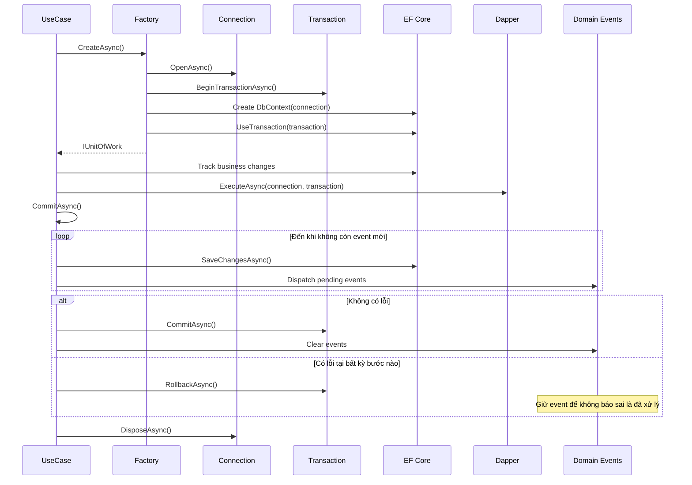
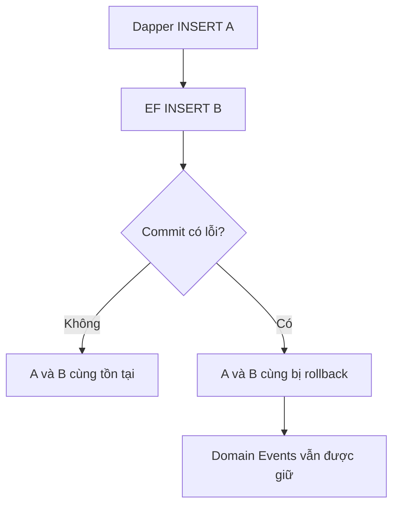
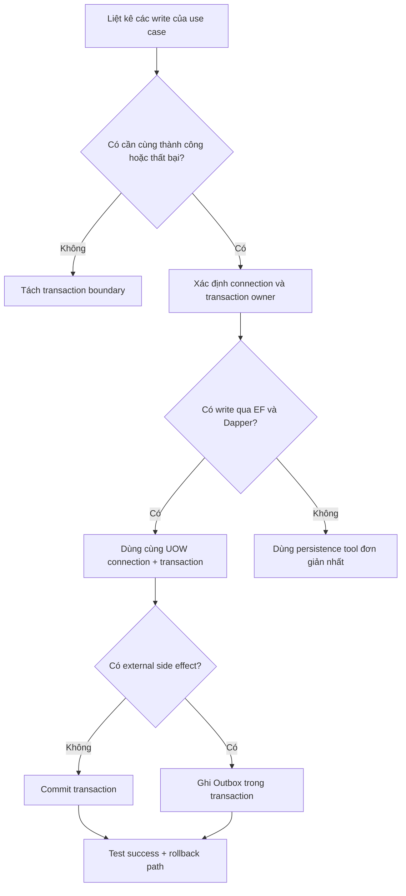

# Tư duy senior khi thiết kế EF Core + Dapper Unit of Work

## 1. Đừng bắt đầu từ pattern

Câu hỏi yếu là:

> Làm sao tạo Unit of Work và Factory?

Câu hỏi đúng là:

> Những thay đổi nào phải cùng thành công hoặc cùng thất bại, và tài nguyên nào quyết định điều đó?

Trong case này:

```text
EF Core write
Dapper write
Domain Event handler write
```

phải atomic. Tài nguyên quyết định atomicity không phải repository hay service, mà là một `DbTransaction` trên một `DbConnection` cụ thể.

## 2. Đi từ dưới lên

### Bước 1 — Xác định primitive thật

EF Core và Dapper đều đi qua ADO.NET:

```text
DbConnection
DbCommand
DbTransaction
```

Vì vậy cần kiểm chứng:

- Ai tạo connection?
- Ai mở và đóng connection?
- Ai tạo transaction?
- EF Core có dùng đúng transaction đó không?
- Dapper command có truyền transaction không?
- Ai commit, rollback và dispose?

Nếu mỗi câu có nhiều hơn một owner, thiết kế dễ lỗi.

### Bước 2 — Xác định transaction boundary

Boundary phải là một business use case, không phải một repository method:

```text
TaoDonHang
├── EF thêm DonHang
├── Dapper cập nhật counter/report table
├── Domain Event handler cập nhật dữ liệu liên quan
└── Commit một lần
```

Repository tự commit sẽ phá boundary vì use case không còn rollback toàn bộ được.

### Bước 3 — Chọn owner duy nhất

Thiết kế chọn `EfDapperUnitOfWork` làm owner:

| Trách nhiệm | Owner |
|---|---|
| Connection | Unit of Work |
| Transaction | Unit of Work |
| DbContext | Unit of Work |
| Commit/Rollback | Unit of Work |
| Domain Event lifecycle | Unit of Work |
| Tạo bộ tài nguyên | Factory |

Factory chỉ tạo. Unit of Work chỉ quản lý một transaction. Repository chỉ thực hiện persistence operation.

## 3. Vì sao Factory tồn tại

Factory có lý do thật khi mỗi use case cần một bộ tài nguyên mới và việc tạo bộ đó có nhiều bước dễ fail:

```text
new connection
→ open
→ begin transaction
→ build DbContext options trên connection
→ create DbContext
→ enlist EF vào transaction
```

Nếu lỗi ở bước giữa, Factory dispose những gì đã tạo. Đây là abstraction che giấu lifecycle thật, không phải Factory “cho đúng pattern”.

Nếu chỉ có `new Service()` thì Factory là thừa.

## 4. Điều kiện để EF và Dapper dùng chung transaction

Phải đồng thời đúng cả hai:

```text
ReferenceEquals(EF connection, Dapper connection)
ReferenceEquals(EF transaction, Dapper transaction)
```

Cùng connection string không đủ:

```text
new MySqlConnection(cs) // session A
new MySqlConnection(cs) // session B
```

Đây vẫn là hai session và hai transaction khác nhau.

EF được enlist bằng `Database.UseTransaction(transaction)`. Dapper nhận transaction qua `CommandDefinition` hoặc tham số `transaction` của `ExecuteAsync`.

## 5. Thiết kế happy path sau cùng

```text
Factory.CreateAsync
  → open connection
  → begin transaction
  → create/enlist DbContext

Use case
  → EF tracks changes
  → Dapper executes with uow.Transaction

Uow.CommitAsync
  → SaveChanges
  → dispatch all pending Domain Events
  → SaveChanges các thay đổi từ handlers
  → repeat nếu handler phát event mới
  → commit transaction
  → clear events
```

`ApplicationDbContext.SaveChangesAsync` không tự commit nữa. Nếu cả DbContext và UOW đều sở hữu transaction, sẽ có nested transaction hoặc commit không rõ owner.

## 6. Phải thiết kế failure path trước code

| Điểm lỗi | Điều phải xảy ra |
|---|---|
| Connection open | Không còn resource sống |
| Begin transaction | Dispose connection |
| Dapper command | Dispose UOW sẽ rollback |
| EF SaveChanges | Rollback Dapper writes trước đó |
| Event handler | Rollback EF + Dapper; giữ events |
| Nested event handler | Không commit khi còn event chưa xử lý |
| Commit database | Giữ events nếu commit không thành công |
| Caller quên commit | Dispose tự rollback |
| Commit hai lần | Throw, không chạy lại event |
| Cancellation | Truyền token và rollback |

Senior không chỉ vẽ happy path. Phần lớn giá trị của UOW nằm ở failure path và ownership.

## 7. Domain Events nằm ở đâu trong transaction

Event nội bộ có handler ghi database phải chạy trước commit để cùng transaction.

Không clear event ngay sau dispatch vì database commit vẫn có thể lỗi. Chỉ clear sau commit thành công.

Event handler có thể phát sinh event mới. Vì vậy commit dùng tập các event đã dispatch theo object reference và lặp đến khi không còn pending event.

Email, webhook và broker là external side effect. Không gọi trực tiếp trước commit vì database có thể rollback sau khi email đã gửi. Khi case đó xuất hiện, handler ghi Outbox trong transaction.

## 8. Concurrency và hiệu năng

Một connection không được dùng đồng thời bởi nhiều EF/Dapper operations. Không dùng `Task.WhenAll` trên cùng UOW.

UOW phải ngắn:

```text
open → query/write cần thiết → commit → dispose
```

Không gọi API ngoài hoặc chờ thao tác người dùng khi transaction đang mở. Transaction dài giữ lock và giảm throughput.

Connection pooling do MySqlConnector quản lý. Dispose connection thường trả physical connection về pool; vì vậy tạo UOW theo use case không đồng nghĩa mở TCP socket mới mỗi lần.

## 9. Testing phải chứng minh điều gì

Mock `IUnitOfWork` không chứng minh hai công nghệ dùng chung transaction. Test quan trọng phải chạy trên relational provider thật hoặc SQLite in-memory:

```text
Dapper INSERT A
EF INSERT B
Commit
→ A và B tồn tại
```

```text
Dapper INSERT A
EF INSERT B
Event handler throw
→ A và B không tồn tại
→ Domain Event vẫn còn
```

SQLite test nhanh chứng minh shared-transaction contract. MySQL smoke test chứng minh production provider wiring và migration; hai loại test trả lời hai câu hỏi khác nhau.

## 10. Các hướng bị loại

### EF tự mở transaction, Dapper tự mở connection

Không atomic. Cùng connection string không cứu được.

### Generic Repository + Generic UOW

Chỉ bọc lại EF, làm mất khả năng query rõ ràng và không giải quyết connection ownership.

### TransactionScope

Ẩn transaction boundary, dễ vô tình enlist connection thứ hai và khó đọc failure path. Chưa cần cho một database.

### Factory tạo repository/service graph

Biến Factory thành service locator. Factory hiện chỉ tạo resource bundle có lifetime phức tạp.

### Automatic retry

Retry transaction có thể chạy lại Dapper command và Domain Event handler. Chỉ thêm khi đã thiết kế idempotency và có lỗi transient thực tế.

## 11. Checklist dùng cho thiết kế tương tự

1. Business operation nào phải atomic?
2. Primitive thấp nhất đảm bảo atomicity là gì?
3. Ai sở hữu connection và transaction?
4. Có đường nào mở connection thứ hai không?
5. Commit nằm đúng một nơi chưa?
6. Caller quên commit thì chuyện gì xảy ra?
7. Mỗi điểm failure rollback và dispose thế nào?
8. Event chạy trước hay sau commit? Vì sao?
9. External side effect có cần Outbox chưa?
10. Concurrency có dùng chung connection song song không?
11. Test nào chứng minh cùng transaction thật, không chỉ mock?
12. Abstraction nào chưa có consumer thật và có thể bỏ?

Nếu trả lời rõ 12 câu này, code thường trở nên ngắn. Nếu chưa trả lời được, thêm interface hay pattern chỉ che mờ vấn đề.

## 12. Sơ đồ kiến trúc và quyền sở hữu resource



Điểm cần đọc từ sơ đồ không phải là số lượng class, mà là **một owner duy nhất**:

- Factory chịu trách nhiệm khởi tạo resource bundle.
- Unit of Work sở hữu connection, transaction và DbContext trong suốt use case.
- EF Core và Dapper chỉ sử dụng resource do Unit of Work cung cấp.
- Application Use Case chỉ được quyết định `CommitAsync` hoặc kết thúc mà không commit.

## 13. Luồng thực thi đầy đủ



## 14. Implement theo từng bước tư duy

### Bước 1 — Viết contract từ transaction boundary

**Tư duy:** use case cần nhìn thấy đúng những resource bắt buộc để EF và Dapper cùng transaction. Không đưa repository hay business service vào UOW.

```csharp
public interface IUnitOfWork : IAsyncDisposable
{
    IApplicationDbContext DbContext { get; }
    DbConnection Connection { get; }
    DbTransaction Transaction { get; }

    Task CommitAsync(CancellationToken cancellationToken = default);
    Task RollbackAsync(CancellationToken cancellationToken = default);
}

public interface IUnitOfWorkFactory
{
    Task<IUnitOfWork> CreateAsync(CancellationToken cancellationToken = default);
}
```

`IApplicationDbContext` không expose `SaveChangesAsync`. Đây là constraint có chủ đích: Application không được save EF riêng rồi tưởng rằng toàn bộ use case đã commit.

### Bước 2 — Factory tạo một resource bundle

**Tư duy:** thứ tự khởi tạo phải đi từ primitive thấp nhất lên abstraction cao hơn. Connection có trước, transaction thuộc connection đó, sau cùng DbContext mới được gắn vào cả hai.

```csharp
connection = new MySqlConnection(_connectionString);
await connection.OpenAsync(cancellationToken);

transaction = await connection.BeginTransactionAsync(cancellationToken);

var options = new DbContextOptionsBuilder<ApplicationDbContext>()
    .UseMySql(connection, ServerVersion)
    .Options;

dbContext = new ApplicationDbContext(options);
await dbContext.Database.UseTransactionAsync(transaction, cancellationToken);

return new EfDapperUnitOfWork(
    dbContext,
    connection,
    transaction,
    _eventDispatcher);
```

Nếu một bước lỗi, Factory phải dọn những resource đã tạo trước đó:

```csharp
catch
{
    if (dbContext is not null) await dbContext.DisposeAsync();
    if (transaction is not null) await transaction.DisposeAsync();
    if (connection is not null) await connection.DisposeAsync();
    throw;
}
```

Thứ tự dispose đi ngược thứ tự tạo. Không trả về một UOW khởi tạo dở dang.

### Bước 3 — Use case dùng EF và Dapper đúng cách

**Tư duy:** mọi write trong cùng business operation phải đi qua đúng object instance của UOW. Dapper không tự tạo connection và không được quên truyền transaction.

Ví dụ minh họa một use case cập nhật hàng hóa:

```csharp
await using var uow = await _unitOfWorkFactory.CreateAsync(cancellationToken);

// EF Core write: entity được track bởi DbContext thuộc UOW.
var hangHoa = await uow.DbContext.HangHoas
    .SingleAsync(x => x.Id == hangHoaId, cancellationToken);
hangHoa.CapNhatTen(tenMoi);

// Dapper write: dùng chính connection và transaction của UOW.
var command = new CommandDefinition(
    "update HangHoaSearch set Ten = @Ten where HangHoaId = @HangHoaId",
    new { Ten = tenMoi, HangHoaId = hangHoaId },
    transaction: uow.Transaction,
    cancellationToken: cancellationToken);

await uow.Connection.ExecuteAsync(command);
await uow.CommitAsync(cancellationToken);
```

> `HangHoas` và `HangHoaSearch` trong đoạn trên là ví dụ use case tương lai. Contract quan trọng là cách truyền `uow.Connection` và `uow.Transaction`.

Không viết như sau:

```csharp
// Sai: connection thứ hai không thuộc transaction của UOW.
await using var connection = new MySqlConnection(connectionString);
await connection.ExecuteAsync(sql, parameters);
```

### Bước 4 — Commit EF, event và Dapper như một khối

**Tư duy:** Dapper đã chạy trực tiếp vào transaction nhưng chưa commit. EF còn giữ change trong Change Tracker nên phải `SaveChangesAsync`. Handler có thể thay đổi entity hoặc phát sinh event mới, vì vậy cần loop.

```csharp
var dispatched = new HashSet<IDomainEvent>(ReferenceEqualityComparer.Instance);

while (true)
{
    await _dbContext.SaveChangesAsync(cancellationToken);

    var pending = TrackedAggregates()
        .SelectMany(aggregate => aggregate.DomainEvents)
        .Where(domainEvent => !dispatched.Contains(domainEvent))
        .ToArray();

    if (pending.Length == 0) break;

    await _eventDispatcher.DispatchAsync(pending, cancellationToken);

    foreach (var domainEvent in pending)
        dispatched.Add(domainEvent);
}

await Transaction.CommitAsync(cancellationToken);

foreach (var aggregate in TrackedAggregates())
    aggregate.ClearDomainEvents();
```

Thứ tự này tạo ra các invariant:

1. Handler lỗi thì transaction chưa commit.
2. Thay đổi do handler tạo ra được EF save trong vòng lặp kế tiếp.
3. Nested event được dispatch đúng một lần theo object reference.
4. Domain Event chỉ bị clear sau khi database commit thành công.

### Bước 5 — Thiết kế rollback trước khi nghĩ đến retry

**Tư duy:** lỗi gốc phải được giữ nguyên. Rollback là best effort; nếu rollback cũng lỗi thì không được che exception ban đầu.

```csharp
catch
{
    await TryRollbackAsync(cancellationToken);
    throw;
}

private async Task TryRollbackAsync(CancellationToken cancellationToken)
{
    try
    {
        await Transaction.RollbackAsync(cancellationToken);
    }
    catch
    {
        // Giữ exception gốc của use case.
    }

    _state = State.RolledBack;
}
```

`DisposeAsync` cũng rollback nếu caller rời scope mà chưa commit:

```csharp
public async ValueTask DisposeAsync()
{
    if (_state == State.Disposed) return;
    if (_state == State.Active)
        await TryRollbackAsync(CancellationToken.None);

    await _dbContext.DisposeAsync();
    await Transaction.DisposeAsync();
    await Connection.DisposeAsync();
    _state = State.Disposed;
}
```

Chưa thêm automatic retry. Retry chỉ an toàn khi Dapper commands, handlers và mọi side effect đã có chiến lược idempotency.

### Bước 6 — Test invariant thay vì test implementation detail

**Tư duy:** mục tiêu test không phải xác nhận một method được gọi, mà chứng minh atomicity thật trên relational transaction.



Ba test tối thiểu đang có:

```text
1. Dapper write + EF write + commit
   → cả hai cùng tồn tại, event dispatch một lần và được clear.

2. Dapper write + EF write + event handler throw
   → cả hai cùng rollback, event vẫn còn.

3. Event handler phát sinh event mới
   → commit loop dispatch đủ event gốc và nested event.
```

SQLite in-memory được chọn cho test nhanh vì nó có relational connection và transaction thật. EF InMemory không phù hợp để chứng minh shared transaction.

## 15. Cách tự suy luận khi gặp use case mới



Đây là trình tự tư duy nên lặp lại:

1. Viết business invariant trước.
2. Vẽ transaction boundary.
3. Chọn một resource owner.
4. Vẽ happy path và failure path.
5. Code abstraction nhỏ nhất giữ được invariant.
6. Viết integration test chứng minh invariant.
7. Chỉ thêm Outbox, retry hoặc repository khi có use case thật bắt buộc.
