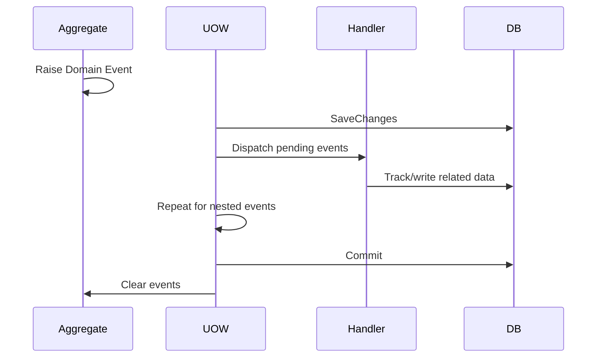

# Event Architecture

## 1. Domain Event dùng để giải quyết gì?

Domain Event biểu diễn business fact đã xảy ra trong một Aggregate, giúp side effect nội bộ không làm Aggregate biết các module/handler khác.

Ví dụ tương lai: `DonHangDaTaoDomainEvent` có thể làm handler tạo lịch sử trạng thái. Aggregate `DonHang` chỉ raise fact; nó không resolve handler hoặc gọi database.

## 2. Current decision: in-process before commit



Handler ghi cùng database chạy trước commit và dùng cùng scope/UOW. Handler lỗi làm toàn transaction rollback. Event chỉ clear sau commit để không ghi nhận sai rằng event đã hoàn tất.

## 3. Problem solved and limit

Thiết kế giải coupling trong process và giữ atomic database writes. Nó **không** cung cấp durable messaging: process chết sau database commit nhưng trước khi gửi email/broker thì external message có thể mất.

Không dùng Domain Event cho mọi method call. Nếu code A luôn phải gọi code B và không có business fact độc lập, lời gọi trực tiếp dễ đọc hơn.

## 4. Domain Event versus Integration Event

| Domain Event | Integration Event |
|---|---|
| Trong bounded context/process | Giao tiếp ra process/service khác |
| Có thể nằm trong local transaction | Chỉ publish bền vững sau commit |
| Domain vocabulary | Public versioned contract |
| Handler failure có thể rollback use case | Consumer failure không rollback database đã commit |

## 5. Khi nào thêm Outbox?

Khi use case có email, webhook, message broker hoặc integration bắt buộc không được mất, handler ghi `OutboxMessage` trong cùng UOW. Background worker publish sau commit và đánh dấu processed.

```text
Domain Event → Outbox row (same transaction) → commit
             → worker publish → consumer idempotency
```

Chưa thêm Outbox vào base hiện tại vì chưa có external side effect consumer. Tạo table/worker/retry trước sẽ thêm vận hành nhưng chưa bảo vệ invariant nào đang tồn tại.

## 6. Handler rules

- Handler nội bộ phải ngắn và không gọi external network trong transaction.
- Chấp nhận handler phát nested event; UOW dispatch đến khi không còn pending event.
- Tránh cycle event A → B → A; đó thường là boundary sai.
- Thứ tự handler không phải business contract. Nếu thứ tự bắt buộc, dùng một orchestrating use case rõ ràng.
- Integration consumer sau này phải idempotent vì delivery thường là at-least-once.
