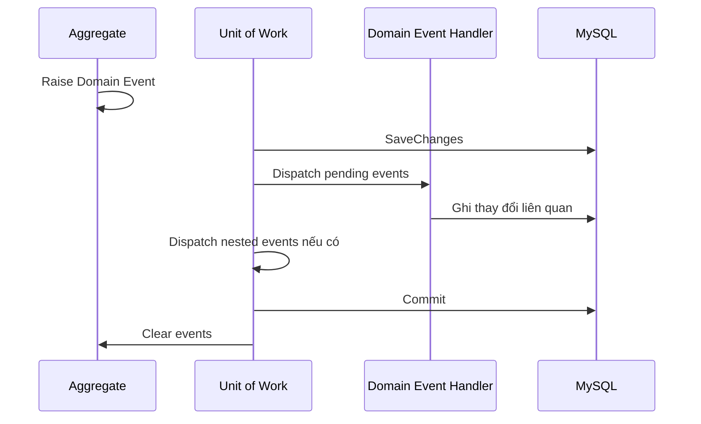
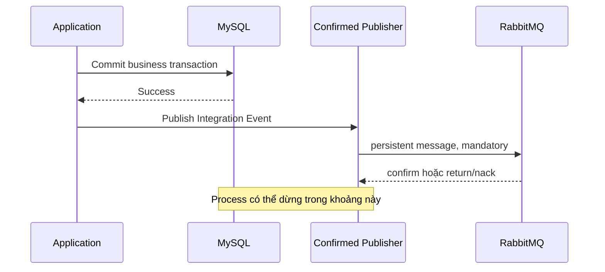
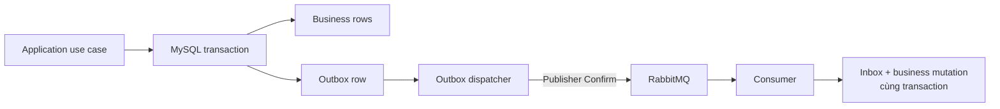

# Event Architecture

## 1. Hai loại event, hai phạm vi trách nhiệm

`Domain Event` biểu diễn một sự kiện nghiệp vụ đã xảy ra bên trong bounded context. Aggregate phát event nhưng không biết handler nào sẽ xử lý. Ví dụ, `DonHangDaTaoDomainEvent` có thể dẫn tới việc ghi lịch sử trạng thái; `DonHang` không cần phụ thuộc vào lớp ghi lịch sử.

`Integration Event` là contract được truyền qua ranh giới process hoặc service. Contract này phải có tên ổn định, version và identity để consumer có thể phát hiện message trùng.

| Thuộc tính | Domain Event | Integration Event |
|---|---|---|
| Phạm vi | Cùng bounded context và process | Khác process hoặc service |
| Transaction | Có thể được xử lý trong local transaction | Không thể kéo transaction nghiệp vụ qua broker |
| Contract | Domain vocabulary nội bộ | Public, versioned contract |
| Failure | Handler lỗi có thể rollback use case | Consumer lỗi không rollback commit của producer |

## 2. Domain Event hiện tại

Domain Event được dispatch trong Unit of Work trước khi transaction commit. Handler ghi cùng database sử dụng cùng scope và transaction. Event chỉ được xóa khỏi Aggregate sau khi commit thành công.

Cơ chế này giảm coupling trong process và giữ các thay đổi nội bộ trong một atomic boundary. Nó không cung cấp durable delivery tới hệ thống bên ngoài.

## 3. RabbitMQ foundation hiện tại

Production base đã có `IIntegrationEvent`, `IIntegrationEventPublisher`, một RabbitMQ connection dài hạn cho mỗi process, một confirm-enabled publisher channel được serialize, durable direct exchange, persistent message, mandatory routing và readiness health check tại `/health/ready`.

Publisher Confirm chứng minh broker đã nhận trách nhiệm đối với message. `mandatory = true` làm lỗi routing quan sát được thay vì âm thầm loại message. Hai cơ chế này vẫn không giải quyết dual-write giữa MySQL và RabbitMQ.

Nếu process dừng sau khi MySQL commit nhưng trước khi publish, business state tồn tại nhưng event bị mất. Direct publisher chỉ phù hợp khi caller chấp nhận failure window này, hoặc khi message không đại diện cho một intent bắt buộc phải phát sau business commit.

## 4. Khi business write bắt buộc phải phát event

Khi xuất hiện use case như “tạo đơn thành công thì shop chắc chắn phải nhận thông báo”, Outbox trở thành một phần của correctness boundary:

Business rows và Outbox row được commit trong cùng MySQL transaction. Dispatcher claim theo batch có lease, publish rồi chỉ đánh dấu `sent` sau Publisher Confirm. Nếu dispatcher dừng sau confirm nhưng trước khi đánh dấu, message sẽ được publish lại. Duplicate là kết quả hợp lệ của recovery, vì thế consumer phải dùng Inbox hoặc một idempotency key tại đúng side-effect boundary.

Reference implementation trong test đã chứng minh bốn dispatcher cạnh tranh claim đủ 100 intent; crash trước publish được instance khác reclaim; crash sau confirm tạo hai physical delivery cùng `MessageId`; hai consumer xử lý đồng thời cùng message chỉ tạo một business effect.

Outbox, Inbox, retry consumer và reconciliation hiện vẫn là reference model trong test. Chúng chỉ được chuyển vào production khi business flow thật xác định table, transaction và ownership tương ứng.

## 5. Multi-tenant message contract

`TenantId` trong header giúp tracing và khôi phục context, nhưng không thay thế authorization. Consumer phải dùng một contract đáng tin cậy, đồng thời mọi query và unique constraint phải giữ đúng scope nghiệp vụ. Với effect thuộc shop, Inbox identity an toàn có dạng `(consumerName, tenantId, shopId, messageId)`.

Thiếu `tenantId` hoặc `shopId` có thể khiến message của hai shop va vào cùng Inbox record. Ngược lại, chỉ thêm scope vào Inbox nhưng quên predicate trong Dapper query vẫn có thể cập nhật dữ liệu của tenant khác.

## 6. Ordering và concurrency

RabbitMQ không biến nhiều consumer thành một luồng tuần tự toàn cục. Hai message của cùng Aggregate có thể được xử lý lại hoặc đến consumer khác nhau. Event thay đổi state cần mang aggregate version; transaction chỉ nhận version kế tiếp hoặc bỏ qua version đã xử lý.

Tồn kho nhiều lô đòi hỏi invariant tại MySQL. Candidate lots được lọc theo `tenant + shop + product`, sắp xếp theo `expiresAt, receivedAt, id`, rồi khóa theo đúng thứ tự trong transaction. `SKIP LOCKED` tăng throughput nhưng có thể bỏ qua lô sắp hết hạn đang bị khóa, vì vậy không phù hợp khi business yêu cầu strict FEFO.

## 7. Quy tắc sử dụng

- Không gọi external HTTP, email hoặc broker bên trong business transaction.
- Không coi Domain Event là Integration Event chỉ vì chúng cùng có hậu tố `Event`.
- Không coi Publisher Confirm là bằng chứng consumer đã xử lý.
- Không ACK trước khi business transaction của consumer commit.
- Mọi at-least-once consumer phải định nghĩa idempotency boundary trước khi bật retry.
- Nếu thứ tự handler là bắt buộc, thể hiện bằng state transition hoặc orchestration rõ ràng.

Phân tích chi tiết nằm tại [RabbitMQ Reliable Messaging](rabbitmq-reliable-messaging.md).
