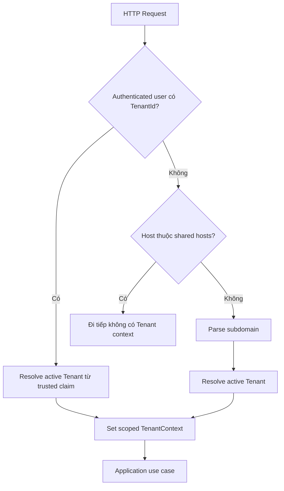

# Multi-tenancy Foundation

## 1. Trust boundary

Tenant là data/security boundary. Một request chỉ có một current Tenant; `TenantId` do client gửi không tự tạo quyền truy cập.



## 2. Vì sao context nằm sau Authentication?

Shared host như `live.food.com.vn` có nhiều Tenant đăng nhập. Tenant phải lấy từ identity đã được server xác thực. Public subdomain như `banhmycay.food.com.vn` có thể resolve từ host.

Thứ tự pipeline là `Authentication → TenantResolution → Authorization`. Authorization cần current identity và tenant context để đánh giá scope.

## 3. Isolation layers

Senior không dựa vào một lớp filter duy nhất:

1. Tenant-owned row lưu `TenantId` trực tiếp khi cần filter/index.
2. Query mặc định scope theo current Tenant.
3. Write use case kiểm tra ownership và trạng thái trực tiếp.
4. Unique/index key bao gồm `TenantId` khi uniqueness chỉ trong Tenant.
5. Dapper SQL luôn có tenant predicate; nó không được EF global filter bảo vệ.

Ví dụ tương lai:

```sql
SELECT *
FROM DonHangs
WHERE TenantId = @TenantId AND ShopId = @ShopId;
```

Chỉ filter `ShopId` vì “có thể suy ra Tenant” làm review khó hơn và tăng blast radius khi query sai join.

## 4. Global query filter giải quyết và không giải quyết gì?

Global filter giảm nguy cơ quên tenant predicate trong EF query thông thường. Nó không bảo vệ:

- Dapper/raw SQL.
- `IgnoreQueryFilters()`.
- Insert/update gắn sai `TenantId`.
- Authorization theo Shop/role.
- Background job không có HTTP tenant context.

Vì vậy filter là safety net, không phải authorization system.

## 5. Host resolution limits

Base domain và shared hosts nằm trong configuration, không hard-code. Normalize host/subdomain trước query và enforce unique subdomain trong database.

Custom domain cần bảng mapping domain → Tenant, ownership verification, TLS/certificate và cache invalidation; chỉ thêm khi product có onboarding custom domain thật.

## 6. Background jobs và events

Không dựa vào ambient HTTP context trong background job. Job payload phải mang `TenantId` trusted từ lúc enqueue, sau đó tạo explicit tenant scope trước khi query.

Integration Event cũng phải mang Tenant identifier nếu consumer cần isolate, nhưng không tin TenantId từ public message nếu producer không được xác thực.

## 7. Database topology upgrade

Hiện dùng shared database/shared schema với `TenantId`: đơn giản migration, transaction và vận hành. Tách database-per-tenant chỉ khi có compliance, noisy-neighbor hoặc backup/restore isolation thật; nó kéo theo connection routing, migration fan-out và observability phức tạp.
