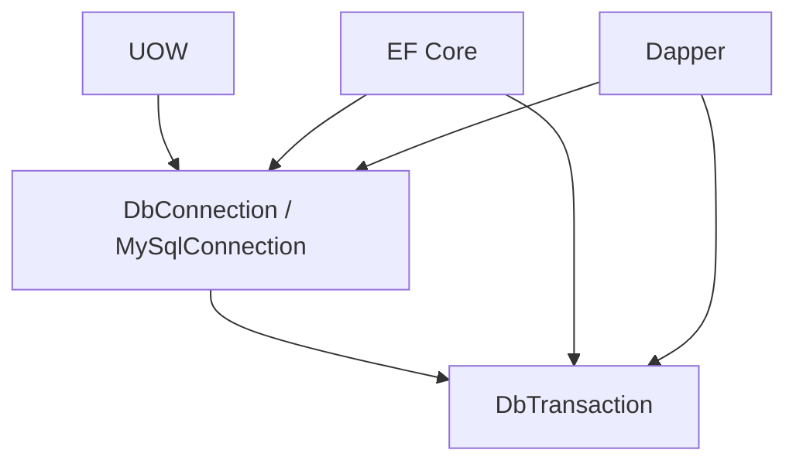

# Persistence, Transactions and Concurrency

## 1. Primitive thật bên dưới EF Core và Dapper

EF Core và Dapper cuối cùng đều tạo ADO.NET command trên `DbConnection` và `DbTransaction`. Dapper không quản lý connection lifecycle; EF có thể quản lý connection được cấu hình cho nó, nhưng ở shared UOW thì owner phải là UOW.



Hai connection có cùng connection string vẫn là hai database sessions. Atomicity chỉ có khi EF và Dapper nhận đúng cùng object connection và transaction.

## 2. Shared Unit of Work

### Context

Một use case có thể update Aggregate bằng EF và chạy SQL tối ưu bằng Dapper. Cả hai write phải cùng thành công hoặc rollback.

### Decision and flow

```text
Factory: open connection → begin transaction → create DbContext
       → UseTransaction(transaction) → return UOW

Use case: EF tracks changes → Dapper writes(connection, transaction)

Commit: SaveChanges → dispatch pending events → repeat if nested events
      → database commit → clear events
```

Factory chỉ tạo resource bundle. `EfDapperUnitOfWork` là owner duy nhất của commit, rollback và dispose. Không dùng `TransactionScope`, Generic Repository hoặc một Dapper connection riêng.

## 3. MySQL default isolation

MySQL InnoDB mặc định dùng `REPEATABLE READ`. Plain consistent `SELECT` trong cùng transaction đọc snapshot được thiết lập bởi consistent read đầu tiên; `READ COMMITTED` tạo snapshot mới cho mỗi consistent read. Nguồn: [MySQL 8.0 Transaction Isolation Levels](https://dev.mysql.com/doc/refman/8.0/en/innodb-transaction-isolation-levels.html).

### Technical decision

Base hiện không override isolation level, vì vậy dùng server/session default. Không hard-code `READ COMMITTED` hoặc `SERIALIZABLE` trước khi có workload và invariant thật.

Điều này giữ behavior khớp MySQL mặc định nhưng yêu cầu production kiểm tra:

```sql
SELECT @@GLOBAL.transaction_isolation, @@SESSION.transaction_isolation;
```

Nếu môi trường thay default, behavior có thể khác; deployment configuration phải ghi nhận giá trị này.

## 4. Isolation không đồng nghĩa concurrency control đầy đủ

Ví dụ hai request cùng đọc `SoLuong = 1`, sau đó cùng đặt một món. Snapshot isolation không tự biến chuỗi “read rồi update” thành một business invariant an toàn.

| Vấn đề | Công cụ phù hợp |
|---|---|
| Hai editor ghi đè cùng Aggregate | Optimistic `ConcurrencyToken` |
| Counter/tồn kho không được âm | Atomic conditional UPDATE |
| Cần khóa record trước chuỗi quyết định | `SELECT ... FOR UPDATE` trong transaction ngắn |
| Uniqueness như subdomain | Unique database constraint |
| Nhiều Aggregate cần atomic | Shared UOW transaction |

Atomic stock example trong tương lai:

```sql
UPDATE TonKho
SET SoLuong = SoLuong - @SoLuongDat
WHERE TenantId = @TenantId
  AND ShopId = @ShopId
  AND HangHoaId = @HangHoaId
  AND SoLuong >= @SoLuongDat;
```

Affected rows bằng `0` nghĩa là invariant không thỏa. Cách này tránh window giữa SELECT và UPDATE.

## 5. Optimistic concurrency trong base

Mọi `AggregateRoot<Guid>` có `ConcurrencyToken`. EF đánh dấu property là concurrency token và đổi token trước mỗi update. SQL update của EF có điều kiện tương đương:

```sql
UPDATE Tenants
SET Name = @name, ConcurrencyToken = @newToken
WHERE Id = @id AND ConcurrencyToken = @oldToken;
```

Nếu request khác đã update trước, affected rows bằng `0` và EF ném `DbUpdateConcurrencyException`. Nó ngăn lost update; nó không tự quyết định retry hay merge. Application phải chọn theo business case: reload, báo conflict, hoặc retry một operation đã chứng minh idempotent.

## 6. Locking and indexes

InnoDB dùng row-level locking, nhưng `UPDATE`/`DELETE` khóa các index record được scan. Thiếu index phù hợp có thể scan và khóa phạm vi lớn; index là một phần của concurrency design, không chỉ performance. Nguồn: [Locks Set by Different SQL Statements](https://dev.mysql.com/doc/refman/8.0/en/innodb-locks-set.html).

Với `REPEATABLE READ`, range locking có thể dùng next-key locks và gap locks. Query theo unique key thường khóa hẹp hơn query range không có index.

## 7. Deadlock

Deadlock vẫn có thể xảy ra ở isolation level hợp lệ. Giảm deadlock bằng cách:

- Giữ transaction ngắn.
- Update resources theo cùng thứ tự giữa các use case.
- Có index đúng query path.
- Không gọi external API trong transaction.
- Chỉ retry deadlock khi toàn operation idempotent.

InnoDB tự phát hiện deadlock và rollback một transaction; đây là expected concurrency outcome, không phải bằng chứng database hỏng. Nguồn: [MySQL InnoDB Internal Locking](https://dev.mysql.com/doc/refman/8.0/en/internal-locking.html).

## 8. Connection pooling và parallelism

Dispose `MySqlConnection` thường trả physical connection về pool. Một UOW mới không đồng nghĩa luôn mở TCP connection mới.

Không chạy `Task.WhenAll` cho nhiều EF/Dapper command trên cùng UOW: connection/DbContext không dành cho concurrent operations. Parallel read độc lập phải dùng scope/connection riêng; write cần atomic thì thực thi tuần tự trong transaction ngắn.

## 9. Upgrade triggers

- Chuyển isolation level: khi measurement cho thấy lock contention hoặc invariant yêu cầu snapshot/serialization khác.
- Pessimistic locking: khi conflict thường xuyên và retry/reload quá đắt.
- Outbox: khi có broker/email/webhook cần đảm bảo sau commit.
- Automatic retry: khi operation idempotent và đã phân loại transient errors.
- Read replica/CQRS read store: khi read workload có bằng chứng gây áp lực database chính.

## 10. Walkthrough từ yêu cầu đến code

Phần này nối từng quyết định thiết kế với code đang chạy trong repository. Business types ngoài `Tenant` chỉ là ví dụ cho module tương lai; infrastructure code là source hiện tại.

### Bước 1 — Viết invariant trước khi viết interface

Giả sử use case tạo đơn cần:

```text
EF Core: thêm DonHang
Dapper: atomic UPDATE tồn kho
Domain Event handler: thêm lịch sử
```

Invariant kỹ thuật là ba database writes phải cùng commit hoặc cùng rollback. Primitive bảo vệ invariant đó là một `DbTransaction` thuộc một `DbConnection`, không phải Repository hay tên class `UnitOfWork`.

Nếu Dapper dùng connection khác, failure timeline có thể là:

```text
Dapper trừ tồn và commit
→ EF INSERT DonHang lỗi
→ không có DonHang nhưng tồn đã giảm
```

Từ invariant này mới suy ra contract cần expose đúng resource chung.

### Bước 2 — Đặt contract tại Application

Application sở hữu transaction boundary của use case, nên nó sở hữu contract. Infrastructure sở hữu cách MySQL/EF/Dapper thực hiện contract.

```csharp
public interface IUnitOfWork : IAsyncDisposable
{
    IApplicationDbContext DbContext { get; }
    DbConnection Connection { get; }
    DbTransaction Transaction { get; }

    Task CommitAsync(CancellationToken cancellationToken = default);
    Task RollbackAsync(CancellationToken cancellationToken = default);
}

public interface IUnitOfWorkFactory
{
    Task<IUnitOfWork> CreateAsync(CancellationToken cancellationToken = default);
}
```

Contract chỉ chứa resource và lifecycle mà use case cần. Nó không chứa repository graph, service locator hoặc automatic retry.

`DbConnection` và `DbTransaction` làm Application biết persistence là relational. Đây là coupling có chủ đích vì Dapper command phải nhận chính xác hai objects này. Nếu sau này một module không được phép biết ADO.NET, module đó dùng một application port hẹp theo use case thay vì mở rộng UOW tổng quát.

### Bước 3 — Factory tạo resource theo thứ tự phụ thuộc

Thứ tự đúng đi từ primitive thấp lên abstraction cao:

```text
MySqlConnection
→ open connection
→ begin DbTransaction
→ build DbContext trên connection đó
→ enlist EF bằng UseTransaction
→ tạo EfDapperUnitOfWork
```

Code hiện tại:

```csharp
connection = new MySqlConnection(_connectionString);
await connection.OpenAsync(cancellationToken);
transaction = await connection.BeginTransactionAsync(cancellationToken);

var options = new DbContextOptionsBuilder<ApplicationDbContext>()
    .UseMySql(connection, ServerVersion)
    .Options;

dbContext = new ApplicationDbContext(options);
await dbContext.Database.UseTransactionAsync(transaction, cancellationToken);

return new EfDapperUnitOfWork(
    dbContext,
    connection,
    transaction,
    _eventDispatcher);
```

`UseMySql(connection, ...)` cho EF dùng connection đã mở. `UseTransactionAsync(transaction)` gắn EF commands vào transaction đã được Factory tạo. Chỉ làm một trong hai bước là chưa đủ.

Factory có lý do tồn tại vì creation có nhiều resource và có thể fail giữa chừng. Failure cleanup đi ngược thứ tự tạo:

```csharp
catch
{
    if (dbContext is not null) await dbContext.DisposeAsync();
    if (transaction is not null) await transaction.DisposeAsync();
    if (connection is not null) await connection.DisposeAsync();
    throw;
}
```

Không trả về một UOW khởi tạo dở dang. Nếu creation chỉ còn `new Service()`, Factory không giải quyết lifecycle nào và nên được bỏ.

### Bước 4 — EF và Dapper write trong một use case

Use case tương lai có thể có shape như sau:

```csharp
await using var uow = await _unitOfWorkFactory.CreateAsync(cancellationToken);

// EF track Aggregate change trên DbContext thuộc UOW.
var donHang = DonHang.Tao(tenantId, shopId, items);
uow.DbContext.DonHangs.Add(donHang);

// Dapper dùng đúng connection và transaction thuộc UOW.
var command = new CommandDefinition(
    """
    UPDATE TonKho
    SET SoLuong = SoLuong - @SoLuongDat
    WHERE TenantId = @TenantId
      AND ShopId = @ShopId
      AND HangHoaId = @HangHoaId
      AND SoLuong >= @SoLuongDat
    """,
    new { TenantId = tenantId, ShopId = shopId, HangHoaId = hangHoaId, SoLuongDat = soLuong },
    transaction: uow.Transaction,
    cancellationToken: cancellationToken);

var affectedRows = await uow.Connection.ExecuteAsync(command);
if (affectedRows == 0)
    throw new DomainException("HANG_HOA_KHONG_DU_TON", "Hàng hóa không đủ tồn.");

await uow.CommitAsync(cancellationToken);
```

`DonHangs` chưa tồn tại trong base hiện tại; đoạn code minh họa contract sử dụng sau khi module Ordering được thêm.

Không viết Dapper write theo cách sau:

```csharp
// Sai: tạo database session thứ hai, nằm ngoài transaction của UOW.
await using var connection = new MySqlConnection(connectionString);
await connection.ExecuteAsync(sql, parameters);
```

### Bước 5 — Commit theo vòng đời của Domain Events

Dapper command đã chạy vào transaction ngay lập tức nhưng chưa commit. EF changes vẫn nằm trong Change Tracker. Commit phải xử lý cả hai cùng các writes phát sinh từ event handlers:

```csharp
var dispatched = new HashSet<IDomainEvent>(ReferenceEqualityComparer.Instance);

while (true)
{
    await _dbContext.SaveChangesAsync(cancellationToken);

    var pending = TrackedAggregates()
        .SelectMany(aggregate => aggregate.DomainEvents)
        .Where(domainEvent => !dispatched.Contains(domainEvent))
        .ToArray();

    if (pending.Length == 0) break;

    await _eventDispatcher.DispatchAsync(pending, cancellationToken);

    foreach (var domainEvent in pending)
        dispatched.Add(domainEvent);
}

await Transaction.CommitAsync(cancellationToken);

foreach (var aggregate in TrackedAggregates())
    aggregate.ClearDomainEvents();
```

Vòng lặp giải quyết handler phát sinh thêm EF changes hoặc nested events. Tập `dispatched` theo object reference ngăn cùng event instance chạy lại ở vòng sau.

Thứ tự tạo ra bốn guarantees:

1. Event handler lỗi khi database chưa commit.
2. EF changes từ handler được save ở vòng tiếp theo.
3. Dapper writes trước đó rollback cùng EF writes.
4. Events chỉ clear sau khi database commit thành công.

External email/webhook không được đưa vào loop này. Database rollback không thể thu hồi network side effect; khi có nhu cầu đó, handler ghi Outbox trong transaction.

### Bước 6 — Rollback phải bảo vệ exception gốc

Commit failure gọi rollback bằng `CancellationToken.None`:

```csharp
catch
{
    await TryRollbackAsync(CancellationToken.None);
    throw;
}
```

Request token có thể đã canceled chính là nguyên nhân đi vào `catch`. Dùng lại token đó có thể làm cleanup bị hủy ngay. Rollback là best effort và không được che exception gốc:

```csharp
private async Task TryRollbackAsync(CancellationToken cancellationToken)
{
    try { await Transaction.RollbackAsync(cancellationToken); }
    catch { /* preserve the original failure */ }
    _state = State.RolledBack;
}
```

Nếu caller rời scope mà không commit, `DisposeAsync` tự rollback rồi dispose theo ownership:

```csharp
if (_state == State.Active)
    await TryRollbackAsync(CancellationToken.None);

await _dbContext.DisposeAsync();
await Transaction.DisposeAsync();
await Connection.DisposeAsync();
```

State machine chặn commit/rollback lần hai. Một transaction chỉ có một terminal decision.

### Bước 7 — Optimistic concurrency nằm trong DbContext

Mọi `AggregateRoot<Guid>` có `ConcurrencyToken`. `ApplicationDbContext` đánh dấu property bằng EF metadata:

```csharp
foreach (var entityType in modelBuilder.Model.GetEntityTypes()
             .Where(x => typeof(AggregateRoot<Guid>).IsAssignableFrom(x.ClrType)))
{
    entityType.FindProperty(nameof(AggregateRoot<Guid>.ConcurrencyToken))!
        .IsConcurrencyToken = true;
}
```

Trước khi save Aggregate đã sửa, token được rotate:

```csharp
foreach (var entry in ChangeTracker.Entries<AggregateRoot<Guid>>()
             .Where(x => x.State == EntityState.Modified))
{
    entry.Property(x => x.ConcurrencyToken).CurrentValue = Guid.NewGuid();
}
```

EF sinh `UPDATE` có old token trong `WHERE`. Nếu request khác commit trước, affected rows bằng `0` và EF ném `DbUpdateConcurrencyException`; API map conflict thành `409`.

Token giải quyết lost update trên cùng Aggregate. Nó không giải quyết hai Aggregate khác nhau cùng tranh món cuối. Case tồn kho dùng atomic conditional update hoặc pessimistic lock tùy invariant và contention.

### Bước 8 — DI chỉ đăng ký Factory

DI đăng ký `IUnitOfWorkFactory` theo request scope:

```csharp
services.AddScoped<IUnitOfWorkFactory>(provider =>
    new EfDapperUnitOfWorkFactory(
        connectionString,
        provider.GetRequiredService<IDomainEventDispatcher>()));
```

Không đăng ký một UOW instance dùng chung cho cả request. Mỗi write use case gọi `CreateAsync` để ownership và transaction lifetime hiện rõ tại call site.

## 11. Failure matrix dùng khi thêm use case

| Failure point | State phải đạt | Cơ chế hiện tại |
|---|---|---|
| Open connection lỗi | Không còn resource sống | Factory cleanup |
| Begin transaction lỗi | Connection được dispose | Factory cleanup |
| Dapper command lỗi | EF/Dapper chưa commit | Dispose/rollback UOW |
| EF SaveChanges lỗi | Dapper writes rollback | Shared transaction |
| Event handler lỗi | Tất cả database writes rollback; events còn | Commit catch + rollback |
| Nested event | Được dispatch trước commit | Commit loop |
| Database commit lỗi | Không clear events | Clear sau commit |
| Caller quên commit | Không lưu thay đổi | Dispose rollback |
| Request bị cancel | Cleanup vẫn được thử | Rollback với `CancellationToken.None` |
| Concurrent Aggregate update | Không ghi đè âm thầm | `ConcurrencyToken` + HTTP `409` |

## 12. Checklist suy luận cho code mới

Trước khi dùng UOW cho một feature, trả lời theo thứ tự:

1. Những writes nào phải atomic?
2. Chúng có nằm trên cùng database không?
3. Tool nào thực hiện từng write: EF hay Dapper?
4. Mọi Dapper write đã nhận `uow.Transaction` chưa?
5. Có external side effect đang nằm trong transaction không?
6. Conflict cần optimistic token, atomic SQL hay row lock?
7. Retry có chạy lặp business side effect không?
8. Query/update đã có index thu hẹp scan và lock chưa?
9. Tenant predicate có mặt trong raw SQL chưa?
10. Transaction có kết thúc trước khi gọi network hoặc chờ user không?

Nếu chưa trả lời rõ, thêm Repository, retry hoặc isolation level cao hơn chỉ che failure mode chứ chưa giải quyết nó.
