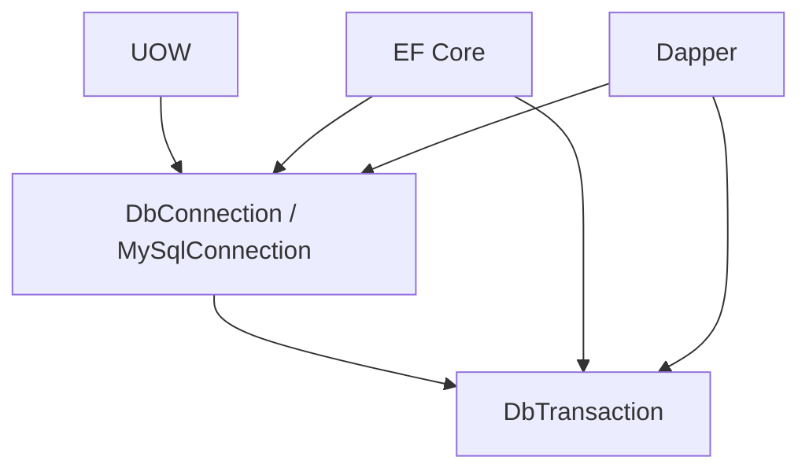

# Persistence, Transactions and Concurrency

## 1. Primitive thật bên dưới EF Core và Dapper

EF Core và Dapper cuối cùng đều tạo ADO.NET command trên `DbConnection` và `DbTransaction`. Dapper không quản lý connection lifecycle; EF có thể quản lý connection được cấu hình cho nó, nhưng ở shared UOW thì owner phải là UOW.



Hai connection có cùng connection string vẫn là hai database sessions. Atomicity chỉ có khi EF và Dapper nhận đúng cùng object connection và transaction.

## 2. Shared Unit of Work

### Context

Một use case có thể update Aggregate bằng EF và chạy SQL tối ưu bằng Dapper. Cả hai write phải cùng thành công hoặc rollback.

### Decision and flow

```text
Factory: open connection → begin transaction → create DbContext
       → UseTransaction(transaction) → return UOW

Use case: EF tracks changes → Dapper writes(connection, transaction)

Commit: SaveChanges → dispatch pending events → repeat if nested events
      → database commit → clear events
```

Factory chỉ tạo resource bundle. `EfDapperUnitOfWork` là owner duy nhất của commit, rollback và dispose. Không dùng `TransactionScope`, Generic Repository hoặc một Dapper connection riêng.

## 3. MySQL default isolation

MySQL InnoDB mặc định dùng `REPEATABLE READ`. Plain consistent `SELECT` trong cùng transaction đọc snapshot được thiết lập bởi consistent read đầu tiên; `READ COMMITTED` tạo snapshot mới cho mỗi consistent read. Nguồn: [MySQL 8.0 Transaction Isolation Levels](https://dev.mysql.com/doc/refman/8.0/en/innodb-transaction-isolation-levels.html).

### Senior decision

Base hiện không override isolation level, vì vậy dùng server/session default. Không hard-code `READ COMMITTED` hoặc `SERIALIZABLE` trước khi có workload và invariant thật.

Điều này giữ behavior khớp MySQL mặc định nhưng yêu cầu production kiểm tra:

```sql
SELECT @@GLOBAL.transaction_isolation, @@SESSION.transaction_isolation;
```

Nếu môi trường thay default, behavior có thể khác; deployment configuration phải ghi nhận giá trị này.

## 4. Isolation không đồng nghĩa concurrency control đầy đủ

Ví dụ hai request cùng đọc `SoLuong = 1`, sau đó cùng đặt một món. Snapshot isolation không tự biến chuỗi “read rồi update” thành một business invariant an toàn.

| Vấn đề | Công cụ phù hợp |
|---|---|
| Hai editor ghi đè cùng Aggregate | Optimistic `ConcurrencyToken` |
| Counter/tồn kho không được âm | Atomic conditional UPDATE |
| Cần khóa record trước chuỗi quyết định | `SELECT ... FOR UPDATE` trong transaction ngắn |
| Uniqueness như subdomain | Unique database constraint |
| Nhiều Aggregate cần atomic | Shared UOW transaction |

Atomic stock example trong tương lai:

```sql
UPDATE TonKho
SET SoLuong = SoLuong - @SoLuongDat
WHERE TenantId = @TenantId
  AND ShopId = @ShopId
  AND HangHoaId = @HangHoaId
  AND SoLuong >= @SoLuongDat;
```

Affected rows bằng `0` nghĩa là invariant không thỏa. Cách này tránh window giữa SELECT và UPDATE.

## 5. Optimistic concurrency trong base

Mọi `AggregateRoot<Guid>` có `ConcurrencyToken`. EF đánh dấu property là concurrency token và đổi token trước mỗi update. SQL update của EF có điều kiện tương đương:

```sql
UPDATE Tenants
SET Name = @name, ConcurrencyToken = @newToken
WHERE Id = @id AND ConcurrencyToken = @oldToken;
```

Nếu request khác đã update trước, affected rows bằng `0` và EF ném `DbUpdateConcurrencyException`. Nó ngăn lost update; nó không tự quyết định retry hay merge. Application phải chọn theo business case: reload, báo conflict, hoặc retry một operation đã chứng minh idempotent.

## 6. Locking and indexes

InnoDB dùng row-level locking, nhưng `UPDATE`/`DELETE` khóa các index record được scan. Thiếu index phù hợp có thể scan và khóa phạm vi lớn; index là một phần của concurrency design, không chỉ performance. Nguồn: [Locks Set by Different SQL Statements](https://dev.mysql.com/doc/refman/8.0/en/innodb-locks-set.html).

Với `REPEATABLE READ`, range locking có thể dùng next-key locks và gap locks. Query theo unique key thường khóa hẹp hơn query range không có index.

## 7. Deadlock

Deadlock vẫn có thể xảy ra ở isolation level hợp lệ. Giảm deadlock bằng cách:

- Giữ transaction ngắn.
- Update resources theo cùng thứ tự giữa các use case.
- Có index đúng query path.
- Không gọi external API trong transaction.
- Chỉ retry deadlock khi toàn operation idempotent.

InnoDB tự phát hiện deadlock và rollback một transaction; đây là expected concurrency outcome, không phải bằng chứng database hỏng. Nguồn: [MySQL InnoDB Internal Locking](https://dev.mysql.com/doc/refman/8.0/en/internal-locking.html).

## 8. Connection pooling và parallelism

Dispose `MySqlConnection` thường trả physical connection về pool. Một UOW mới không đồng nghĩa luôn mở TCP connection mới.

Không chạy `Task.WhenAll` cho nhiều EF/Dapper command trên cùng UOW: connection/DbContext không dành cho concurrent operations. Parallel read độc lập phải dùng scope/connection riêng; write cần atomic thì thực thi tuần tự trong transaction ngắn.

## 9. Upgrade triggers

- Chuyển isolation level: khi measurement cho thấy lock contention hoặc invariant yêu cầu snapshot/serialization khác.
- Pessimistic locking: khi conflict thường xuyên và retry/reload quá đắt.
- Outbox: khi có broker/email/webhook cần đảm bảo sau commit.
- Automatic retry: khi operation idempotent và đã phân loại transient errors.
- Read replica/CQRS read store: khi read workload có bằng chứng gây áp lực database chính.
