# RabbitMQ: từ một HTTP request đến hệ thống xử lý message tin cậy

Một hệ thống hiếm khi bắt đầu bằng message broker. Phiên bản đầu tiên thường chỉ có API và database: client gửi yêu cầu, server xử lý toàn bộ công việc, ghi dữ liệu rồi trả response. Thiết kế ấy dễ hiểu, dễ debug và hoàn toàn đúng khi khối lượng công việc còn nhỏ.

RabbitMQ chỉ trở nên cần thiết khi ranh giới của một HTTP request không còn chứa được toàn bộ công việc. Chương này đi theo đúng quá trình đó. Ta bắt đầu bằng một luồng đặt đồ ăn không có queue, quan sát từng failure window, rồi xây hệ thống messaging từng lớp. Mỗi cơ chế mới xuất hiện để giải quyết một vấn đề đã nhìn thấy, không phải vì kiến trúc “đủ lớn” thì mặc định phải có broker.

Business case xuyên suốt là một nền tảng đặt đồ ăn multi-tenant. Đơn hàng được quản lý theo shop; menu có thể dùng chung trong tenant hoặc đồng bộ xuống chi nhánh; tồn kho tương lai có thể theo dõi theo nhiều lô. Production base hiện chỉ triển khai phần kết nối và publish trên .NET 6. Consumer nghiệp vụ, Outbox, Inbox và FEFO vẫn là reference model đã được kiểm chứng bằng integration test.

## 1. Khi chưa có Message Queue

### 1.1 Phiên bản đầu tiên

Giả sử khách hàng xác nhận đơn. API cần lưu đơn, gửi email cho khách, thông báo cho shop và cập nhật một hệ thống báo cáo.

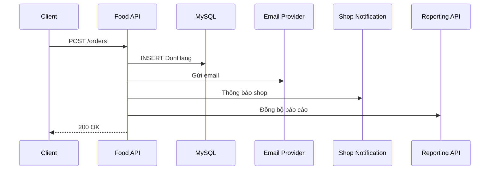

Mọi bước chạy tuần tự. Nếu ghi MySQL mất 80 ms, email 600 ms, notification 300 ms và reporting 400 ms thì response đã mất khoảng 1,38 giây, chưa tính network fluctuation. Tải tăng không chỉ làm API chậm; thread và database connection còn bị giữ trong lúc chờ các hệ thống bên ngoài.

Điểm quan trọng hơn latency là ý nghĩa của lỗi. Nếu đơn đã commit nhưng email timeout, API nên trả thành công hay thất bại? Trả thất bại có thể khiến client gửi lại và tạo hai đơn. Trả thành công nghĩa là phải có cách tiếp tục email sau khi request kết thúc.

Ta vừa phát hiện hai nhóm công việc:

- công việc quyết định kết quả của request: validate, kiểm tra invariant, tạo đơn và commit;
- công việc có thể hoàn thành sau: gửi xác nhận, cập nhật read model, phát event cho service khác.

Chỉ nhóm thứ hai là ứng viên của background processing.

### 1.2 `Task.Run` không phải durable queue

Giải pháp trực giác đầu tiên thường là:

```csharp
await donHangService.CreateAsync(request, cancellationToken);

_ = Task.Run(() => emailService.SendAsync(request.Email));

return Ok();
```

Response nhanh hơn, nhưng công việc chỉ sống trong memory của process hiện tại. Deployment, process crash hoặc autoscaling terminate instance có thể làm task biến mất. Exception không có nơi quản lý tập trung; retry không bền vững; instance khác không thể nhận phần việc còn dang dở.

Đây không phải lỗi của `Task.Run`. Nó được dùng sai abstraction. `Task` mô tả asynchronous work trong một process; durable job cần tồn tại độc lập với process đã tạo ra nó.

### 1.3 Tự tạo bảng công việc trong MySQL

Ta có thể ghi một row `PendingJob`, rồi worker polling định kỳ:

```text
HTTP request → INSERT PendingJob → COMMIT
worker       → SELECT pending rows → execute → mark completed
```

Cách này hợp lý với một loại job đơn giản. Khi hệ thống phát triển, ta phải tự giải quyết claim giữa nhiều worker, lease khi worker chết, retry delay, dead letter, routing cho nhiều loại consumer, backpressure, metrics và cleanup. Một bảng không sai; nó chỉ đang dần trở thành một message broker tự viết.

Đó là thời điểm cần một hạ tầng chuyên vận chuyển message.

## 2. Message Queue ra đời để giải quyết điều gì?

Message Queue đặt một durable boundary giữa bên tạo công việc và bên thực hiện công việc.

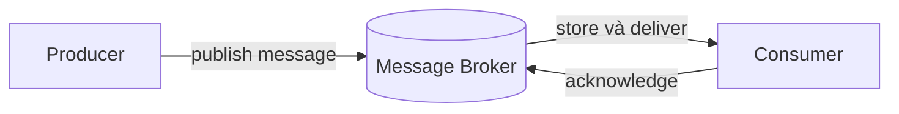

Producer không cần chờ consumer hoàn thành. Consumer có thể scale độc lập. Khi consumer tạm dừng, message chờ trong queue thay vì mất cùng process. Broker điều phối delivery và giữ trạng thái message đã được xác nhận hay chưa.

Sự tách rời này đổi failure model chứ không xóa failure:

- producer có thể không biết publish đã tới broker chưa;
- broker có thể nhận message nhưng chưa có queue phù hợp;
- consumer có thể xử lý xong rồi chết trước khi ACK;
- MySQL và broker không cùng một transaction;
- message có thể được giao nhiều lần hoặc đến khác thứ tự mong muốn.

Một hệ thống reliable không né các tình huống đó. Nó chọn invariant rõ ràng và thiết kế recovery cho từng cửa sổ lỗi.

## 3. RabbitMQ là gì?

RabbitMQ là một message broker. Trong mô hình AMQP 0-9-1, producer không gửi trực tiếp tới queue theo cách thông thường; nó publish tới `Exchange`. Exchange dùng `Routing Key` và `Binding` để định tuyến message vào một hoặc nhiều `Queue`. Consumer subscribe queue và xác nhận delivery bằng `ACK`.

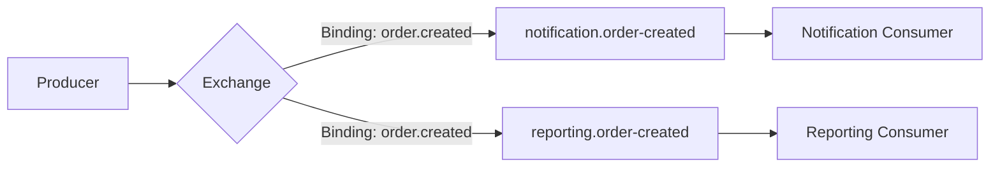

Exchange tạo một lớp gián tiếp quan trọng. Producer chỉ phát fact `order.created`; notification và reporting tự sở hữu queue của mình. Thêm consumer mới không buộc producer gọi thêm một HTTP endpoint.

### 3.1 Các khái niệm cần nắm trước khi viết code

**Producer** là ứng dụng publish message. **Consumer** là ứng dụng nhận delivery và thực hiện công việc.

**Connection** là TCP connection dài hạn giữa application process và RabbitMQ node. Tạo connection cho từng message gây handshake, socket churn và làm recovery phức tạp. Một process thường giữ một số ít connection dài hạn.

**Channel** là phiên AMQP logical chạy trên connection. Channel nhẹ hơn connection. Publisher và consumer nên có channel ownership rõ ràng; không mặc định dùng một channel đồng thời từ nhiều thread.

**Exchange** nhận message và định tuyến. Bốn kiểu phổ biến:

| Exchange type | Cách route | Khi phù hợp |
|---|---|---|
| `direct` | Routing key khớp binding key | Event name hoặc command route rõ ràng |
| `topic` | Khớp pattern như `order.*` | Nhiều nhóm event theo namespace |
| `fanout` | Gửi tới mọi queue đã bind | Broadcast không cần routing key |
| `headers` | So khớp headers | Rule dựa trên metadata, ít dùng hơn |

**Queue** giữ message chờ consumer. Nhiều consumer cùng subscribe một queue tạo competing consumers: mỗi message chỉ được một consumer trong nhóm nhận tại một thời điểm. Muốn cùng một event đi tới hai hệ thống độc lập, tạo hai queue cùng bind exchange, không để hai hệ thống tranh cùng một queue.

**Binding** là rule nối exchange với queue. **Routing Key** là giá trị producer gửi để exchange áp dụng rule đó.

**Virtual Host** là namespace logic chứa exchange, queue, binding và permission. Nó hỗ trợ tách application hoặc environment nhưng không thay tenant isolation trong business data.

## 4. Cài RabbitMQ cho môi trường local

Project sử dụng RabbitMQ Management image. Management plugin cung cấp HTTP API và giao diện quan sát exchange, queue, connection, channel và message rates.

```yaml
services:
  rabbitmq:
    image: rabbitmq:4.1.8-management-alpine
    container_name: food-delivery-rabbitmq
    restart: unless-stopped
    environment:
      RABBITMQ_DEFAULT_USER: food_app
      RABBITMQ_DEFAULT_PASS: food_dev
      RABBITMQ_DEFAULT_VHOST: food
    ports:
      - "5673:5672"
      - "15673:15672"
    volumes:
      - rabbitmq_data:/var/lib/rabbitmq
    healthcheck:
      test: ["CMD", "rabbitmq-diagnostics", "-q", "ping"]
      interval: 5s
      timeout: 5s
      retries: 12

volumes:
  rabbitmq_data:
```

Khởi động broker từ thư mục `backend`:

```powershell
docker compose up -d rabbitmq
docker compose ps rabbitmq
```

Hai port có hai vai trò khác nhau:

- `localhost:5673`: AMQP endpoint mà .NET client kết nối;
- `http://localhost:15673`: Management UI, đăng nhập bằng `food_app / food_dev` trong local environment.

Trong Management UI, kiểm tra `Connections` chỉ sau khi application thực sự mở connection. Foundation tạo connection lazy, nên chỉ khởi động API chưa chắc đã làm connection xuất hiện; gọi readiness hoặc publish lần đầu sẽ kích hoạt kết nối.

## 5. Kết nối RabbitMQ từ .NET 6

### 5.1 Cài client package

RabbitMQ server và .NET application là hai process độc lập. Application cần client library để nói giao thức AMQP:

```powershell
dotnet add FoodDelivery.Infrastructure package RabbitMQ.Client --version 7.2.2
```

`RabbitMQ.Client` nằm ở Infrastructure vì đây là chi tiết I/O. Domain không biết exchange, queue hoặc AMQP. Application chỉ sở hữu contract mà use case cần gọi.

```csharp
public interface IIntegrationEvent
{
    Guid MessageId { get; }
    string EventName { get; }
    int ContractVersion { get; }
    DateTimeOffset OccurredAtUtc { get; }
    string? CorrelationId { get; }
    Guid? TenantId { get; }
}

public interface IIntegrationEventPublisher
{
    Task PublishAsync<TEvent>(
        TEvent integrationEvent,
        string routingKey,
        CancellationToken cancellationToken = default)
        where TEvent : IIntegrationEvent;
}
```

Interface được đặt ở Application không phải để che giấu RabbitMQ bằng mọi giá. Nó giữ use case phụ thuộc vào hành vi “publish Integration Event”, còn connection lifecycle, serialization và broker client thuộc Infrastructure. Nếu hệ thống chỉ có một chỗ publish và không cần boundary này, interface riêng có thể là dư thừa; trong Clean Architecture hiện tại, Application cần gọi publisher mà không reference Infrastructure nên boundary có lý do cụ thể.

### 5.2 Configuration

```json
"RabbitMq": {
  "HostName": "localhost",
  "Port": 5673,
  "UserName": "food_app",
  "Password": "food_dev",
  "VirtualHost": "food",
  "ConnectionName": "food-delivery-api",
  "ExchangeName": "food.events",
  "NetworkRecoverySeconds": 5,
  "RequestedHeartbeatSeconds": 30
}
```

Credential trong ví dụ chỉ dành cho local Docker. Production lấy secret từ secret manager hoặc environment, bật TLS và cấp quyền tối thiểu theo vhost.

Options phải fail fast khi thiếu host, credential, vhost hoặc exchange. Một configuration sai không nên đợi tới request đầu tiên mới biến thành lỗi khó đọc.

### 5.3 Một connection dài hạn cho mỗi process

```csharp
public sealed class RabbitMqConnectionManager : IAsyncDisposable
{
    private readonly ConnectionFactory _factory;
    private readonly SemaphoreSlim _gate = new(1, 1);
    private IConnection? _connection;

    public RabbitMqConnectionManager(RabbitMqOptions options)
    {
        _factory = new ConnectionFactory
        {
            HostName = options.HostName,
            Port = options.Port,
            UserName = options.UserName,
            Password = options.Password,
            VirtualHost = options.VirtualHost,
            AutomaticRecoveryEnabled = true,
            TopologyRecoveryEnabled = true,
            NetworkRecoveryInterval = TimeSpan.FromSeconds(options.NetworkRecoverySeconds),
            RequestedHeartbeat = TimeSpan.FromSeconds(options.RequestedHeartbeatSeconds)
        };
    }

    public async Task<IConnection> GetConnectionAsync(
        CancellationToken cancellationToken = default)
    {
        if (_connection?.IsOpen == true) return _connection;

        await _gate.WaitAsync(cancellationToken);
        try
        {
            if (_connection?.IsOpen == true) return _connection;
            if (_connection is not null) await _connection.DisposeAsync();
            _connection = await _factory.CreateConnectionAsync(
                "food-delivery-api",
                cancellationToken);
            return _connection;
        }
        finally
        {
            _gate.Release();
        }
    }
}
```

Hai lần kiểm tra `IsOpen` nằm trước và sau gate. Lần đầu giữ fast path không lock; lần sau ngăn hai caller cùng tạo connection khi application vừa khởi động. Automatic recovery giúp client nối lại sau network interruption, nhưng không biến publish đang ở trạng thái không xác định thành exactly-once.

### 5.4 Publisher đầu tiên

Publisher tạo một channel, bật Publisher Confirm, declare durable direct exchange rồi publish persistent message:

```csharp
_channel = await connection.CreateChannelAsync(
    new CreateChannelOptions(
        publisherConfirmationsEnabled: true,
        publisherConfirmationTrackingEnabled: true),
    cancellationToken);

await _channel.ExchangeDeclareAsync(
    "food.events",
    ExchangeType.Direct,
    durable: true,
    autoDelete: false,
    cancellationToken: cancellationToken);

await _channel.BasicPublishAsync(
    exchange: "food.events",
    routingKey,
    mandatory: true,
    basicProperties: properties,
    body,
    cancellationToken);
```

Foundation serialize các publish call qua `SemaphoreSlim(1, 1)` vì channel được sở hữu chung. Cách này ưu tiên correctness và lifecycle đơn giản. Reference load đo khoảng 449 confirmed publish/giây với baseline publisher; chỉ tạo channel pool khi target thực tế cao hơn và profiler cho thấy publisher là bottleneck.

Message properties hiện có:

```text
MessageId       = event.MessageId
Type            = event.EventName
ContentType     = application/json
DeliveryMode    = persistent
CorrelationId   = event.CorrelationId
x-event-version = event.ContractVersion
x-tenant-id     = event.TenantId
```

`MessageId` là logical identity, không tạo mới mỗi lần retry. `CorrelationId` nối HTTP request, Outbox, broker và consumer logs. `ContractVersion` cho phép producer và consumer rolling deployment mà không đoán schema từ payload.

### 5.5 Dependency Injection và readiness

```csharp
services.AddSingleton(rabbitMqOptions);
services.AddSingleton<RabbitMqConnectionManager>();
services.AddSingleton<RabbitMqPublisher>();
services.AddSingleton<IIntegrationEventPublisher>(provider =>
    provider.GetRequiredService<RabbitMqPublisher>());

services.AddHealthChecks()
    .AddCheck<RabbitMqHealthCheck>("rabbitmq", tags: new[] { "ready" });
```

```csharp
app.MapHealthChecks("/health/ready", new HealthCheckOptions
{
    Predicate = registration => registration.Tags.Contains("ready")
});
```

Connection manager và publisher là Singleton vì chúng sở hữu resource dài hạn theo process. Đăng ký publisher Scoped sẽ tạo nhiều connection/channel owner theo request và làm dispose/recovery khó kiểm soát.

Readiness trả lời instance hiện có giao tiếp được với dependency bắt buộc hay không. Liveness không nên kill process chỉ vì RabbitMQ lỗi tạm thời; nếu cả liveness và readiness cùng phụ thuộc broker, orchestrator có thể tạo restart storm đúng lúc broker đang gặp sự cố.

## 6. Theo dõi publish đầu tiên trên Dashboard

Để thấy message ở trạng thái `Ready`, cần có queue và binding trước khi publish. Exchange không phải nơi lưu message. Trong Management UI:

1. mở `Queues and Streams`, tạo durable queue `notification.order-created`;
2. mở exchange `food.events`;
3. thêm binding từ exchange tới queue với routing key `order.created`;
4. gọi publisher với routing key `order.created`;
5. quay lại queue và quan sát `Ready = 1` nếu chưa có consumer.

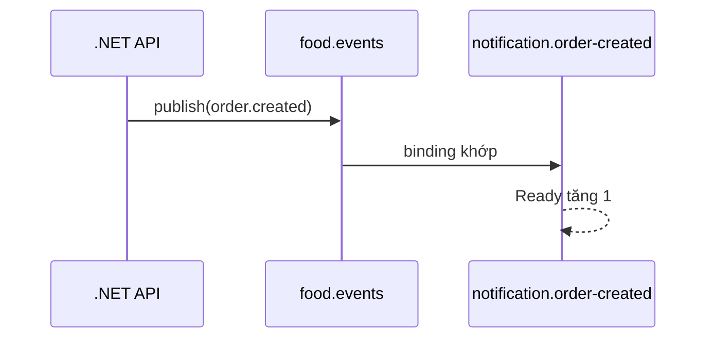

Nếu routing key không có binding, `mandatory = true` làm broker return message với `NO_ROUTE`. Nếu bỏ `mandatory`, publish vẫn có thể được broker chấp nhận rồi message bị loại vì không có đích. Publisher Confirm và mandatory routing giải quyết hai câu hỏi khác nhau:

- Confirm: broker đã nhận trách nhiệm cho publish chưa?
- Mandatory return: message có được route vào ít nhất một queue không?

## 7. Work Queue và competing consumers

Khi hai instance cùng consume `notification.order-created`, RabbitMQ phân phối các message trong queue giữa chúng. Đây là scale-out của một logical consumer.

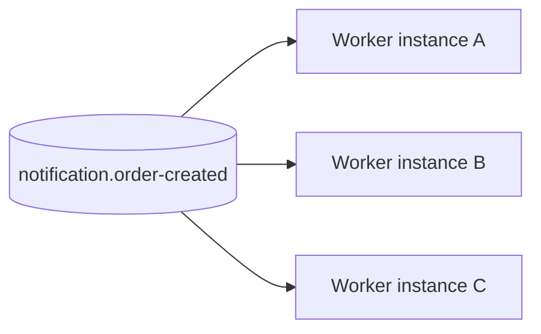

Ba instance không nhận ba bản sao. Muốn reporting cũng nhận `order.created`, reporting phải có queue riêng bind cùng exchange. Queue là subscription durability boundary; consumer instance chỉ là capacity của subscription đó.

## 8. ACK: khi nào broker được phép xóa message?

Automatic ACK xóa trách nhiệm của broker ngay khi delivery được gửi. Nếu process dừng trong lúc gửi email hoặc commit MySQL, message đã mất. Manual ACK cho phép application quyết định lúc nào effect đủ bền vững.

Thiết kế trực giác khác là ACK trước rồi mới commit để tránh duplicate:

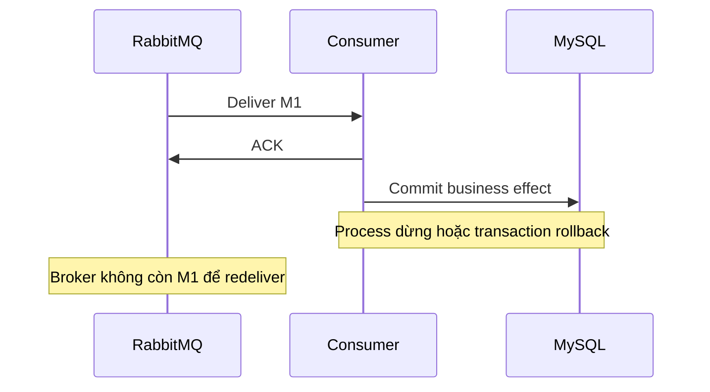

ACK trước commit đổi duplicate thành data loss. Thiết kế an toàn chọn commit trước ACK:

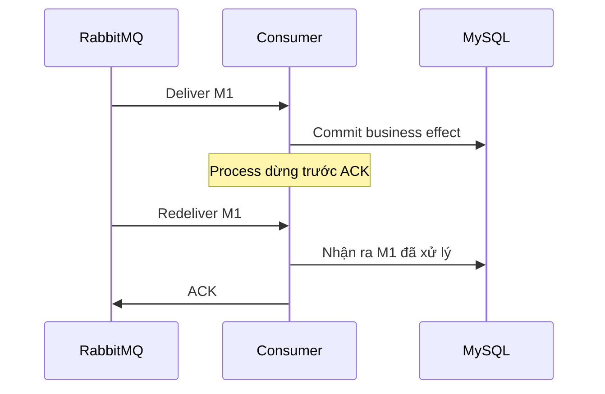

Lúc này có thể duplicate nhưng không mất effect. Ta vừa suy ra requirement tiếp theo: consumer phải idempotent.

## 9. Idempotency và Inbox

Một operation idempotent cho cùng kết quả quan sát được dù nhận cùng logical request nhiều lần. Với database consumer, Inbox lưu `MessageId` đã xử lý. Inbox insert và business mutation phải commit trong cùng transaction.

```text
BEGIN
  INSERT Inbox(consumerName, tenantId, shopId, messageId)
  UPDATE business state
COMMIT
ACK
```

Nếu Inbox và mutation nằm ở hai transaction, crash giữa chúng làm Inbox nói “đã xử lý” trong khi effect chưa tồn tại, hoặc effect tồn tại nhưng Inbox chưa ghi. Atomic boundary quan trọng hơn tên pattern.

Trong multi-tenant system, unique key không thể chỉ là `MessageId`. Scope tham chiếu an toàn cho effect theo shop là:

```text
(consumerName, tenantId, shopId, messageId)
```

Header tenant hỗ trợ truyền context và tracing, không thay authorization. Consumer vẫn phải kiểm tra tenant/shop scope trong EF query, Dapper predicate, cache key và database constraint.

Side effect ngoài MySQL cần idempotency tại provider boundary. Inbox không thể rollback email hoặc payment request đã rời process. Khi provider hỗ trợ idempotency key, dùng chính logical `MessageId` hoặc business operation key; nếu không, cần state machine và reconciliation.

## 10. Prefetch và backpressure

`prefetch` giới hạn số delivery chưa ACK trên mỗi consumer channel. Giá trị quá thấp để worker nhàn trong lúc chờ network; quá cao giữ nhiều message trong memory và tạo burst lên MySQL.

```text
globalConsumers = instanceCount × consumersPerInstance
maximumUnacked  = globalConsumers × prefetch
```

Với 4 instance, mỗi instance 8 consumer, prefetch 32:

```text
globalConsumers = 4 × 8 = 32
maximumUnacked  = 32 × 32 = 1.024
```

Reference load ghi nhận đúng `Unacked = 1.024`. Điều này không chứng minh 32 là cấu hình tốt nhất; nó cho thấy parameter đã tạo đúng concurrency envelope dự tính. Ceiling tiếp theo nằm ở MySQL connection pool và downstream safe concurrency. Tăng worker khi database đã bão hòa chỉ làm transaction latency và lock contention tăng.

## 11. Retry không đồng nghĩa với reliability

Retry phù hợp với lỗi có khả năng tự hết: network timeout, downstream `503`, deadlock hoặc lock wait timeout. Contract version không hỗ trợ, validation failure hay business resource không tồn tại là permanent failure. Retry chúng vô hạn chỉ làm queue nghẽn.

NACK rồi requeue ngay vào cùng queue có thể tạo hot loop: consumer nhận lại cùng poison message liên tục và không còn capacity cho message tốt. Một retry topology thêm delay:

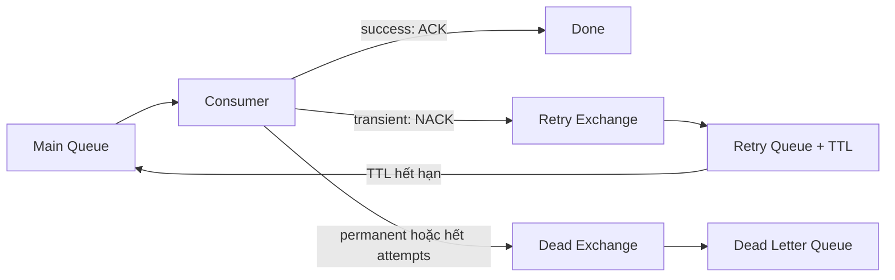

Mỗi retry policy cần `maxAttempts`, delay/backoff, execution timeout và terminal state. RabbitMQ thêm `x-death` khi dead-letter. Trong integration test, message lỗi transient hai lần rồi thành công có `rejected=2` và `expired=2`; permanent failure đi DLQ ở attempt đầu; poison message đi DLQ sau attempt thứ ba.

Khi application tự publish message sang DLQ để bổ sung failure metadata, phải chờ Publisher Confirm của DLQ trước khi ACK delivery gốc. Nếu ACK trước rồi DLQ publish thất bại, error handling lại trở thành nguồn làm mất message.

## 12. Publisher Confirm vẫn chưa giải quyết dual-write

Ta đã làm publisher biết broker nhận message. Nhưng use case tạo đơn vẫn cần ghi MySQL và publish RabbitMQ:

```text
COMMIT DonHang
publish DonHangDaTao
```

Process có thể dừng giữa hai dòng. Đổi thứ tự không giúp được:

```text
publish DonHangDaTao
ROLLBACK DonHang
```

Consumer nhận event cho một đơn chưa từng tồn tại. MySQL transaction không thể tự động bao trùm RabbitMQ publish. Đây là dual-write problem.

## 13. Transactional Outbox

Outbox ghi business state và intent phát event trong cùng MySQL transaction:

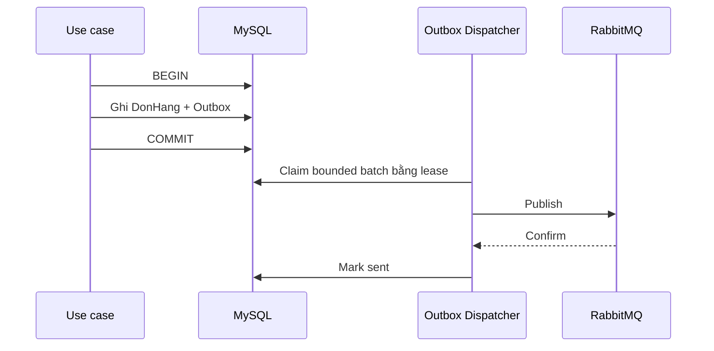

Outbox không tạo exactly-once. Nếu dispatcher dừng sau Confirm nhưng trước `mark sent`, lease hết hạn và message được publish lại. Outbox chọn “không mất intent, có thể duplicate”; Inbox hoàn thiện cặp thiết kế bằng cách biến duplicate thành no-op.

Nhiều dispatcher dùng `FOR UPDATE SKIP LOCKED`, bounded batch, `lockedBy` và `lockedUntilUtc`. `SKIP LOCKED` phù hợp với Outbox vì các row độc lập và không có yêu cầu xử lý tuyệt đối theo thứ tự. Lease cho phép instance khác reclaim khi worker dừng.

Reference test từng phát hiện index claim sai làm bốn worker nhận batch `[25, 0, 0, 0]`. Index chứa `lockedUntil` trước các cột order khiến MySQL không phân phối query như dự tính. Sau khi index theo filter và stable order `(runId, sentAt, occurredAt, messageId)`, bốn worker claim đủ 100 intent. Bài học là phải xem execution plan và batch distribution thật; có `SKIP LOCKED` trong SQL không tự động đồng nghĩa dispatcher scale tốt.

Production base chưa thêm Outbox table/dispatcher vì chưa có business write sở hữu event. Tạo schema và worker chung chung từ trước sẽ buộc business sau này thích nghi với một contract chưa được xác định.

## 14. Ordering trong hệ thống nhiều instance

RabbitMQ giữ thứ tự trong phạm vi hẹp, nhưng retry, redelivery và nhiều consumer có thể khiến completion order khác publish order. Hai event `DonHangDaXacNhan(version=3)` và `DonHangDaHuy(version=4)` không nên dựa vào thời điểm arrival để quyết định state.

Event thay đổi aggregate state cần mang aggregate version. Transaction consumer chỉ áp dụng version hợp lệ hoặc bỏ qua stale event. Nếu business bắt buộc serialize theo một key, có thể partition topology hoặc dùng database coordination, nhưng mỗi lựa chọn làm giảm parallelism và tăng vận hành. Đừng yêu cầu global ordering khi invariant chỉ cần per-aggregate ordering.

Process-local `lock` không bảo vệ dữ liệu dùng chung giữa nhiều instance. Correctness đa instance phải dựa trên database constraint, conditional update, row lock hoặc coordinator phân tán có failure model rõ ràng.

## 15. Tồn kho nhiều lô: broker vận chuyển, MySQL bảo vệ invariant

Giả sử tồn còn 10, hai đơn đồng thời mỗi đơn đặt 7. Hai consumer cùng đọc 10 rồi cùng ghi 3 tạo lost update: hệ thống đã chấp nhận 14 nhưng số dư chỉ giảm 7. RabbitMQ không giải quyết race này.

Với nhiều lô, strict FEFO yêu cầu chọn lô hết hạn sớm trước:

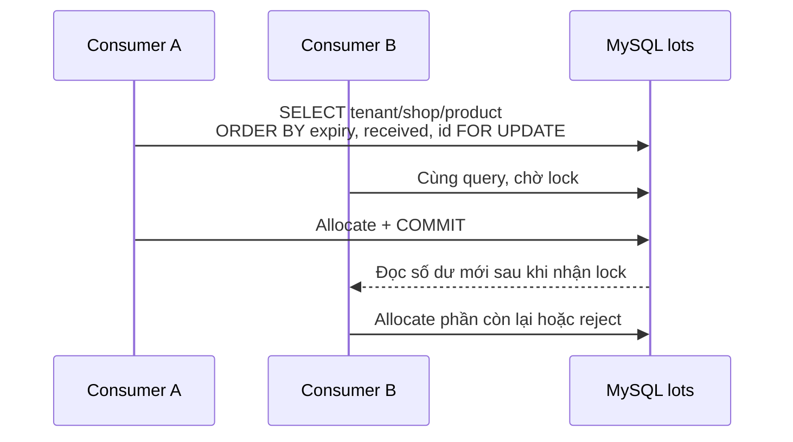

Mọi transaction lock candidate lots theo cùng thứ tự `expiresAt, receivedAt, id`. `SKIP LOCKED` có thể bỏ qua lô sớm nhất đang bị transaction khác khóa và chọn lô muộn hơn. Nó tăng throughput nhưng thay đổi business semantics, nên không dùng khi invariant là strict FEFO.

Với 100 shop và 100.000 thẻ kho, query phải bắt đầu bằng composite index theo `tenant + shop + product` rồi tới sort key. Reference run có một hot `shop + product` chứa 500 lô; lấy 10 candidate mất khoảng `0,21 ms` và không scan toàn bộ 100.000 row. Đây là kết quả trong môi trường test, không phải production SLA.

## 16. Quorum queue và broker cluster

Durable queue trên một node vẫn không chịu được node failure. Quorum queue sao chép message theo majority giữa các RabbitMQ node.

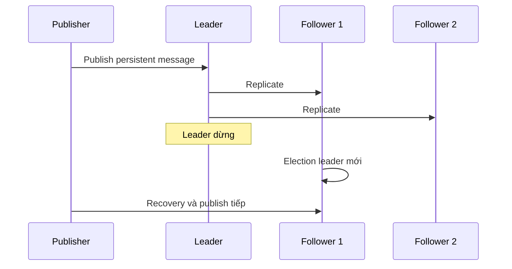

Reference test dùng cluster ba node, dừng leader trong lúc publish. Leader mới được bầu sau khoảng `1,41 giây`; đủ 2.000 logical message, không thiếu và không duplicate trong lần đo. Kết quả chứng minh đúng fault đã mô phỏng, không chứng minh hệ thống miễn nhiễm network partition, disk exhaustion hoặc upgrade lỗi.

Production quorum topology thường cần tối thiểu ba node trải trên failure domain phù hợp. Cùng với replication phải có disk/memory alarm, partition monitoring, capacity và runbook. Cluster không thay backup; replication có thể sao chép cả thao tác xóa hoặc dữ liệu sai.

## 17. Load test: đọc kết quả thay vì chỉ nhìn throughput

Reference reliability profile:

```text
100 shop
100.000 logical message
3 publisher
32 consumer
prefetch 32
5% duplicate publish
2% transient failure
1% crash sau business commit, trước ACK
```

| Metric | Kết quả |
|---|---:|
| Physical messages | 105.000 |
| Inbox rows | 100.000 |
| Business effects | 100.000 |
| Duplicate business effects | 0 |
| Missing logical messages | 0 |
| Transient failures | 2.000 |
| Post-commit crashes | 1.000 |
| Redeliveries | 3.000 |
| Publish duration | 242,40 giây |
| Consume duration | 113,19 giây |
| Tổng thời gian | khoảng 5 phút 57 giây |

Hot shop nhận 50% message. Thiết kế đầu tiên cập nhật một counter row duy nhất cho mỗi shop, khiến smoke test 1.000 message mất khoảng 33,4 giây. Chia effect theo `shop + inventory bucket` giảm cùng smoke profile xuống khoảng 4–10 giây tùy lần chạy.

Sự khác biệt không đến từ RabbitMQ tuning. Database model ban đầu biến một shop thành hot row, khiến consumer xếp hàng ở row lock. Đây là lý do load test cần kiểm tra transaction latency, lock wait, connection pool và business outcomes, không chỉ messages/second.

## 18. Đọc RabbitMQ Management UI

Dashboard biểu diễn technical state của broker:

| Giá trị | Cách đọc |
|---|---|
| `Ready` | Message trong queue chưa được giao |
| `Unacked` | Message đã giao nhưng chưa ACK |
| `Total` | `Ready + Unacked` |
| `Consumers` | Số consumer đang subscribe |
| Publish rate | Tốc độ message đi vào exchange |
| Deliver rate | Tốc độ broker giao message |
| ACK rate | Tốc độ consumer xác nhận |
| Redelivered | Delivery đã được giao lại |

`Ready` tăng liên tục nghĩa là arrival rate lớn hơn completion rate. Trước khi tăng worker, kiểm tra ACK rate, handler duration, MySQL pool và downstream latency.

`Unacked` chạm đúng trần `consumer × prefetch` cho thấy capacity đang nằm trong handler/downstream. Tăng prefetch lúc này thường chỉ tăng memory và thời gian message nằm ngoài queue.

Redelivery tăng có thể đến từ process restart, connection recovery, NACK hoặc crash sau commit. Nó không tự nói business effect bị duplicate; cần đối chiếu Inbox deduplication metrics.

DLQ tăng cần phân loại failure trước khi requeue. Bulk requeue poison message khi code chưa sửa chỉ đưa sự cố quay lại main queue.

Management UI không phải business audit. `ACK` không chứng minh email tới người nhận, tiền đã thu hoặc tồn kho đúng. Business state vẫn nằm trong database và external provider outcome.

## 19. Capacity planning

Load parameter xuất phát từ traffic và downstream ceiling:

```text
messageCount       = peakArrivalRate × testDuration
requiredThroughput = peakArrivalRate × headroom
globalConsumers    = instanceCount × consumersPerInstance
maximumUnacked     = globalConsumers × prefetch
```

Sau đó áp constraint:

```text
globalConsumers ≤ DB connections dành cho worker
globalConsumers ≤ downstream safe concurrency
```

Ví dụ peak 500 message/giây trong 10 phút tạo 300.000 message. Nếu cần headroom 40%, target drain rate là 700 message/giây. Con số này mới là đầu vào để thử số consumer; không lấy một cấu hình trên blog rồi gọi là production default.

Mỗi profile cần ghi environment, CPU/RAM, broker topology, MySQL configuration, payload size, persistence mode, confirm mode, consumer count, prefetch và failure injection. Nếu thiếu các dữ kiện đó, hai con số throughput không thể so sánh có ý nghĩa.

## 20. Production checklist cho .NET 6

Trước khi phát event nghiệp vụ đầu tiên:

- contract có `MessageId`, stable event name, version, timestamp, correlation và tenant context;
- connection được tái sử dụng theo process, channel có owner rõ ràng;
- exchange và queue durable, message persistent nếu yêu cầu survive restart;
- Publisher Confirm và mandatory routing được xử lý thành failure quan sát được;
- manual ACK chỉ xảy ra sau durable business outcome;
- consumer idempotency được kiểm chứng bằng duplicate delivery thật;
- retry phân biệt transient/permanent, có giới hạn và DLQ;
- business write bắt buộc phát event dùng Outbox;
- Inbox và mutation dùng cùng MySQL transaction;
- tenant/shop scope có mặt trong query, cache key và unique constraint;
- global concurrency không vượt DB/downstream ceiling;
- metrics, alert và runbook đã tồn tại trước khi tăng instance;
- secret không nằm trong source control; production dùng TLS và least privilege;
- producer/consumer hỗ trợ contract compatibility trong rolling deployment.

Foundation hiện chạy trên .NET 6 và `RabbitMQ.Client 7.2.2`. .NET 6 đã hết vòng đời hỗ trợ; dự án vẫn giữ target đã chốt nhưng production roadmap cần kế hoạch nâng runtime. Việc nâng runtime không làm thay đổi các invariant về ACK, idempotency, Outbox hoặc concurrency đã trình bày trong chương.

## 21. Những gì production base đã có và chưa có

Đã có trong `FoodDelivery.Infrastructure`:

- validated `RabbitMqOptions`;
- một long-lived connection manager trên mỗi process;
- confirmed persistent publisher với mandatory routing;
- integration-event wire metadata;
- automatic connection/topology recovery;
- readiness health check;
- integration tests chạy với RabbitMQ thật.

Chưa đưa vào production:

- business queue và consumer;
- Outbox/Inbox schema cùng dispatcher;
- retry/DLQ topology;
- aggregate version handler;
- inventory allocator và strict FEFO.

Những phần này không bị bỏ quên. Chúng đang ở test-only reference implementation để chứng minh failure model trước khi business module thật xác định transaction, table ownership và contract.

## 22. Từ khóa tra cứu

| Keyword | Ý nghĩa |
|---|---|
| Message broker | Hạ tầng nhận, định tuyến, lưu và giao message |
| Producer | Thành phần publish message |
| Consumer | Thành phần xử lý delivery |
| Connection | TCP connection dài hạn tới RabbitMQ node |
| Channel | Phiên AMQP logical trên connection |
| Exchange | Thành phần định tuyến message |
| Queue | Durable subscription và nơi giữ message |
| Binding | Rule nối exchange với queue |
| Routing Key | Giá trị dùng cho routing |
| Publisher Confirm | Phản hồi broker đã nhận trách nhiệm publish |
| ACK/NACK | Xác nhận thành công hoặc từ chối delivery |
| Prefetch | Giới hạn số delivery chưa ACK |
| Redelivery | Message được giao lại |
| DLQ | Queue giữ message không thể xử lý tự động |
| Outbox | Intent publish được ghi cùng business transaction |
| Inbox | Idempotency record của consumer |
| Quorum queue | Queue replicated theo majority |
| FEFO | Xuất lô hết hạn sớm trước |
| Poison message | Message luôn thất bại với handler hiện tại |

## 23. Nguồn đọc tiếp

- [RabbitMQ Tutorials](https://www.rabbitmq.com/tutorials) — học topology theo thứ tự Hello World, Work Queue, Publish/Subscribe và Routing.
- [AMQP 0-9-1 Model Explained](https://www.rabbitmq.com/tutorials/amqp-concepts) — bản chất exchange, queue, binding, ACK và prefetch.
- [RabbitMQ .NET Client Guide](https://www.rabbitmq.com/client-libraries/dotnet-api-guide) — connection, channel, recovery và concurrency của .NET client.
- [Consumer Acknowledgements and Publisher Confirms](https://www.rabbitmq.com/docs/confirms) — hai chiều reliability độc lập.
- [Quorum Queues](https://www.rabbitmq.com/docs/quorum-queues) — replication, majority và failure behavior.
