# RabbitMQ và kiến trúc Message Queue trong .NET

Khi khách hàng xác nhận đặt món, đơn hàng phải được lưu trước khi server trả kết quả.

Sau khi đơn hàng được tạo, hệ thống còn ba công việc:

- thông báo cho shop;
- gửi email xác nhận cho khách hàng;
- chuyển dữ liệu bán hàng sang hệ thống báo cáo.

Nếu ba công việc cùng nằm trong HTTP request, thời gian phản hồi phụ thuộc vào mọi hệ thống tham gia.

Một email provider phản hồi chậm có thể kéo dài thao tác đặt món, dù đơn hàng đã được lưu. Nếu provider lỗi sau khi transaction commit, server còn phải quyết định kết quả của request dựa trên một tác vụ phụ.

Business case xuyên suốt là một nền tảng đặt đồ ăn multi-tenant.

- Đơn hàng được quản lý theo shop.
- Menu có thể dùng chung trong tenant hoặc được đồng bộ xuống chi nhánh.
- Tồn kho tương lai có thể được theo dõi theo nhiều lô.

Production base hiện chỉ triển khai phần kết nối và publish trên .NET 6. Consumer nghiệp vụ, Outbox, Inbox và FEFO vẫn là reference model đã được kiểm chứng bằng integration test.

## 1. Luồng xử lý đồng bộ

### 1.1 Giao dịch đặt món

Giả sử khách hàng xác nhận đơn. API cần lưu đơn, gửi email cho khách, thông báo cho shop và cập nhật một hệ thống báo cáo.

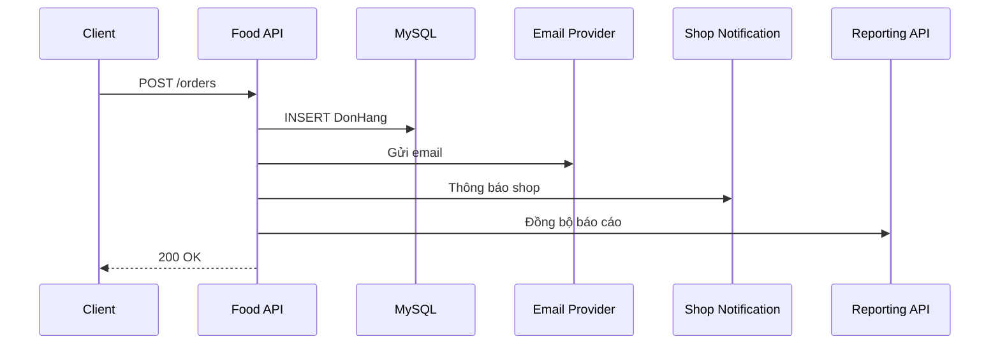

Mọi bước trong sơ đồ chạy tuần tự. Một lần xử lý có thể gồm:

| Công việc | Thời gian giả định |
|---|---:|
| Ghi MySQL | 80 ms |
| Gửi email | 600 ms |
| Thông báo shop | 300 ms |
| Đồng bộ báo cáo | 400 ms |

Tổng thời gian đã đạt khoảng 1,38 giây, chưa tính network fluctuation.

Khi tải tăng, API không chỉ phản hồi chậm hơn. Thread và database connection còn bị giữ trong lúc chờ các hệ thống bên ngoài.

Latency chưa phải vấn đề khó nhất. Nếu đơn đã commit nhưng email timeout, API phải chọn kết quả cho request.

- Trả thất bại có thể khiến client gửi lại và tạo hai đơn.
- Trả thành công đòi hỏi một cơ chế tiếp tục gửi email sau khi request kết thúc.

Luồng xử lý chứa hai nhóm công việc có lifecycle khác nhau:

- công việc quyết định kết quả của request: validate, kiểm tra invariant, tạo đơn và commit;
- công việc có thể hoàn thành sau: gửi xác nhận, cập nhật read model, phát event cho service khác.

Chỉ nhóm thứ hai là ứng viên của background processing.

### 1.2 Tác vụ ngoài HTTP request

Giải pháp trực giác đầu tiên thường là:

```csharp
await donHangService.CreateAsync(request, cancellationToken);

_ = Task.Run(() => emailService.SendAsync(request.Email));

return Ok();
```

Response nhanh hơn, nhưng công việc chỉ sống trong memory của process hiện tại. Task có thể biến mất khi:

- application được deployment lại;
- process bị crash;
- autoscaling terminate instance.

Exception không có nơi quản lý tập trung. Retry không bền vững. Instance khác cũng không thể nhận phần việc còn dang dở.

Đây không phải lỗi của `Task.Run`. Nó được dùng sai abstraction. `Task` mô tả asynchronous work trong một process; durable job cần tồn tại độc lập với process đã tạo ra nó.

### 1.3 Bảng công việc trong MySQL

Một row `PendingJob` có thể lưu công việc để worker polling định kỳ:

```text
HTTP request → INSERT PendingJob → COMMIT
worker       → SELECT pending rows → execute → mark completed
```

Cách này hợp lý với một loại job đơn giản. Khi số worker và loại công việc tăng, application phải tự bổ sung:

- cơ chế claim và lease;
- retry delay và dead letter;
- routing cho nhiều consumer;
- backpressure, metrics và cleanup.

Một bảng không sai. Phạm vi trách nhiệm của nó đang dần trở thành một message broker tự viết.

Đó là thời điểm cần một hạ tầng chuyên vận chuyển message.

## 2. Message Queue và Message Broker

Message Queue đặt một durable boundary giữa bên tạo công việc và bên thực hiện công việc.

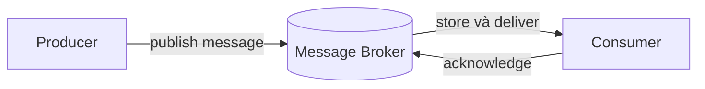

Producer không cần chờ consumer hoàn thành. Consumer có thể scale độc lập.

Khi consumer tạm dừng, message chờ trong queue thay vì mất cùng process. Broker điều phối delivery và ghi nhận message đã được xác nhận hay chưa.

Sự tách rời này đổi failure model chứ không xóa failure:

- producer có thể không biết publish đã tới broker chưa;
- broker có thể nhận message nhưng chưa có queue phù hợp;
- consumer có thể xử lý xong rồi chết trước khi ACK;
- MySQL và broker không cùng một transaction;
- message có thể được giao nhiều lần hoặc đến khác thứ tự mong muốn.

Một hệ thống reliable không né các tình huống đó. Nó chọn invariant rõ ràng và thiết kế recovery cho từng cửa sổ lỗi.

## 3. Kiến trúc RabbitMQ

RabbitMQ là một message broker.

Trong mô hình AMQP 0-9-1, producer publish message tới `Exchange`. Exchange dùng `Routing Key` và `Binding` để định tuyến message vào một hoặc nhiều `Queue`. Consumer subscribe queue và xác nhận delivery bằng `ACK`.

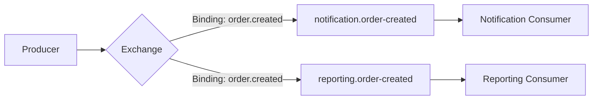

Exchange tạo một lớp gián tiếp quan trọng. Producer chỉ phát fact `order.created`; notification và reporting tự sở hữu queue của mình. Thêm consumer mới không buộc producer gọi thêm một HTTP endpoint.

### 3.1 Connection, Channel, Exchange, Queue và Binding

**Producer** là ứng dụng publish message. **Consumer** là ứng dụng nhận delivery và thực hiện công việc.

**Connection** là TCP connection dài hạn giữa application process và RabbitMQ node. Tạo connection cho từng message gây handshake, socket churn và làm recovery phức tạp. Một process thường giữ một số ít connection dài hạn.

**Channel** là phiên AMQP logical chạy trên connection. Channel nhẹ hơn connection. Publisher và consumer nên có channel ownership rõ ràng; không mặc định dùng một channel đồng thời từ nhiều thread.

**Exchange** nhận message và định tuyến. Bốn kiểu phổ biến:

| Exchange type | Cách route | Khi phù hợp |
|---|---|---|
| `direct` | Routing key khớp binding key | Event name hoặc command route rõ ràng |
| `topic` | Khớp pattern như `order.*` | Nhiều nhóm event theo namespace |
| `fanout` | Gửi tới mọi queue đã bind | Broadcast không cần routing key |
| `headers` | So khớp headers | Rule dựa trên metadata, ít dùng hơn |

**Queue** giữ message chờ consumer.

Nhiều consumer cùng subscribe một queue tạo competing consumers. Mỗi message chỉ được một consumer trong nhóm nhận tại một thời điểm.

Nếu một event phải đi tới hai hệ thống độc lập, mỗi hệ thống cần một queue riêng cùng bind vào exchange.

**Binding** là rule nối exchange với queue. **Routing Key** là giá trị producer gửi để exchange áp dụng rule đó.

**Virtual Host** là namespace logic chứa exchange, queue, binding và permission. Nó hỗ trợ tách application hoặc environment nhưng không thay tenant isolation trong business data.

## 4. Cài đặt RabbitMQ

Project sử dụng RabbitMQ Management image. Management plugin cung cấp HTTP API và giao diện quan sát exchange, queue, connection, channel và message rates.

```yaml
services:
  rabbitmq:
    image: rabbitmq:4.1.8-management-alpine
    container_name: food-delivery-rabbitmq
    restart: unless-stopped
    environment:
      RABBITMQ_DEFAULT_USER: food_app
      RABBITMQ_DEFAULT_PASS: food_dev
      RABBITMQ_DEFAULT_VHOST: food
    ports:
      - "5673:5672"
      - "15673:15672"
    volumes:
      - rabbitmq_data:/var/lib/rabbitmq
    healthcheck:
      test: ["CMD", "rabbitmq-diagnostics", "-q", "ping"]
      interval: 5s
      timeout: 5s
      retries: 12

volumes:
  rabbitmq_data:
```

Khởi động broker từ thư mục `backend`:

```powershell
docker compose up -d rabbitmq
docker compose ps rabbitmq
```

Hai port có hai vai trò khác nhau:

- `localhost:5673`: AMQP endpoint mà .NET client kết nối;
- `http://localhost:15673`: Management UI, đăng nhập bằng `food_app / food_dev` trong local environment.

Management UI chỉ hiển thị `Connections` sau khi application thực sự mở connection.

Foundation tạo connection theo cơ chế lazy. Khởi động API chưa làm connection xuất hiện; readiness check hoặc lần publish đầu tiên sẽ kích hoạt kết nối.

## 5. RabbitMQ Client trong .NET 6

### 5.1 Client package

RabbitMQ server và .NET application là hai process độc lập. Application cần client library để nói giao thức AMQP:

```powershell
dotnet add FoodDelivery.Infrastructure package RabbitMQ.Client --version 7.2.2
```

`RabbitMQ.Client` nằm ở Infrastructure vì đây là chi tiết I/O. Domain không biết exchange, queue hoặc AMQP. Application chỉ sở hữu contract mà use case cần gọi.

```csharp
public interface IIntegrationEvent
{
    Guid MessageId { get; }
    string EventName { get; }
    int ContractVersion { get; }
    DateTimeOffset OccurredAtUtc { get; }
    string? CorrelationId { get; }
    Guid? TenantId { get; }
}

public interface IIntegrationEventPublisher
{
    Task PublishAsync<TEvent>(
        TEvent integrationEvent,
        string routingKey,
        CancellationToken cancellationToken = default)
        where TEvent : IIntegrationEvent;
}
```

Interface giữ use case phụ thuộc vào hành vi “publish Integration Event”. Connection lifecycle, serialization và broker client vẫn thuộc Infrastructure.

Boundary này có lý do cụ thể trong kiến trúc hiện tại: Application cần gọi publisher mà không reference Infrastructure. Nếu không tồn tại ranh giới project đó, một interface chỉ có một implementation có thể là dư thừa.

### 5.2 Configuration

```json
"RabbitMq": {
  "HostName": "localhost",
  "Port": 5673,
  "UserName": "food_app",
  "Password": "food_dev",
  "VirtualHost": "food",
  "ConnectionName": "food-delivery-api",
  "ExchangeName": "food.events",
  "NetworkRecoverySeconds": 5,
  "RequestedHeartbeatSeconds": 30
}
```

Credential trong ví dụ chỉ dành cho local Docker. Production lấy secret từ secret manager hoặc environment, bật TLS và cấp quyền tối thiểu theo vhost.

Options phải fail fast khi thiếu host, credential, vhost hoặc exchange. Một configuration sai không nên đợi tới request đầu tiên mới biến thành lỗi khó đọc.

### 5.3 Connection lifecycle

```csharp
public sealed class RabbitMqConnectionManager : IAsyncDisposable
{
    private readonly ConnectionFactory _factory;
    private readonly SemaphoreSlim _gate = new(1, 1);
    private IConnection? _connection;

    public RabbitMqConnectionManager(RabbitMqOptions options)
    {
        _factory = new ConnectionFactory
        {
            HostName = options.HostName,
            Port = options.Port,
            UserName = options.UserName,
            Password = options.Password,
            VirtualHost = options.VirtualHost,
            AutomaticRecoveryEnabled = true,
            TopologyRecoveryEnabled = true,
            NetworkRecoveryInterval = TimeSpan.FromSeconds(options.NetworkRecoverySeconds),
            RequestedHeartbeat = TimeSpan.FromSeconds(options.RequestedHeartbeatSeconds)
        };
    }

    public async Task<IConnection> GetConnectionAsync(
        CancellationToken cancellationToken = default)
    {
        if (_connection?.IsOpen == true) return _connection;

        await _gate.WaitAsync(cancellationToken);
        try
        {
            if (_connection?.IsOpen == true) return _connection;
            if (_connection is not null) await _connection.DisposeAsync();
            _connection = await _factory.CreateConnectionAsync(
                "food-delivery-api",
                cancellationToken);
            return _connection;
        }
        finally
        {
            _gate.Release();
        }
    }
}
```

`IsOpen` được kiểm tra trước và sau gate.

- Lần kiểm tra đầu giữ fast path không lock.
- Lần kiểm tra sau ngăn hai caller cùng tạo connection khi application vừa khởi động.

Automatic recovery giúp client nối lại sau network interruption. Nó không biến một publish có kết quả chưa xác định thành exactly-once.

### 5.4 Message Publisher

Publisher tạo một channel, bật Publisher Confirm, declare durable direct exchange rồi publish persistent message:

```csharp
_channel = await connection.CreateChannelAsync(
    new CreateChannelOptions(
        publisherConfirmationsEnabled: true,
        publisherConfirmationTrackingEnabled: true),
    cancellationToken);

await _channel.ExchangeDeclareAsync(
    "food.events",
    ExchangeType.Direct,
    durable: true,
    autoDelete: false,
    cancellationToken: cancellationToken);

await _channel.BasicPublishAsync(
    exchange: "food.events",
    routingKey,
    mandatory: true,
    basicProperties: properties,
    body,
    cancellationToken);
```

Foundation serialize các publish call qua `SemaphoreSlim(1, 1)` vì channel được sở hữu chung. Cách này giữ ownership và lifecycle đơn giản.

Reference load đo khoảng 449 confirmed publish/giây với baseline publisher. Channel pool chỉ cần thiết khi target thực tế cao hơn và profiler xác nhận publisher là bottleneck.

Message properties hiện có:

```text
MessageId       = event.MessageId
Type            = event.EventName
ContentType     = application/json
DeliveryMode    = persistent
CorrelationId   = event.CorrelationId
x-event-version = event.ContractVersion
x-tenant-id     = event.TenantId
```

`MessageId` là logical identity, không tạo mới mỗi lần retry. `CorrelationId` nối HTTP request, Outbox, broker và consumer logs. `ContractVersion` cho phép producer và consumer rolling deployment mà không đoán schema từ payload.

### 5.5 Dependency Injection và readiness

```csharp
services.AddSingleton(rabbitMqOptions);
services.AddSingleton<RabbitMqConnectionManager>();
services.AddSingleton<RabbitMqPublisher>();
services.AddSingleton<IIntegrationEventPublisher>(provider =>
    provider.GetRequiredService<RabbitMqPublisher>());

services.AddHealthChecks()
    .AddCheck<RabbitMqHealthCheck>("rabbitmq", tags: new[] { "ready" });
```

```csharp
app.MapHealthChecks("/health/ready", new HealthCheckOptions
{
    Predicate = registration => registration.Tags.Contains("ready")
});
```

Connection manager và publisher là Singleton vì chúng sở hữu resource dài hạn theo process. Đăng ký publisher Scoped sẽ tạo nhiều connection/channel owner theo request và làm dispose/recovery khó kiểm soát.

Readiness cho biết instance có giao tiếp được với dependency bắt buộc hay không.

Liveness không nên kill process chỉ vì RabbitMQ lỗi tạm thời. Nếu cả liveness và readiness cùng phụ thuộc broker, orchestrator có thể tạo restart storm đúng lúc broker gặp sự cố.

## 6. Message Publishing và Dashboard

Để thấy message ở trạng thái `Ready`, cần có queue và binding trước khi publish. Exchange không phải nơi lưu message. Trong Management UI:

1. mở `Queues and Streams`, tạo durable queue `notification.order-created`;
2. mở exchange `food.events`;
3. thêm binding từ exchange tới queue với routing key `order.created`;
4. gọi publisher với routing key `order.created`;
5. quay lại queue và quan sát `Ready = 1` nếu chưa có consumer.

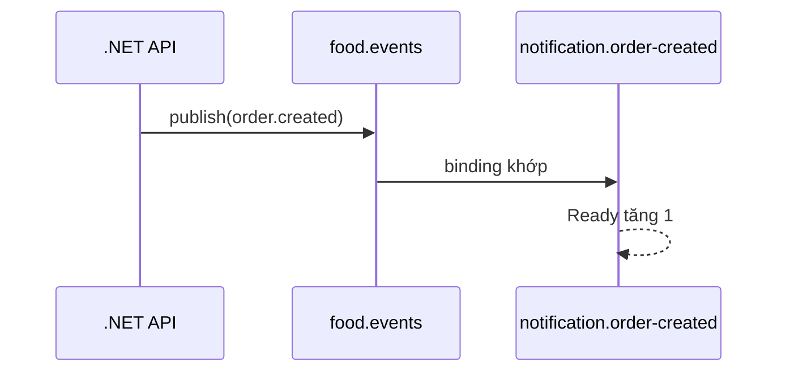

Nếu routing key không có binding, `mandatory = true` làm broker return message với `NO_ROUTE`.

Nếu bỏ `mandatory`, broker vẫn có thể chấp nhận publish rồi loại message vì không có đích. Publisher Confirm và mandatory routing giải quyết hai câu hỏi khác nhau:

- Confirm: broker đã nhận trách nhiệm cho publish chưa?
- Mandatory return: message có được route vào ít nhất một queue không?

## 7. Work Queue và competing consumers

Khi hai instance cùng consume `notification.order-created`, RabbitMQ phân phối các message trong queue giữa chúng. Đây là scale-out của một logical consumer.

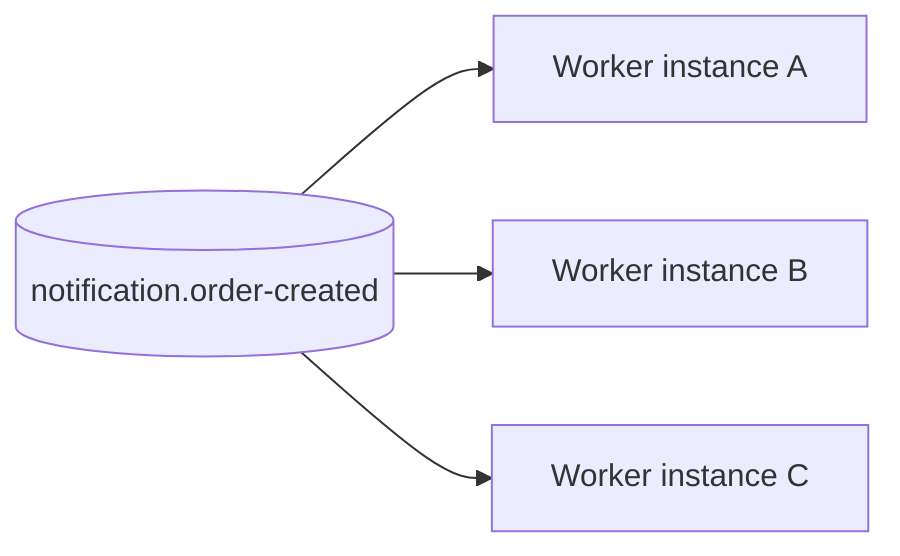

Ba instance không nhận ba bản sao. Muốn reporting cũng nhận `order.created`, reporting phải có queue riêng bind cùng exchange. Queue là subscription durability boundary; consumer instance chỉ là capacity của subscription đó.

## 8. Message Acknowledgement

Automatic ACK xóa trách nhiệm của broker ngay khi delivery được gửi. Nếu process dừng trong lúc gửi email hoặc commit MySQL, message đã mất. Manual ACK cho phép application quyết định lúc nào effect đủ bền vững.

Thiết kế trực giác khác là ACK trước rồi mới commit để tránh duplicate:

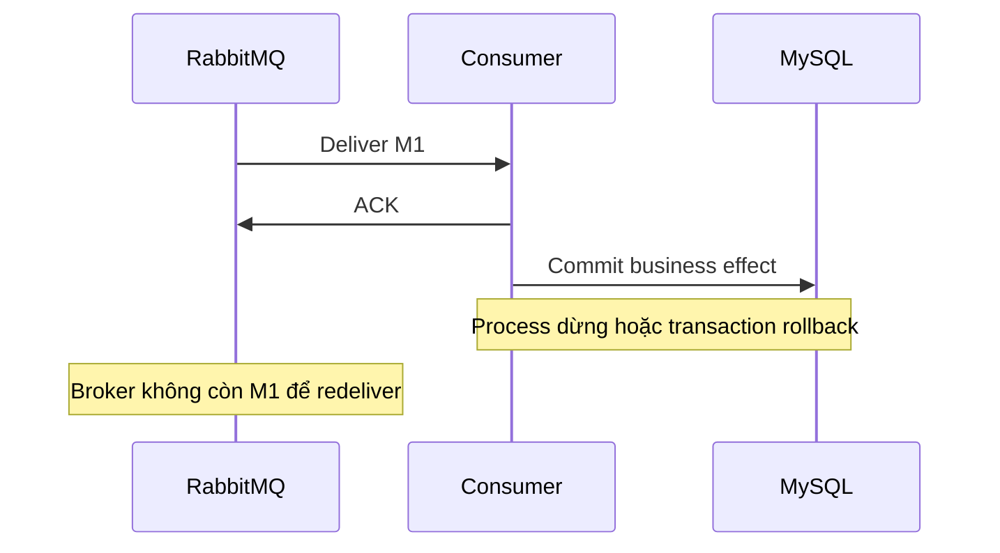

ACK trước commit đổi duplicate thành data loss. Thiết kế an toàn chọn commit trước ACK:

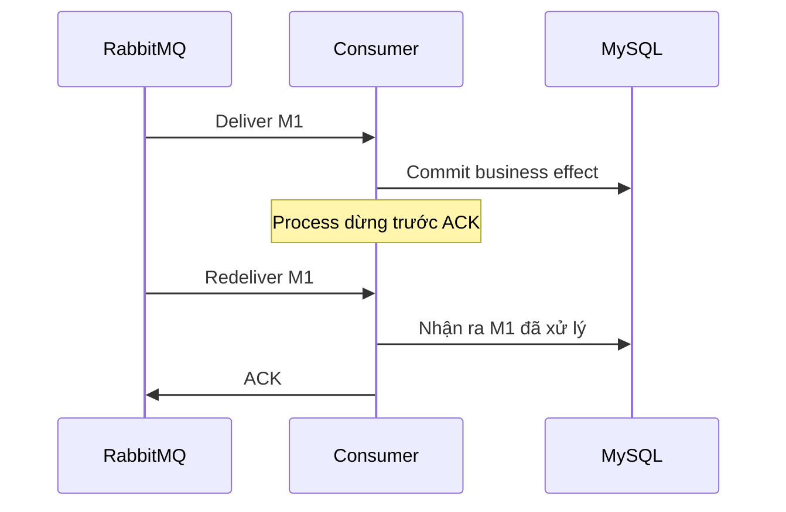

Thứ tự này có thể tạo duplicate nhưng không làm mất effect. Consumer vì thế phải nhận diện được một logical message đã xử lý trước đó.

## 9. Idempotency và Inbox

Một operation idempotent cho cùng kết quả quan sát được dù nhận cùng logical request nhiều lần. Với database consumer, Inbox lưu `MessageId` đã xử lý. Inbox insert và business mutation phải commit trong cùng transaction.

```text
BEGIN
  INSERT Inbox(consumerName, tenantId, shopId, messageId)
  UPDATE business state
COMMIT
ACK
```

Nếu Inbox và mutation nằm ở hai transaction, crash giữa chúng làm Inbox nói “đã xử lý” trong khi effect chưa tồn tại, hoặc effect tồn tại nhưng Inbox chưa ghi. Atomic boundary quan trọng hơn tên pattern.

Trong multi-tenant system, unique key không thể chỉ là `MessageId`. Scope tham chiếu an toàn cho effect theo shop là:

```text
(consumerName, tenantId, shopId, messageId)
```

Header tenant hỗ trợ truyền context và tracing, không thay authorization. Consumer vẫn phải kiểm tra tenant/shop scope trong EF query, Dapper predicate, cache key và database constraint.

Side effect ngoài MySQL cần idempotency tại provider boundary. Inbox không thể rollback email hoặc payment request đã rời process.

Nếu provider hỗ trợ idempotency key, consumer dùng logical `MessageId` hoặc business operation key. Nếu không, hệ thống cần state machine và reconciliation.

## 10. Prefetch và backpressure

`prefetch` giới hạn số delivery chưa ACK trên mỗi consumer channel. Giá trị quá thấp để worker nhàn trong lúc chờ network; quá cao giữ nhiều message trong memory và tạo burst lên MySQL.

```text
globalConsumers = instanceCount × consumersPerInstance
maximumUnacked  = globalConsumers × prefetch
```

Với 4 instance, mỗi instance 8 consumer, prefetch 32:

```text
globalConsumers = 4 × 8 = 32
maximumUnacked  = 32 × 32 = 1.024
```

Reference load ghi nhận `Unacked = 1.024`. Kết quả này cho thấy parameter đã tạo đúng concurrency envelope dự tính; nó không chứng minh 32 là cấu hình tối ưu.

Ceiling tiếp theo nằm ở MySQL connection pool và downstream safe concurrency. Tăng worker khi database đã bão hòa chỉ làm transaction latency và lock contention tăng.

## 11. Retry và Dead Letter Queue

Retry phù hợp với lỗi có khả năng tự hết:

- network timeout;
- downstream `503`;
- deadlock hoặc lock wait timeout.

Contract version không hỗ trợ, validation failure và business resource không tồn tại là permanent failure. Retry chúng vô hạn chỉ làm queue nghẽn.

NACK rồi requeue ngay vào cùng queue có thể tạo hot loop: consumer nhận lại cùng poison message liên tục và không còn capacity cho message tốt. Một retry topology thêm delay:

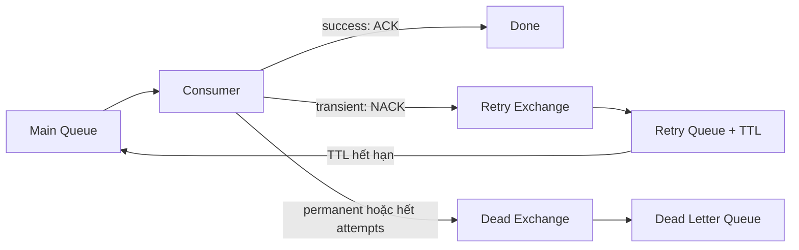

Mỗi retry policy cần `maxAttempts`, delay/backoff, execution timeout và terminal state. RabbitMQ thêm `x-death` khi dead-letter.

Integration test quan sát được ba kết quả:

| Case | Kết quả |
|---|---|
| Transient failure hai lần | Thành công với `rejected=2`, `expired=2` |
| Permanent failure | Vào DLQ ở attempt đầu |
| Poison message | Vào DLQ sau attempt thứ ba |

Khi application tự publish message sang DLQ để bổ sung failure metadata, phải chờ Publisher Confirm của DLQ trước khi ACK delivery gốc. Nếu ACK trước rồi DLQ publish thất bại, error handling lại trở thành nguồn làm mất message.

## 12. Dual-write và Publisher Confirm

Publisher Confirm cho biết broker đã nhận message. Use case tạo đơn vẫn phải thực hiện hai thao tác độc lập: ghi MySQL và publish RabbitMQ.

```text
COMMIT DonHang
publish DonHangDaTao
```

Process có thể dừng giữa hai dòng. Đổi thứ tự không giúp được:

```text
publish DonHangDaTao
ROLLBACK DonHang
```

Consumer nhận event cho một đơn chưa từng tồn tại. MySQL transaction không thể tự động bao trùm RabbitMQ publish. Đây là dual-write problem.

## 13. Transactional Outbox

Outbox ghi business state và intent phát event trong cùng MySQL transaction:

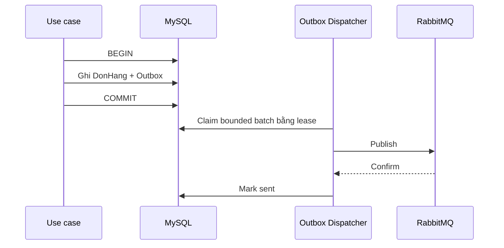

Outbox không tạo exactly-once. Nếu dispatcher dừng sau Confirm nhưng trước `mark sent`, lease hết hạn và message được publish lại.

Outbox chọn “không mất intent, có thể duplicate”. Inbox hoàn thiện cặp thiết kế bằng cách biến duplicate thành no-op.

Nhiều dispatcher dùng bounded batch với các thành phần:

- `FOR UPDATE SKIP LOCKED`;
- `lockedBy`;
- `lockedUntilUtc`.

`SKIP LOCKED` phù hợp với Outbox vì các row độc lập và không yêu cầu thứ tự tuyệt đối. Lease cho phép instance khác reclaim khi worker dừng.

Reference test từng phát hiện index claim sai làm bốn worker nhận batch `[25, 0, 0, 0]`. Index chứa `lockedUntil` trước các cột order, khiến MySQL không phân phối query như dự tính.

Index sau đó được đổi theo filter và stable order:

```text
(runId, sentAt, occurredAt, messageId)
```

Bốn worker sau thay đổi claim đủ 100 intent. `SKIP LOCKED` chỉ tạo concurrency tốt khi execution plan và batch distribution cũng phù hợp.

Production base chưa thêm Outbox table/dispatcher vì chưa có business write sở hữu event. Tạo schema và worker chung chung từ trước sẽ buộc business sau này thích nghi với một contract chưa được xác định.

## 14. Ordering trong hệ thống đa instance

RabbitMQ giữ thứ tự trong phạm vi hẹp. Retry, redelivery và nhiều consumer có thể khiến completion order khác publish order.

Hai event `DonHangDaXacNhan(version=3)` và `DonHangDaHuy(version=4)` không nên dựa vào thời điểm arrival để quyết định state.

Event thay đổi aggregate state cần mang aggregate version. Transaction consumer chỉ áp dụng version hợp lệ hoặc bỏ qua stale event.

Nếu business bắt buộc serialize theo một key, hệ thống có thể partition topology hoặc dùng database coordination. Cả hai lựa chọn đều làm giảm parallelism và tăng chi phí vận hành.

Global ordering không cần thiết khi invariant chỉ yêu cầu per-aggregate ordering.

Process-local `lock` không bảo vệ dữ liệu dùng chung giữa nhiều instance. Correctness đa instance phải dựa trên database constraint, conditional update, row lock hoặc coordinator phân tán có failure model rõ ràng.

## 15. Tính nhất quán của tồn kho nhiều lô

Giả sử tồn còn 10, hai đơn đồng thời mỗi đơn đặt 7. Hai consumer cùng đọc 10 rồi cùng ghi 3 tạo lost update: hệ thống đã chấp nhận 14 nhưng số dư chỉ giảm 7. RabbitMQ không giải quyết race này.

Với nhiều lô, strict FEFO yêu cầu chọn lô hết hạn sớm trước:

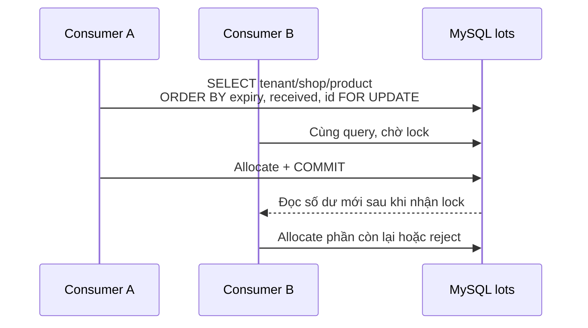

Mọi transaction lock candidate lots theo cùng thứ tự:

```text
expiresAt → receivedAt → id
```

`SKIP LOCKED` có thể bỏ qua lô sớm nhất đang bị transaction khác khóa và chọn lô muộn hơn. Cơ chế này tăng throughput nhưng thay đổi business semantics, nên không phù hợp với strict FEFO.

Với 100 shop và 100.000 thẻ kho, query bắt đầu bằng composite index theo `tenant + shop + product`, sau đó mới tới sort key.

Reference run dùng một hot `shop + product` chứa 500 lô. Query lấy 10 candidate mất khoảng `0,21 ms` và không scan toàn bộ 100.000 row.

Con số này mô tả môi trường test, không phải production SLA.

## 16. Quorum Queue và RabbitMQ Cluster

Durable queue trên một node vẫn không chịu được node failure. Quorum queue sao chép message theo majority giữa các RabbitMQ node.

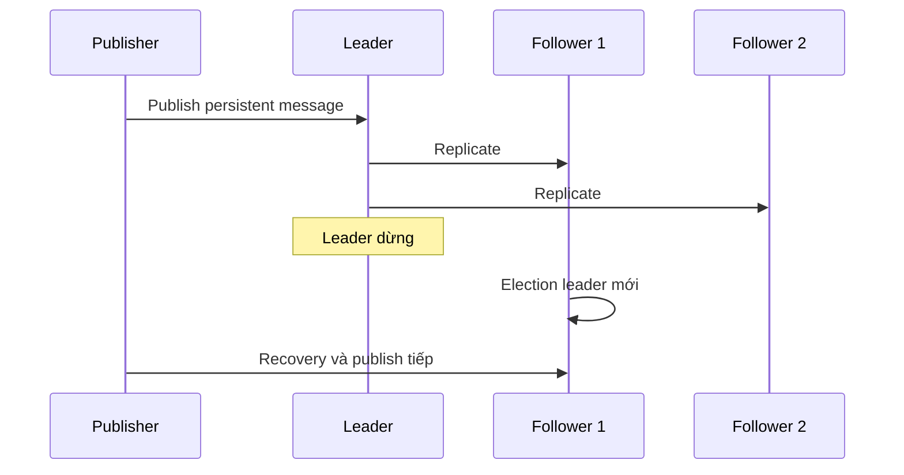

Reference test dùng cluster ba node và dừng leader trong lúc publish.

| Kết quả | Giá trị |
|---|---:|
| Thời gian bầu leader mới | khoảng 1,41 giây |
| Logical message | 2.000 |
| Message thiếu | 0 |
| Message trùng | 0 |

Kết quả chỉ chứng minh fault đã mô phỏng. Network partition, disk exhaustion và lỗi rolling upgrade cần các profile riêng.

Production quorum topology thường cần tối thiểu ba node trải trên failure domain phù hợp. Replication phải đi cùng disk/memory alarm, partition monitoring, capacity và runbook.

Cluster không thay thế backup. Replication có thể sao chép cả thao tác xóa hoặc dữ liệu sai.

## 17. Load Testing và Business Invariant

Reference reliability profile:

```text
100 shop
100.000 logical message
3 publisher
32 consumer
prefetch 32
5% duplicate publish
2% transient failure
1% crash sau business commit, trước ACK
```

| Metric | Kết quả |
|---|---:|
| Physical messages | 105.000 |
| Inbox rows | 100.000 |
| Business effects | 100.000 |
| Duplicate business effects | 0 |
| Missing logical messages | 0 |
| Transient failures | 2.000 |
| Post-commit crashes | 1.000 |
| Redeliveries | 3.000 |
| Publish duration | 242,40 giây |
| Consume duration | 113,19 giây |
| Tổng thời gian | khoảng 5 phút 57 giây |

Hot shop nhận 50% message. Thiết kế đầu tiên cập nhật một counter row duy nhất cho mỗi shop.

Smoke test 1.000 message khi đó mất khoảng 33,4 giây. Sau khi effect được chia theo `shop + inventory bucket`, cùng profile giảm xuống khoảng 4–10 giây tùy lần chạy.

Sự khác biệt không đến từ RabbitMQ tuning. Database model ban đầu biến một shop thành hot row, khiến consumer xếp hàng ở row lock.

Load test vì thế phải kiểm tra transaction latency, lock wait, connection pool và business outcomes. Chỉ số messages/second không thể giải thích bottleneck này.

### Gộp yêu cầu tính lại thẻ kho theo InventoryKey

Một message không nhất thiết phải tương ứng với một lần tính lại toàn bộ thẻ kho. Với một `InventoryKey` có 50.000 thẻ, 101 message liên tiếp sẽ tạo ra 5.050.000 lượt xử lý row nếu consumer chạy phép tính sau mỗi lần nhận message.

Phép thử dùng một durable intent trong MySQL. Consumer chỉ tăng `RequestedVersion`, cập nhật thời điểm yêu cầu gần nhất, commit rồi ACK. Worker chờ `Debounce = 200 ms`, nhưng không chờ quá `MaxWait = 2 s`, sau đó chụp version hiện tại và tính lại 50.000 thẻ. Message version 101 được phát đúng lúc pass đầu đã bắt đầu.

```text
50.000 stock cards
100 messages trong initial burst
1 message phát sinh giữa recalculation
Debounce: 200 ms
MaxWait: 2 s
```

Một lần chạy tham chiếu cho kết quả:

| Metric | Kết quả |
|---|---:|
| Message đã ACK | 101/101 |
| Queue Ready / Unacked khi kết thúc | 0 / 0 |
| RequestedVersion / CompletedVersion | 101 / 101 |
| Version nhỏ nhất / lớn nhất trên 50.000 thẻ | 101 / 101 |
| Row đã cập nhật trước khi message 101 được ACK | 5.000 |
| Số lần recalculation | 2 |
| Khối lượng baseline tương đương | 5.050.000 row visits |
| Khối lượng coalescing thực tế | 100.000 row updates |
| Thời gian ACK initial burst | khoảng 1,73 giây |
| Thời gian ACK message cuối | khoảng 18 ms |
| Tổng thời gian | khoảng 2,61 giây |

`MaxWait` có thể hết hạn trước khi toàn bộ burst được consume. Khi đó pass đầu xử lý một version nhỏ hơn 100; đây là giới hạn độ trễ có chủ đích, không phải mất message. Vì `RequestedVersion` vẫn tiếp tục tăng trong MySQL, worker chạy pass kế tiếp cho version mới nhất. Điều kiện hoàn thành là `CompletedVersion = RequestedVersion`, không phải “mỗi message tạo một pass”.

Deadline được tính hoàn toàn bằng clock của MySQL. Trộn `UTC_TIMESTAMP()` trong database với clock của application process làm debounce phụ thuộc clock skew giữa các máy và đã tạo kết quả không ổn định trong lần thử đầu.

Chạy lại profile:

```powershell
$env:RABBIT_INVENTORY_COALESCING='1'
dotnet test backend/FoodDelivery.Infrastructure.Tests/FoodDelivery.Infrastructure.Tests.csproj --filter FullyQualifiedName~InventoryRecalculationCoalescingTests
```

Phép thử này chạy coalescing thật trên RabbitMQ, MySQL và xác nhận cardinality đúng 50.000 row. Worker cập nhật 5.000 row đầu tiên rồi mới phát tín hiệu để message 101 được publish và ACK; 45.000 row còn lại của pass đầu được xử lý sau thời điểm đó. Tổng `100.000 row updates` lấy từ affected rows của MySQL, không phải giá trị suy ra từ cấu hình.

Giá trị baseline là khối lượng công việc tương đương `101 × 50.000`, không phải thời gian đo từ stored procedure hiện có. Muốn so sánh latency của procedure cần chạy chính procedure đó trên schema và execution plan của hệ thống sở hữu dữ liệu.

## 18. RabbitMQ Management UI

Dashboard biểu diễn technical state của broker:

| Giá trị | Cách đọc |
|---|---|
| `Ready` | Message trong queue chưa được giao |
| `Unacked` | Message đã giao nhưng chưa ACK |
| `Total` | `Ready + Unacked` |
| `Consumers` | Số consumer đang subscribe |
| Publish rate | Tốc độ message đi vào exchange |
| Deliver rate | Tốc độ broker giao message |
| ACK rate | Tốc độ consumer xác nhận |
| Redelivered | Delivery đã được giao lại |

`Ready` tăng liên tục nghĩa là arrival rate lớn hơn completion rate. Trước khi tăng worker, kiểm tra ACK rate, handler duration, MySQL pool và downstream latency.

`Unacked` chạm đúng trần `consumer × prefetch` cho thấy capacity đang nằm trong handler/downstream. Tăng prefetch lúc này thường chỉ tăng memory và thời gian message nằm ngoài queue.

Redelivery tăng có thể đến từ process restart, connection recovery, NACK hoặc crash sau commit. Nó không tự nói business effect bị duplicate; cần đối chiếu Inbox deduplication metrics.

DLQ tăng cần phân loại failure trước khi requeue. Bulk requeue poison message khi code chưa sửa chỉ đưa sự cố quay lại main queue.

Management UI không phải business audit. `ACK` không chứng minh email tới người nhận, tiền đã thu hoặc tồn kho đúng. Business state vẫn nằm trong database và external provider outcome.

## 19. Capacity planning

Load parameter xuất phát từ traffic và downstream ceiling:

```text
messageCount       = peakArrivalRate × testDuration
requiredThroughput = peakArrivalRate × headroom
globalConsumers    = instanceCount × consumersPerInstance
maximumUnacked     = globalConsumers × prefetch
```

Sau đó áp constraint:

```text
globalConsumers ≤ DB connections dành cho worker
globalConsumers ≤ downstream safe concurrency
```

Peak 500 message/giây trong 10 phút tạo 300.000 message. Với headroom 40%, target drain rate là 700 message/giây.

Target này là đầu vào để thử số consumer. Một cấu hình lấy từ môi trường khác không thể trở thành production default nếu chưa được đo lại.

Mỗi profile cần ghi lại:

- environment và CPU/RAM;
- broker topology và MySQL configuration;
- payload size và persistence mode;
- confirm mode, consumer count và prefetch;
- failure injection.

Nếu thiếu các dữ kiện này, hai con số throughput không thể được so sánh có ý nghĩa.

## 20. Production Checklist cho .NET 6

Trước khi phát event nghiệp vụ đầu tiên:

- contract có `MessageId`, stable event name, version, timestamp, correlation và tenant context;
- connection được tái sử dụng theo process, channel có owner rõ ràng;
- exchange và queue durable, message persistent nếu yêu cầu survive restart;
- Publisher Confirm và mandatory routing được xử lý thành failure quan sát được;
- manual ACK chỉ xảy ra sau durable business outcome;
- consumer idempotency được kiểm chứng bằng duplicate delivery thật;
- retry phân biệt transient/permanent, có giới hạn và DLQ;
- business write bắt buộc phát event dùng Outbox;
- Inbox và mutation dùng cùng MySQL transaction;
- tenant/shop scope có mặt trong query, cache key và unique constraint;
- global concurrency không vượt DB/downstream ceiling;
- metrics, alert và runbook đã tồn tại trước khi tăng instance;
- secret không nằm trong source control; production dùng TLS và least privilege;
- producer/consumer hỗ trợ contract compatibility trong rolling deployment.

Foundation hiện chạy trên .NET 6 và `RabbitMQ.Client 7.2.2`.

.NET 6 đã hết vòng đời hỗ trợ. Dự án vẫn giữ target đã chốt, nhưng production roadmap cần kế hoạch nâng runtime.

Việc nâng runtime không làm thay đổi các invariant về ACK, idempotency, Outbox hoặc concurrency.

## 21. Phạm vi của Production Foundation

Đã có trong `FoodDelivery.Infrastructure`:

- validated `RabbitMqOptions`;
- một long-lived connection manager trên mỗi process;
- confirmed persistent publisher với mandatory routing;
- integration-event wire metadata;
- automatic connection/topology recovery;
- readiness health check;
- integration tests chạy với RabbitMQ thật.

Chưa đưa vào production:

- business queue và consumer;
- Outbox/Inbox schema cùng dispatcher;
- retry/DLQ topology;
- aggregate version handler;
- inventory allocator và strict FEFO.

Những phần này không bị bỏ quên. Chúng đang ở test-only reference implementation để chứng minh failure model trước khi business module thật xác định transaction, table ownership và contract.

## 22. Thuật ngữ

| Keyword | Ý nghĩa |
|---|---|
| Message broker | Hạ tầng nhận, định tuyến, lưu và giao message |
| Producer | Thành phần publish message |
| Consumer | Thành phần xử lý delivery |
| Connection | TCP connection dài hạn tới RabbitMQ node |
| Channel | Phiên AMQP logical trên connection |
| Exchange | Thành phần định tuyến message |
| Queue | Durable subscription và nơi giữ message |
| Binding | Rule nối exchange với queue |
| Routing Key | Giá trị dùng cho routing |
| Publisher Confirm | Phản hồi broker đã nhận trách nhiệm publish |
| ACK/NACK | Xác nhận thành công hoặc từ chối delivery |
| Prefetch | Giới hạn số delivery chưa ACK |
| Redelivery | Message được giao lại |
| DLQ | Queue giữ message không thể xử lý tự động |
| Outbox | Intent publish được ghi cùng business transaction |
| Inbox | Idempotency record của consumer |
| Quorum queue | Queue replicated theo majority |
| FEFO | Xuất lô hết hạn sớm trước |
| Poison message | Message luôn thất bại với handler hiện tại |

## 23. Tài liệu tham khảo

- [RabbitMQ Tutorials](https://www.rabbitmq.com/tutorials) — học topology theo thứ tự Hello World, Work Queue, Publish/Subscribe và Routing.
- [AMQP 0-9-1 Model Explained](https://www.rabbitmq.com/tutorials/amqp-concepts) — bản chất exchange, queue, binding, ACK và prefetch.
- [RabbitMQ .NET Client Guide](https://www.rabbitmq.com/client-libraries/dotnet-api-guide) — connection, channel, recovery và concurrency của .NET client.
- [Consumer Acknowledgements and Publisher Confirms](https://www.rabbitmq.com/docs/confirms) — hai chiều reliability độc lập.
- [Quorum Queues](https://www.rabbitmq.com/docs/quorum-queues) — replication, majority và failure behavior.
