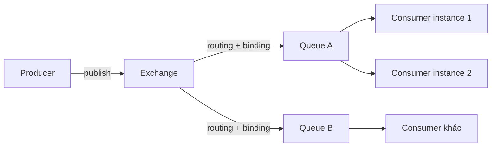
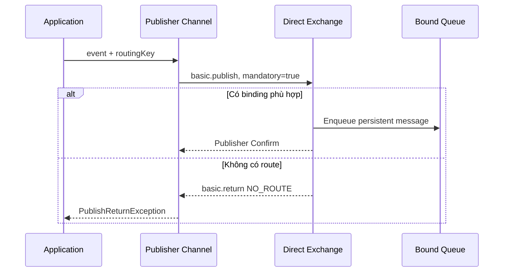
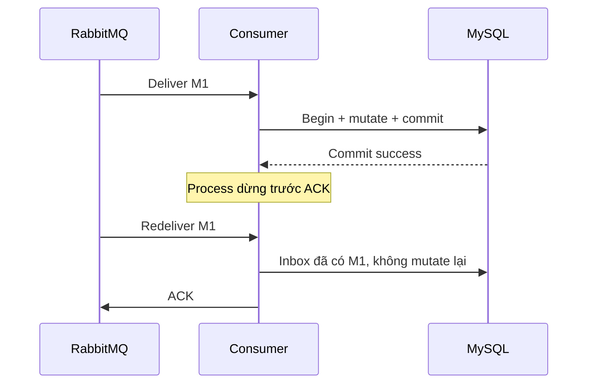
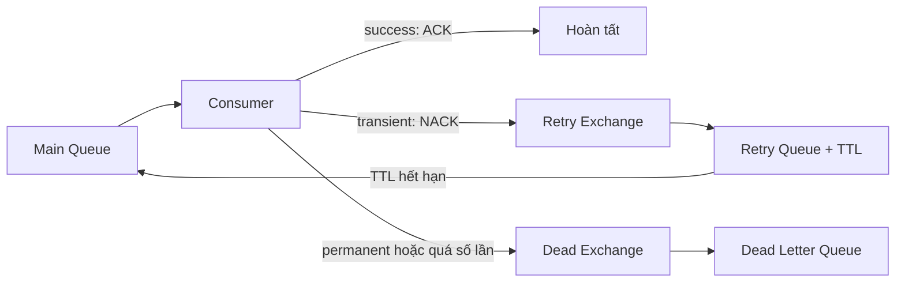
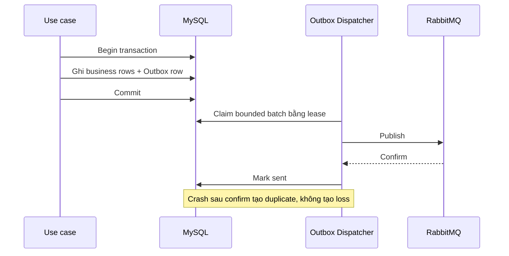
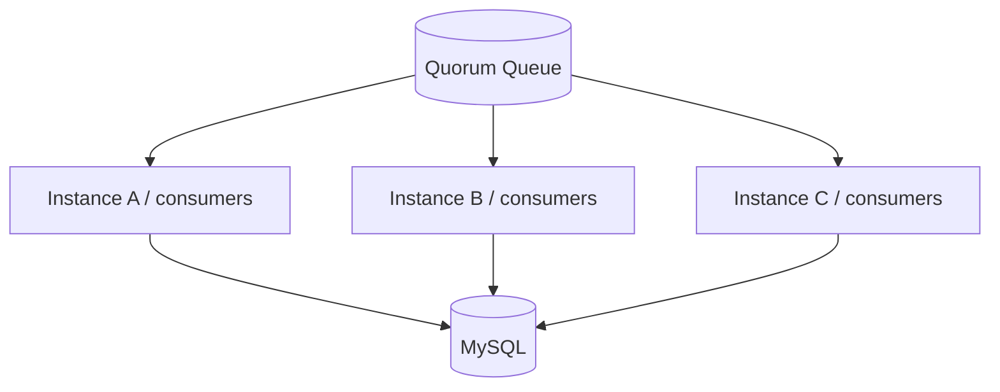
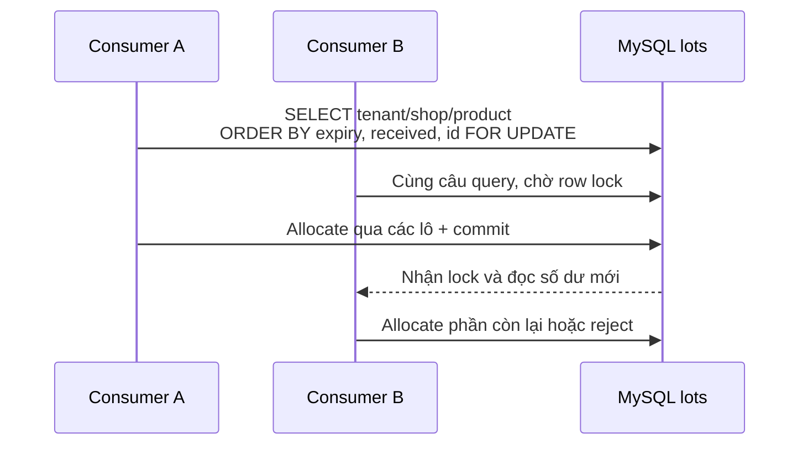
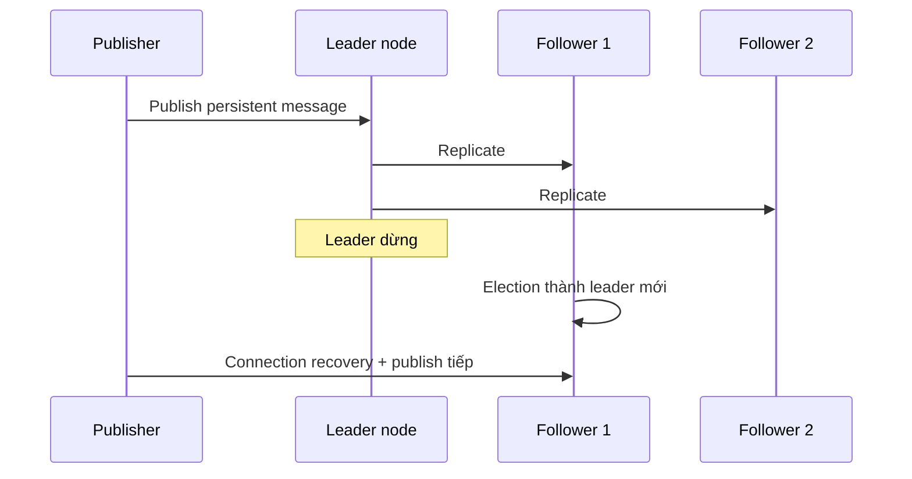

# RabbitMQ và Reliable Messaging

## 1. Từ business invariant tới Job Queue

Một HTTP request nên hoàn thành những việc quyết định kết quả trả về cho client. Những tác vụ có thể thực hiện sau như gửi thông báo, đồng bộ search index hoặc chuyển dữ liệu sang một service khác không cần giữ request mở. Job Queue tách thời điểm ghi nhận công việc khỏi thời điểm thực thi công việc đó.

RabbitMQ là message broker. Producer gửi message tới broker; broker định tuyến message vào queue; consumer nhận và xác nhận kết quả xử lý. Broker giải quyết việc vận chuyển message giữa các boundary độc lập. Nó không thay business database, không tự tạo transaction xuyên MySQL và RabbitMQ, cũng không tự bảo đảm một side effect chỉ xảy ra đúng một lần.

Business case xuyên suốt là hệ thống đặt đồ ăn multi-tenant. Đơn hàng thuộc shop; menu có thể thuộc tenant và đồng bộ xuống chi nhánh; tồn kho tương lai có thể được theo dõi theo nhiều lô. Các case này dùng để làm rõ invariant, không có nghĩa toàn bộ module đã tồn tại trong production base.

## 2. Runtime architecture



`Connection` là TCP connection dài hạn giữa application process và RabbitMQ node. Tạo connection cho từng message gây handshake, socket churn và làm recovery khó kiểm soát. Foundation sử dụng một connection cho mỗi process.

`Channel` là phiên AMQP logical chạy trên connection. Channel nhẹ hơn connection nhưng không nên bị nhiều thread publish đồng thời nếu code không quản lý correlation của confirm. Publisher hiện tại giữ một channel và serialize thao tác publish. Đây là lựa chọn đơn giản nhất có ownership rõ ràng; channel pool chỉ cần thiết khi throughput đã đo không đạt target.

`Exchange` nhận message từ producer và quyết định queue đích. `Queue` lưu message chờ consumer. `Binding` nối exchange với queue theo routing rule. Foundation dùng durable `direct exchange`: routing key phải khớp binding key.

## 3. Publish path và routing



`persistent message` yêu cầu broker lưu message theo đặc tính của durable queue. `durable exchange/queue` tồn tại qua broker restart. Cả hai phải đi cùng nhau; persistent message gửi vào transient queue vẫn không tạo durable pipeline.

`mandatory = true` bảo vệ lỗi cấu hình routing. Nếu không có queue phù hợp, broker return message để publisher quan sát. Publisher Confirm trả lời câu hỏi khác: broker đã chấp nhận trách nhiệm đối với publish hay chưa. Confirm không có nghĩa consumer đã nhận hoặc business transaction của consumer đã commit.

Wire metadata hiện tại:

| Field | Vai trò |
|---|---|
| `MessageId` | Identity dùng cho idempotency và tracing |
| `Type` | Tên integration event |
| `ContentType` | `application/json` |
| `DeliveryMode` | Persistent |
| `CorrelationId` | Nối request, event và log |
| `x-event-version` | Version của contract |
| `x-tenant-id` | Tenant context phục vụ routing/tracing |

## 4. Consumer lifecycle, ACK và prefetch

Consumer nhận delivery ở trạng thái chưa xác nhận. Sau khi business transaction commit, consumer gửi `ACK`; với lỗi có thể retry, consumer `NACK` theo retry policy; với lỗi vĩnh viễn, message đi tới Dead Letter Queue.



ACK trước commit tạo cửa sổ mất effect: broker xóa message nhưng transaction sau đó rollback. Commit trước ACK tạo cửa sổ duplicate: transaction thành công nhưng broker chưa biết và redeliver. Chọn commit trước ACK, rồi làm consumer idempotent.

`prefetch` giới hạn số message chưa ACK trên mỗi consumer channel. Với `instanceCount × consumersPerInstance × prefetch`, upper bound của Unacked gần đúng là:

```text
maximumUnacked = instanceCount × consumersPerInstance × prefetch
```

Ví dụ 4 instance, mỗi instance 8 consumer và prefetch 32 cho phép tối đa khoảng `4 × 8 × 32 = 1.024` message Unacked. Tăng prefetch không tạo thêm database capacity; nó chỉ đưa nhiều work vào memory và kéo dài thời gian message bị giữ bởi consumer.

## 5. Delivery guarantee và idempotency

Reliable RabbitMQ consumer được thiết kế theo `at-least-once`: logical message có thể xuất hiện nhiều physical delivery. `exactly-once side effect` không đến từ broker; nó được xây tại nơi side effect được commit.

Với mutation trong MySQL, Inbox record và mutation phải dùng cùng transaction. Unique key cần mang đúng scope:

```text
(consumerName, tenantId, shopId, messageId)
```

Nếu insert Inbox thành công nhưng mutation nằm ở transaction khác, crash giữa hai transaction có thể làm lần retry thấy Inbox và bỏ qua mutation chưa từng xảy ra. Nếu mutation commit trước Inbox, crash có thể làm mutation lặp lại.

Side effect bên ngoài như payment hoặc email cần idempotency key do provider hỗ trợ, hoặc một state machine lưu request/outcome. Inbox chỉ bảo vệ transaction của database chứa nó; Inbox không thể rollback một API call đã rời process.

## 6. Retry, DLQ và poison message



Retry chỉ dành cho lỗi có khả năng tự hết: network timeout, downstream `503`, deadlock hoặc lock wait timeout có bounded policy. Validation failure, contract không hỗ trợ và resource không tồn tại theo business rule là permanent failure; retry chúng chỉ đốt capacity.

Retry queue dùng TTL rồi dead-letter message trở lại main queue. RabbitMQ thêm `x-death`; trong test transient lỗi hai lần rồi thành công, header quan sát được là `rejected=2` và `expired=2`. Permanent failure đi DLQ ngay ở attempt đầu; poison message đi DLQ sau attempt thứ ba. Trước khi ACK bản gốc để chuyển sang DLQ, publisher phải nhận confirm cho bản sao ở DLQ, nếu không failure path lại có thể làm mất message.

Không tạo retry loop không giới hạn. Mỗi policy phải có `maxAttempts`, delay/backoff, timeout và terminal state. DLQ là hàng chờ điều tra, không phải nơi chôn message: operator cần biết failure reason, event type/version, tenant/shop, first/last failure và correlation.

## 7. Dual-write và Transactional Outbox

Thiết kế trực giác thường commit đơn hàng rồi publish:

```text
INSERT DonHang → COMMIT → publish DonHangDaTao
```

Process dừng sau commit nhưng trước publish làm mất intent. Đảo thứ tự cũng không đúng: publish trước rồi transaction rollback tạo event cho một đơn không tồn tại.



Outbox biến hai thao tác không atomic thành một local atomic write cộng một quy trình delivery có thể lặp. Dispatcher nhiều instance dùng bounded batch, `FOR UPDATE SKIP LOCKED`, `lockedBy` và `lockedUntilUtc`. Lease hết hạn cho phép instance khác reclaim khi worker dừng.

Một lỗi thực tế trong reference test cho thấy index claim sai có thể vô hiệu hóa concurrency. Index gồm `lockedUntil` trước cột sort khiến bốn worker nhận batch `[25, 0, 0, 0]`. Index claim được sửa theo filter và order ổn định `(runId, sentAt, occurredAt, messageId)`; kết quả trở thành bốn batch đủ 100 intent. Bài học không phải “luôn FORCE INDEX”, mà là kiểm tra execution plan và distribution thật khi query vừa lock, vừa order, vừa limit.

## 8. Multi-instance và ordering



Các consumer cạnh tranh lấy message; scale instance làm tăng concurrency toàn cục. Broker không bảo đảm hai event của cùng Aggregate luôn tới cùng consumer khi redelivery hoặc recovery xảy ra. Event thay đổi state nên mang `aggregateVersion`; database chỉ áp dụng transition hợp lệ và từ chối stale version.

Không dùng process-local lock để bảo vệ dữ liệu dùng chung. `lock` trong C# chỉ phối hợp thread của một instance. Invariant đa instance phải nằm ở database constraint, conditional update, row lock hoặc một coordinator phân tán có failure model rõ ràng.

## 9. Multi-tenancy

Message contract cần chứa tenant và, khi nghiệp vụ thuộc shop, shop identity. Exchange/queue không nhất thiết tách vật lý theo từng tenant trong phase đầu; một topology dùng chung với logical isolation thường vận hành đơn giản hơn. Tách queue theo tenant chỉ khi cần isolation về throughput, compliance hoặc deployment, vì 100 tenant nhân nhiều event type có thể tạo topology lớn và khó giám sát.

Consumer phải dựng tenant context trước khi gọi application logic. Mọi Dapper SQL, EF query filter, cache key, Inbox key và unique constraint đều cần đúng scope. Một header đúng không bù được query thiếu `WHERE TenantId = @tenantId AND ShopId = @shopId`.

## 10. Tồn kho nhiều lô và strict FEFO

Giả sử hai đơn đồng thời đặt cùng sản phẩm, tồn còn 10 nhưng mỗi đơn yêu cầu 7. Hai worker cùng đọc 10 rồi cùng ghi 3 là lost update: hệ thống đã nhận 14 nhưng số dư chỉ phản ánh 7. RabbitMQ không giải quyết race này; transaction của inventory mới là correctness boundary.



Strict FEFO yêu cầu mọi transaction lock candidate lots theo cùng thứ tự `expiresAt, receivedAt, id`. `SKIP LOCKED` có thể chọn lô đến hạn muộn hơn trong lúc lô sớm nhất đang bị khóa; đó là throughput optimization làm thay đổi business semantics.

Với 100 shop và 100.000 thẻ kho, query phải bắt đầu bằng composite index theo scope và sort key. Reference run có hot `shop + product` chứa 500 lô; query lấy 10 candidate từ 500 lô mất khoảng `0,21 ms`, không scan toàn bộ 100.000 row. Con số này là evidence của môi trường test, không phải SLA production.

## 11. Quorum queue và node failure



Quorum queue sao chép message theo majority. Trong test ba node, leader bị dừng giữa lúc publish; leader mới được bầu trong khoảng `1,41 s`. Hai nghìn logical message được kiểm tra đủ, không có duplicate và không có publish failure trong lần đo. Kết quả chứng minh topology test chịu được một node failure đã mô phỏng; nó không chứng minh mọi network partition, disk exhaustion hoặc rolling upgrade đều an toàn.

Một node RabbitMQ đơn không thể cung cấp node-failure tolerance dù queue được đặt tên là durable. Production cần ít nhất ba node cho quorum queue, trải trên failure domain phù hợp, cùng monitoring disk, memory alarm và partition.

## 12. Capacity planning

Load parameter bắt đầu từ workload, không bắt đầu từ số worker tùy ý:

```text
messageCount      = arrivalRate × testDuration
globalConsumers   = instanceCount × consumersPerInstance
maximumUnacked    = globalConsumers × prefetch
requiredThroughput = peakArrivalRate × headroom
```

Database connection pool và downstream concurrency đặt ceiling thực tế:

```text
globalConsumers ≤ availableDbConnectionsForWorkers
globalConsumers ≤ downstreamSafeConcurrency
```

Reference reliability run sử dụng 100 shop, 100.000 logical message, 3 publisher, 32 consumer, prefetch 32, duplicate 5%, transient failure 2% và post-commit crash 1%. Kết quả:

| Metric | Observed value |
|---|---:|
| Physical messages published | 105.000 |
| Inbox rows | 100.000 |
| Business effects | 100.000 |
| Duplicate business effects | 0 |
| Missing logical messages | 0 |
| Transient failures | 2.000 |
| Post-commit crashes | 1.000 |
| Redeliveries | 3.000 |
| Publish duration | 242,40 s |
| Consume duration | 113,19 s |
| Total duration | khoảng 5 phút 57 giây |

Management snapshot giữa lần chạy ghi nhận 32 consumer, `Unacked=1.024`, đúng bằng `32 × prefetch 32`; main queue còn `Ready=46.855`, retry queue có 2 và DLQ bằng 0.

Một thiết kế counter duy nhất cho mỗi shop từng làm smoke test 1.000 message mất khoảng 33,4 giây vì tạo hot row ở MySQL. Chia business effect theo `shop + inventory bucket` giảm smoke run xuống khoảng 4–10 giây tùy lần chạy. Đây là ví dụ quan trọng: tăng consumer không sửa được database contention; data model phải phản ánh các aggregate có thể cập nhật độc lập.

## 13. Management UI, metrics và runbook

Management UI cho biết trạng thái broker, không cho biết business invariant đã đúng. Khi điều tra queue, đọc cùng nhau:

| Giá trị | Ý nghĩa |
|---|---|
| `Ready` | Message nằm trong queue, chưa được giao |
| `Unacked` | Message đã giao, consumer chưa ACK |
| `Total` | `Ready + Unacked` |
| `Consumers` | Số consumer đang subscribe |
| Publish/deliver/ack rate | Tốc độ theo từng stage |
| Redelivered | Delivery được đánh dấu đã giao lại |
| Memory/disk alarm | Broker đang áp dụng flow control hoặc thiếu tài nguyên |

Runbook theo triệu chứng:

- `Ready` tăng liên tục: so sánh arrival rate với ACK rate, kiểm tra downstream và database latency trước khi tăng worker.
- `Unacked` chạm trần: handler chậm, prefetch quá lớn hoặc consumer bị treo; xem transaction duration và cancellation.
- redelivery tăng: process restart, connection recovery, consumer NACK hoặc crash sau commit; kiểm tra Inbox deduplication.
- DLQ tăng: phân loại contract/permanent/transient, không bulk requeue khi chưa sửa nguyên nhân.
- publisher latency tăng: kiểm tra broker alarm, disk, quorum health, network và confirm timeout.

## 14. Security, deployment và compatibility

- Dùng TLS và secret store ngoài source control trong production.
- Mỗi application có user/vhost và quyền configure/write/read tối thiểu.
- Không public Management UI; đặt sau authentication, network policy hoặc VPN.
- Producer và consumer phải hỗ trợ contract version trong thời gian rolling deployment.
- Queue/exchange policy được quản lý như deployment configuration, có review và rollback.
- Readiness kiểm tra dependency cần thiết; liveness không nên kill process chỉ vì một dependency tạm thời lỗi.

Foundation chạy trên .NET 6 với `RabbitMQ.Client 7.2.2`. Trước production phải kiểm tra compatibility giữa .NET runtime, client, RabbitMQ server và deployment platform. .NET 6 đã hết support nên rủi ro runtime cần được quản lý trong roadmap nâng cấp, nhưng base hiện vẫn giữ đúng version dự án đã chốt.

## 15. .NET 6 foundation

Application chỉ sở hữu abstraction và contract:

```csharp
public interface IIntegrationEventPublisher
{
    Task PublishAsync<TEvent>(
        TEvent integrationEvent,
        string routingKey,
        CancellationToken cancellationToken = default)
        where TEvent : IIntegrationEvent;
}
```

Infrastructure sở hữu RabbitMQ client, connection lifecycle, exchange declaration và wire metadata. Publisher bật confirm tracking, publish với `mandatory: true` và dùng một `SemaphoreSlim` bảo vệ channel. Readiness gọi connection manager và chỉ healthy khi connection đang mở.

Foundation không có generic message bus, consumer factory, topology DSL hoặc serializer registry. Một publisher implementation đủ cho requirement hiện tại; abstraction khác chỉ được thêm khi xuất hiện consumer và business contract thật.

## 16. Business case catalogue

| Business case | Failure cần tái hiện | Invariant và mechanism |
|---|---|---|
| Tạo đơn rồi thông báo shop | Crash giữa DB commit và publish | Transactional Outbox |
| Consumer crash sau trừ tồn | Broker redeliver | Inbox + mutation cùng transaction |
| Hai đơn tranh cùng 10 sản phẩm | Lost update | Row lock/conditional update |
| Xuất kho nhiều lô | Chọn lô muộn khi lô sớm bị lock | Deterministic `FOR UPDATE`, không `SKIP LOCKED` nếu strict FEFO |
| Hai tenant cùng `MessageId` | Inbox key collision | Unique key đủ tenant/shop scope |
| Dapper consumer thiếu predicate | Cross-tenant update | Tenant/shop predicate bắt buộc tại query boundary |
| Event cũ đến sau event mới | State regression | Aggregate version + conditional transition |
| Downstream timeout | Retry tạo duplicate side effect | Bounded retry + idempotency key |
| Contract không hỗ trợ | Retry vô hạn | Permanent failure → DLQ |
| Một broker node dừng | Queue unavailable hoặc mất message | Ba-node quorum + recovery + monitoring |
| Scale API replicas | Background concurrency tăng ngoài ý muốn | Tính global concurrency và tách worker deployment khi cần |

## 17. Verification đã thực hiện

Các kết luận trong chương được lấy từ test chạy trên MySQL 8 và RabbitMQ thật, không dùng mock cho ACK, redelivery, retry hoặc quorum failover:

- baseline tái hiện lost intent, ACK-before-commit và lost update;
- correctness suite Outbox/Inbox/strict FEFO chạy ổn định 20/20;
- retry/DLQ suite chạy ổn định 20/20;
- multi-instance Outbox suite chạy ổn định 20/20;
- reference load 100.000 persistent message không thiếu logical intent và không tạo duplicate business effect;
- quorum failover ba node giữ đủ 2.000 logical message trong lần đo.

Chi tiết môi trường và output nằm trong `backend/test-results/rabbitmq`. Mỗi kết quả là một reference point để so sánh regression, không phải capacity recommendation cho production hardware khác.

## 18. Keyword reference

| Keyword | Nghĩa trong kiến trúc này |
|---|---|
| Producer | Thành phần publish message |
| Consumer | Thành phần nhận và xử lý delivery |
| Connection | TCP connection dài hạn tới broker |
| Channel | Phiên AMQP logical trên connection |
| Exchange | Thành phần định tuyến message |
| Queue | Nơi giữ message chờ consumer |
| Binding | Quy tắc nối exchange với queue |
| Routing key | Giá trị exchange dùng để định tuyến |
| Publisher Confirm | Phản hồi broker đã nhận trách nhiệm publish |
| ACK/NACK | Xác nhận thành công/thất bại của delivery |
| Prefetch | Giới hạn delivery chưa ACK trên consumer channel |
| Redelivery | Message được giao lại |
| DLQ | Queue giữ message không thể xử lý tự động |
| Outbox | Intent phát message được ghi cùng business transaction |
| Inbox | Idempotency record của consumer |
| Quorum queue | Queue replicated theo majority |
| FEFO | Xuất lô hết hạn sớm trước |
| Poison message | Message luôn thất bại với handler hiện tại |
