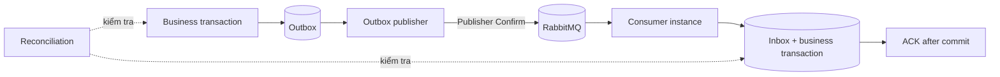
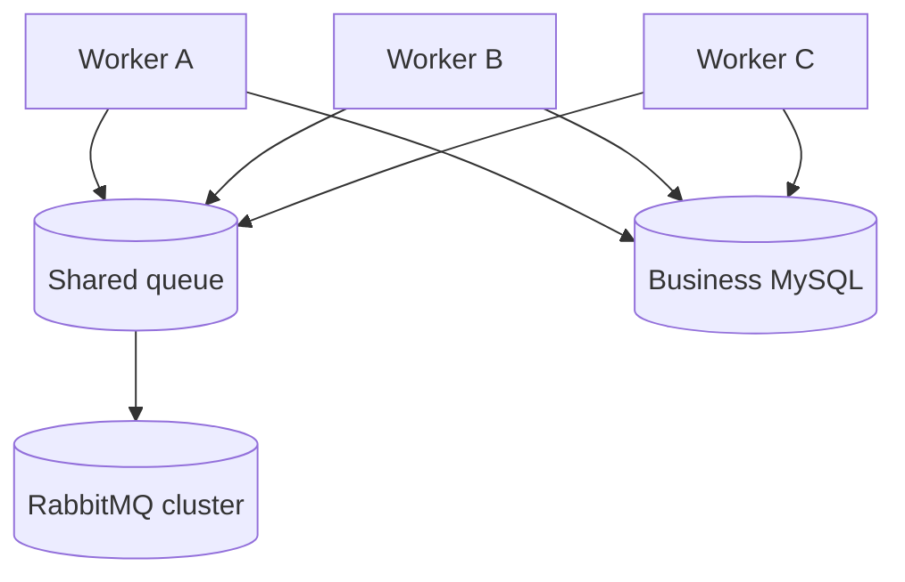

# RabbitMQ Foundation và tài liệu thiết kế đáng tin cậy

## 1. Mục tiêu

Thay đổi này tạo hai sản phẩm có phạm vi độc lập:

- Một chương tài liệu RabbitMQ trong `base-angular`, giải thích từ mô hình cơ bản đến correctness, multi-instance, capacity planning và vận hành production.
- Một RabbitMQ foundation tối thiểu trong `food-delivery`, đủ để kết nối, publish và mở rộng khi business module xuất hiện nhưng chưa tạo giả business entities hoặc consumers.

Business case trong tài liệu không đồng nghĩa với business scope của `food-delivery` Phase 1. Các case được dùng để chứng minh failure mode và cách suy ra thiết kế.

## 2. Nguyên tắc trình bày

Tài liệu không phân loại người đọc theo cấp độ. Mỗi quyết định được dẫn dắt bằng cùng một chuỗi lập luận:

```text
Cách triển khai trực giác
  -> giả định ẩn
  -> failure window
  -> invariant cần bảo vệ
  -> cơ chế được chọn
  -> trade-off và giới hạn
  -> dấu hiệu cần nâng cấp
```

Ví dụ, `SaveChanges` rồi publish trực tiếp được trình bày trước. Tài liệu cho process dừng giữa hai thao tác, xác định lost-event window, sau đó mới giới thiệu Transactional Outbox. Người đọc thấy được nguyên nhân hình thành pattern thay vì chỉ sao chép pattern.

Mỗi khái niệm có một owner section. Phần sau tham chiếu lại kết luận thay vì giải thích lại từ đầu.

## 3. Phạm vi RabbitMQ foundation

Foundation sử dụng trực tiếp `RabbitMQ.Client` để các primitive của broker không bị che bởi framework cấp cao.

### 3.1 Thành phần được triển khai

- RabbitMQ service trong Docker Compose, kèm Management UI và health check.
- Configuration options cho endpoint, credentials, virtual host, connection name và publisher behavior.
- Một connection được tái sử dụng trong mỗi process.
- Channel được sở hữu theo operation hoặc theo publisher boundary an toàn; không chia sẻ channel đồng thời giữa nhiều threads.
- Integration event envelope ổn định, gồm message ID, event type, contract version, occurred time, correlation ID và tenant scope tùy chọn.
- Publisher adapter hỗ trợ persistent message và Publisher Confirm.
- Dependency injection registration và startup/readiness validation.
- Infrastructure verification cho serialization, topology declaration, confirm và reconnect behavior.

### 3.2 Thành phần chưa triển khai

- `DonHang`, `TonKho`, `LoHang` hoặc consumer nghiệp vụ.
- Outbox/Inbox tables và dispatcher khi chưa có transaction nghiệp vụ cần bảo vệ.
- Generic consumer base class, retry framework hoặc topology builder không có consumer thực tế.
- RabbitMQ RPC.
- Cluster provisioning cho production.

Những phần này vẫn được thiết kế và minh họa bằng code trong tài liệu. Chúng chỉ được đưa vào runtime khi business module đầu tiên tạo ra invariant tương ứng.

## 4. Ranh giới bảo đảm

RabbitMQ không tự bảo đảm business correctness. Luồng đáng tin cậy cần bảo vệ từng durable boundary:



| Failure window | Hệ quả | Cơ chế bảo vệ |
| --- | --- | --- |
| Business commit xong, process dừng trước publish | Event bị mất | Transactional Outbox. |
| Publish xong, producer không nhận confirm | Outcome không chắc chắn | Publisher Confirm và publish lại. |
| Broker restart | Message có thể mất nếu topology sai | Durable exchange/queue, persistent message và replication phù hợp. |
| Consumer ACK trước commit | Message mất nhưng business state chưa đổi | Manual ACK sau commit. |
| Consumer commit rồi dừng trước ACK | Duplicate delivery | Inbox và idempotent business operation. |
| Poison message retry liên tục | Queue bị nghẽn | Retry budget, delayed retry topology và DLQ. |
| DLQ không có người xử lý | Business intent vẫn chưa hoàn tất | Alert, replay runbook và reconciliation. |

Delivery model được coi là at-least-once. Exactly-once side effect không phải guarantee của RabbitMQ.

## 5. Multi-instance model

Mỗi application hoặc worker instance có connection riêng. Trong một process, connection được tái sử dụng; channels có ownership rõ ràng.



Nhiều consumers trên cùng queue tạo competing-consumer model. RabbitMQ phân phối deliveries giữa các consumers; nó không biến business operation thành thread-safe.

Các invariant không dựa vào in-memory lock vì mỗi process có memory riêng. Correctness được giữ bằng Inbox unique key, aggregate version, atomic conditional update và database transaction.

Global concurrency được tính trên toàn cụm:

```text
globalConsumerConcurrency
  = tổng số consumer channels của mọi instances lắng nghe queue

maximumUnacked
  = tổng(prefetch của từng consumer channel)
```

Scale replica đồng thời tăng connection count, channel count, unacked window, database concurrency và tải lên downstream systems. Autoscaling không được quyết định chỉ từ CPU của API.

## 6. Capacity planning và load parameters

Configuration được suy ra từ workload thay vì sao chép default.

### 6.1 Input cần đo

| Parameter | Ý nghĩa |
| --- | --- |
| `arrivalRate` | Số messages đến mỗi giây ở average và peak. |
| `burstSize` | Số messages tăng đột biến trong một khoảng ngắn. |
| `averageDuration` và `p95Duration` | Thời gian xử lý một message. |
| `payloadBytes` | Kích thước message sau serialization. |
| `startSlo` | Thời gian tối đa từ publish đến khi bắt đầu xử lý. |
| `completionSlo` | Thời gian tối đa để hoàn tất business outcome. |
| `retryRate` | Tỷ lệ attempt được tạo thêm. |
| `databasePoolSize` | Giới hạn concurrent database operations. |
| `downstreamRateLimit` | Giới hạn email, payment, webhook hoặc service ngoài. |

### 6.2 Suy ra concurrency

Baseline theo Little's Law:

```text
requiredConcurrency ~= arrivalRate * averageDuration
```

Ví dụ `100 messages/s * 0,2 s = 20` concurrent executions. Con số production còn bị chặn bởi database pool, downstream rate limit, lock contention, p95 duration và retry traffic.

Consumer utilization không nên duy trì sát 100%. Khi arrival rate bằng đúng service capacity, một burst nhỏ cũng làm queue age tăng không có thời gian phục hồi.

### 6.3 Prefetch

Prefetch là số deliveries RabbitMQ cho phép consumer giữ nhưng chưa ACK. Prefetch thấp giới hạn blast radius và phân phối công bằng hơn; prefetch cao giảm idle time khi network latency đáng kể nhưng tăng memory, redelivery burst và số messages bị giữ bởi consumer chậm.

Giá trị ban đầu được chọn từ execution concurrency và duration, sau đó điều chỉnh bằng queue age, consumer utilization và redelivery rate. Không dùng một giá trị cố định cho mọi queue.

### 6.4 Cụm và giới hạn khả thi

Tài liệu phân biệt ba cụm tài nguyên:

1. **Application cluster:** replicas, connections, channels, consumers và process memory.
2. **RabbitMQ cluster:** queue leader, replicas, disk I/O, network replication và broker memory alarm.
3. **Database cluster:** connection pool, row locks, transaction duration và index write cost.

Tăng application replicas chỉ hữu ích khi RabbitMQ và database còn capacity. Một queue vẫn có leader và coordination cost; thêm consumers không tạo throughput tuyến tính vô hạn. Khi một queue trở thành bottleneck đã đo được, partition theo business key hoặc workload boundary mới được xem xét.

Load test phải chạy với topology gần production, payload thật, confirm bật, manual ACK, retry traffic và broker/database latency thực tế. Benchmark chỉ publish vào broker nhưng không chạy consumer không chứng minh end-to-end capacity.

## 7. Business case tồn kho theo nhiều lô

Tài liệu sử dụng case giữ tồn theo `tenantId`, `shopId`, `hangHoaId` và nhiều lô. FEFO ưu tiên lô hết hạn sớm nhất; `receivedAt` và `id` là tie-breaker để tạo thứ tự xác định.

```text
Lo A: available = 5, expiresAt = 2026-09-01
Lo B: available = 8, expiresAt = 2026-09-10
Yêu cầu giữ 10
  -> Lo A: 5
  -> Lo B: 5
```

### 7.1 Invariant

- Không lô nào có số lượng khả dụng âm.
- Tổng allocation bằng lượng reservation đã xác nhận.
- Một message ID chỉ tạo một logical reservation.
- Mọi query và unique key chứa đúng tenant/shop scope.
- Release và confirm reservation là state transition có điều kiện.
- Aggregate version ngăn event cũ ghi đè state mới.

### 7.2 Strict FEFO

Transaction đọc các lô theo `expiresAt`, `receivedAt`, `id`, khóa row theo cùng thứ tự và phân bổ đến khi đủ số lượng. Cách này giữ thứ tự FEFO chặt nhưng request đồng thời có thể chờ cùng lô đầu tiên.

`SKIP LOCKED` tăng parallelism nhưng có thể bỏ qua lô hết hạn sớm đang bị khóa và lấy lô sau. Thiết kế không được gọi đó là strict FEFO. Chỉ sử dụng khi business chấp nhận FEFO gần đúng và reconciliation/expiry policy vẫn bảo đảm lô cũ được tiêu thụ.

### 7.3 Consumer transaction

```text
BEGIN
  INSERT Inbox(consumer, messageId) với unique constraint
  nếu duplicate: đọc outcome cũ và COMMIT
  khóa candidate lots theo deterministic order
  kiểm tra tổng available
  tạo Reservation + Allocation rows
  cập nhật từng lot bằng conditional update
  ghi integration event tiếp theo vào Outbox
COMMIT
ACK RabbitMQ delivery
```

Nếu không đủ tồn, transaction ghi outcome `Rejected` theo idempotency contract. Consumer không retry một permanent business rejection.

### 7.4 Ordering

RabbitMQ ordering không được dùng làm business invariant khi có nhiều consumers, redelivery và retry queues. Message mang aggregate version hoặc expected state. Consumer chỉ áp dụng transition hợp lệ; stale message được bỏ qua có audit hoặc đưa vào reconciliation tùy loại sự kiện.

## 8. Business cases trong tài liệu

Một bộ case dùng chung sẽ phát triển dần qua các chương:

1. Gửi xác nhận sau khi đơn hàng được tạo.
2. Đồng bộ menu từ tenant xuống shop.
3. Webhook cập nhật trạng thái giao hàng.
4. Analytics consumer độc lập.
5. Giữ tồn món giới hạn theo shop.
6. Giữ tồn nguyên liệu theo nhiều lô bằng FEFO.
7. Release reservation khi đơn bị hủy hoặc hết hạn.
8. Hai workers cùng giữ một lô.
9. Duplicate delivery sau khi consumer commit nhưng chưa ACK.
10. Event đến sai thứ tự.
11. Outbox dispatcher chạy trên nhiều instances.
12. DLQ tích tụ nhưng không có operator xử lý.
13. Tenant predicate hoặc idempotency key thiếu shop scope.
14. Broker chậm, database pool cạn và retry storm.

Mỗi case chỉ thêm một biến phức tạp, chỉ ra thiết kế trực giác thất bại ở đâu và suy ra mechanism cần thiết.

## 9. Cấu trúc chương RabbitMQ

```text
Tổng quan Job Queue và message broker
RabbitMQ runtime architecture
Connection, Channel, Exchange, Queue và Binding
Publish path và routing patterns
Consumer lifecycle, ACK/NACK và prefetch
Durability và Publisher Confirm
At-least-once, duplicate và idempotency
Retry, DLQ và poison message
Outbox, Inbox và reconciliation
Multi-instance và ordering
Multi-tenancy
Tồn kho nhiều lô và FEFO
Capacity planning và cluster feasibility
Management UI, metrics, alert và runbook
Security, deployment và compatibility
.NET 6 implementation
Business case catalogue
Verification strategy
Keyword reference
```

Tài liệu có sơ đồ Mermaid cho publish flow, consumer ACK flow, failure windows, retry/DLQ, Outbox/Inbox, multiple instances, FEFO allocation và cluster capacity.

## 10. Correctness và load-test harness

Business models trong test chỉ là executable specification. Chúng không được reference từ production projects và không tạo migration cho `food-delivery`.

Test harness sử dụng RabbitMQ và MySQL thật để kiểm tra end-to-end behavior. Mock chỉ phù hợp với serialization hoặc configuration branch; mock broker không chứng minh ACK, redelivery, confirm, connection recovery hoặc cạnh tranh giữa nhiều consumers.

### 10.1 Test-first sequence

```text
Viết invariant và failure scenario
  -> chạy để thấy baseline trực giác thất bại
  -> bổ sung mechanism tối thiểu
  -> chạy lại correctness test
  -> chạy multi-instance test
  -> chạy load profile
  -> ghi measurement và giới hạn vào tài liệu
```

Baseline cần chứng minh được các lỗi sau trước khi áp dụng pattern:

- `SaveChanges` rồi publish làm mất event khi process dừng ở giữa.
- ACK trước commit làm mất delivery nhưng business state chưa đổi.
- Commit rồi dừng trước ACK tạo duplicate delivery.
- Read-modify-write tồn kho làm lost update dưới concurrent consumers.
- Idempotency key thiếu tenant/shop scope tạo collision.
- FEFO dùng `SKIP LOCKED` có thể lấy lô hết hạn muộn hơn.

### 10.2 Test-only business schema

Harness tạo schema biệt lập gồm `TestOrder`, `TestInventoryLot`, `TestReservation`, `TestAllocation`, `TestOutbox` và `TestInbox`. Schema được tạo và xóa trong test database, không đi qua production migrations.

Các invariant được kiểm tra sau mỗi scenario:

```text
missingLogicalEvents = 0
duplicateLogicalEffects = 0
mọi lot.available >= 0
initialQuantity = available + allocated + confirmedConsumption
reservation.quantity = tổng allocation.quantity
mỗi (consumer, messageId) có tối đa một Inbox record
strict FEFO không dùng lô sau khi lô trước còn available tại lock boundary
```

### 10.3 Scenario đối chứng

Mỗi case có một baseline test và một correctness test. Baseline test không được để ở trạng thái thất bại; nó điều phối timing bằng barrier/checkpoint rồi assert rằng anomaly đã xuất hiện. Correctness test chạy cùng timing nhưng assert invariant được giữ.

| Case phổ biến | Thiết kế trực giác | Kết quả được test chứng minh | Thiết kế bảo vệ invariant |
| --- | --- | --- | --- |
| Publish event | Commit rồi gọi `BasicPublish` | Process dừng giữa hai bước làm mất intent | Outbox ghi cùng business transaction. |
| Producer recovery | Coi method publish return là broker đã lưu | Mất kết nối tạo unknown publish outcome | Persistent message, Publisher Confirm và publish lại từ Outbox. |
| Consumer success | `autoAck = true` hoặc ACK trước xử lý | Consumer dừng làm message mất | Manual ACK sau business commit. |
| Consumer retry | Xử lý lại toàn bộ message | Commit rồi dừng trước ACK làm side effect lặp | Inbox unique key và idempotent outcome. |
| Trừ tồn | `SELECT`, trừ trong memory, `UPDATE` | Hai consumers cùng đọc một giá trị gây lost update hoặc tồn âm | Row lock hoặc atomic conditional update. |
| Nhiều lô | Mỗi worker tự chọn lô đầu tiên | Hai workers cùng allocate một quantity | Deterministic lock order và transaction. |
| FEFO throughput | Dùng `SKIP LOCKED` nhưng vẫn gọi là strict FEFO | Lô sau được dùng khi lô trước đang khóa | Chọn strict FEFO có blocking hoặc công bố rõ approximate FEFO. |
| Idempotency scope | Unique theo `messageId` hoặc `businessKey` thiếu scope | Tenant/shop này chặn hoặc ghi đè tenant/shop khác | Unique key gồm consumer, tenant, shop và operation identity phù hợp. |
| Ordering | Tin rằng queue luôn giao đúng thứ tự | Retry và nhiều consumers làm event cũ đến sau | Aggregate version và conditional state transition. |
| Retry | Requeue ngay mọi exception | Permanent error tạo hot loop; outage tạo retry storm | Error taxonomy, backoff, retry budget và DLQ. |
| Multiple instances | Dùng `lock` trong process | Hai replicas vẫn chạy cùng critical section | Database constraint/transaction hoặc distributed coordination đúng resource. |
| Scale | Tăng replicas và prefetch cùng lúc | DB pool cạn, unacked tăng, tail latency xấu hơn | Suy ra global concurrency từ workload và bottleneck. |
| DLQ | Coi message vào DLQ là đã xử lý | Business intent nằm im không ai phục hồi | Alert, operator runbook, replay và reconciliation. |

Tên test phản ánh mechanism thay vì đánh giá người viết code, ví dụ:

```text
DirectPublishBaselineTests
OutboxRecoveryTests
AckBeforeCommitBaselineTests
InboxIdempotencyTests
ReadModifyWriteBaselineTests
AtomicLotAllocationTests
StrictFefoContentionTests
MultiInstanceLoadTests
```

Tài liệu chỉ nhúng các test excerpt ngắn khi code giúp nhìn thấy failure window rõ hơn prose. Bốn excerpt ưu tiên là:

1. Barrier buộc hai transactions cùng đọc tồn cũ để tái hiện lost update.
2. Consumer commit rồi dừng trước ACK để tái hiện duplicate delivery.
3. Inbox unique constraint khiến delivery thứ hai trả lại outcome cũ.
4. Hai consumers cạnh tranh các lô và vẫn tạo allocation theo strict FEFO.

Mỗi excerpt phải chỉ ra arrange, điểm đồng bộ concurrency, assertion và kết quả. Load runner, fixture, retry loop và setup schema đầy đủ nằm trong test project; tài liệu liên kết tới source file thay vì sao chép hàng trăm dòng infrastructure code.

### 10.4 Failure injection

Harness có deterministic checkpoints để dừng execution tại:

1. Sau business commit, trước khi Outbox dispatcher đọc record.
2. Sau khi dispatcher claim Outbox, trước publish.
3. Sau Publisher Confirm, trước khi đánh dấu Outbox sent.
4. Sau consumer nhận delivery, trước business transaction.
5. Sau business commit, trước ACK.
6. Khi hai consumers cùng chọn lô FEFO đầu tiên.

Mỗi test khởi động instance thay thế, chờ recovery và kiểm tra business invariant thay vì chỉ kiểm tra message count.

### 10.5 Load parameters

Load profile được mô tả bằng các input có thể tái lập:

| Parameter | Default kiểm chứng | Ý nghĩa |
| --- | ---: | --- |
| `messageCount` | `10_000` | Tổng logical operations. |
| `publisherInstances` | `3` | Số producer processes được mô phỏng. |
| `consumerInstances` | `4` | Số competing consumer hosts. |
| `consumersPerInstance` | `4` | Consumer channels trên mỗi host. |
| `prefetchPerConsumer` | `16` | Maximum unacked trên mỗi channel. |
| `payloadBytes` | `1_024` | Payload size gần với event thực tế. |
| `duplicateRate` | `5%` | Tỷ lệ message ID được publish lại. |
| `transientFailureRate` | `2%` | Tỷ lệ attempt lỗi trước khi thành công. |
| `postCommitCrashRate` | `1%` | Tỷ lệ consumer dừng sau commit, trước ACK. |
| `tenantCount` | `20` | Số tenant scopes. |
| `shopCountPerTenant` | `10` | Số shop scopes trên mỗi tenant. |
| `lotsPerProduct` | `8` | Số lô cạnh tranh cho một hàng hóa. |
| `hotProductRatio` | `20%` | Tỷ lệ messages cùng cạnh tranh một product. |

Default trên là profile học tập, không phải production target. Test runner cho phép override bằng environment variables để chạy smoke, baseline và stress profiles.

### 10.6 Measurements và acceptance

Harness ghi:

- publish-confirm throughput và p50/p95/p99 latency;
- end-to-end enqueue-to-commit latency;
- queue drain time và oldest-message age;
- redelivery, retry, duplicate và DLQ counts;
- MySQL transaction duration, deadlock/retry count;
- global connections, channels và maximum unacked;
- số logical operations thành công, bị từ chối do thiếu tồn và còn unknown.

Correctness acceptance không phụ thuộc throughput:

- Không mất logical intent sau recovery.
- Không duplicate logical effect.
- Không tồn âm hoặc allocation lệch reservation.
- Không cross-tenant/shop mutation.
- Outbox và Inbox không còn record mắc kẹt ngoài recovery policy.

Performance acceptance được suy ra từ workload target và phải ghi rõ hardware/topology. Nếu chưa có production SLO, kết quả chỉ là baseline measurement, không đặt ngưỡng tùy ý để tuyên bố hệ thống đủ tải.

## 11. Quyết định và giới hạn

- Chọn Transactional Outbox thay distributed transaction giữa MySQL và RabbitMQ.
- Chấp nhận at-least-once và thiết kế duplicate-safe.
- Chọn FEFO strict làm baseline; chỉ dùng `SKIP LOCKED` khi business chấp nhận FEFO gần đúng.
- Không dùng RabbitMQ RPC cho request cần response đồng bộ.
- Không dùng event để thay lời gọi nội bộ khi một local transaction đơn giản đã bảo vệ được invariant.
- Không thêm broker abstraction tổng quát có thể che mất delivery guarantee.
- Không hứa throughput bằng số replica; mọi con số phải được đo end-to-end.
- Reconciliation là correctness mechanism, không chỉ là công cụ sửa dữ liệu thủ công.

## 12. Tiêu chí hoàn thành

- Tài liệu giải thích được nguyên nhân của từng pattern và failure window mà pattern xử lý.
- Business cases bao phủ lost event, duplicate, wrong ordering, multi-instance, retry storm và multi-lot allocation.
- Capacity section cho phép suy ra cấu hình ban đầu từ workload và chỉ rõ cách kiểm chứng tính khả thi.
- `food-delivery` chạy được MySQL và RabbitMQ bằng Docker Compose.
- RabbitMQ foundation build trên .NET 6, có configuration validation và publisher confirm.
- Foundation không chứa business entity hoặc speculative consumer framework.
- Automated checks xác nhận serialization, connection reuse, publish confirm và configuration failure.
- Test harness chứng minh các failure của thiết kế trực giác trước khi xác nhận Outbox, Inbox, manual ACK và atomic FEFO allocation.
- Load profile ghi đầy đủ parameters, topology, hardware assumptions, measurements và business invariants.
