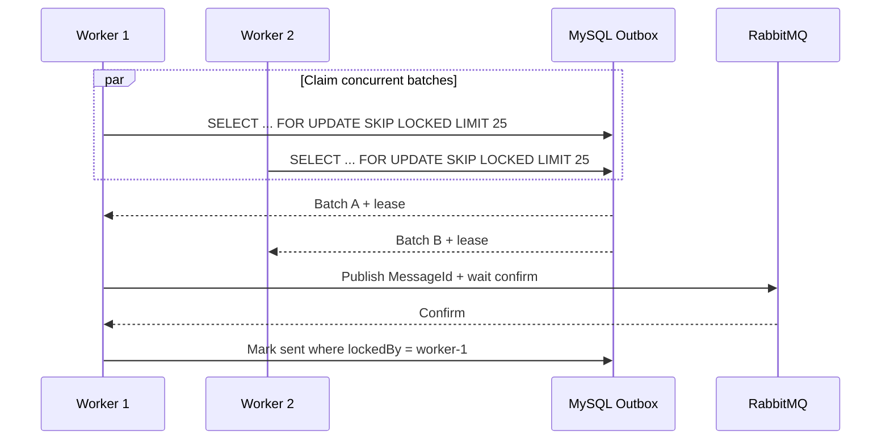
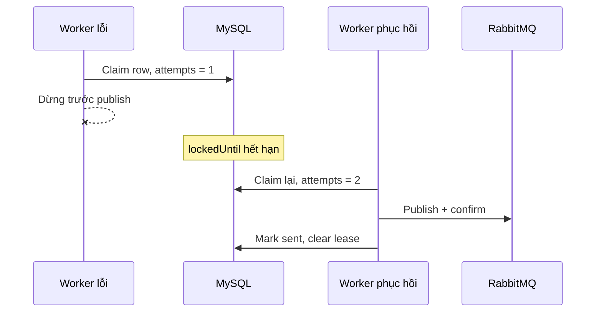
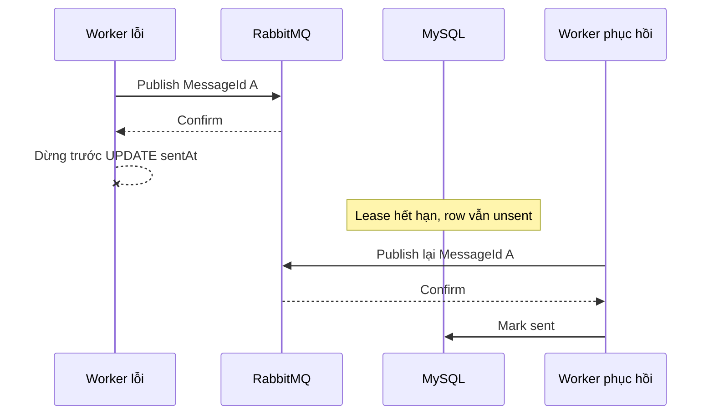

# Outbox Dispatcher multi-instance và lease recovery

## Invariant cần bảo vệ

Business transaction và Outbox row phải commit trong cùng MySQL transaction. Dispatcher không tạo event mới; nó chỉ chuyển durable intent đã tồn tại trong Outbox sang RabbitMQ.

Một Outbox row chưa hoàn thành phải thỏa một trong hai trạng thái:

- chưa có lease và có thể được claim;
- đang có lease còn hiệu lực và chỉ worker sở hữu lease được mark sent.

Nếu worker biến mất, `lockedUntil` hết hạn khiến row có thể được claim lại. Recovery có thể publish duplicate, nhưng không được làm mất intent.

## Claim flow



Claim transaction dùng `READ COMMITTED`, giữ row locks trong thời gian chọn và ghi lease rồi commit ngay. Network publish không nằm trong MySQL transaction; nếu giữ database locks trong lúc chờ broker, throughput và deadlock risk sẽ phụ thuộc network latency.

## Composite index và lỗi được phát hiện

Thiết kế index đầu tiên là:

```text
(runId, sentAt, lockedUntil, occurredAt, messageId)
```

Bốn workers chạy đồng thời cho kết quả claim thực tế:

```text
[25, 0, 0, 0]
```

`lockedUntil` đứng trước claim order khiến MySQL không thể dùng index để duyệt trực tiếp theo `occurredAt, messageId`. Sau khi candidate bị sort và giới hạn, các workers còn lại skip 25 locked rows nhưng không refill đủ batch.

Index claim được sửa thành:

```text
(runId, sentAt, occurredAt, messageId)
```

`lockedUntil` vẫn là predicate xác định lease đã hết hạn, nhưng không phá equality prefix và deterministic order. Sau khi sửa, kết quả là bốn batches rời nhau, tổng cộng 100/100 intents được claim, publish và mark sent. Test chạy ổn định 20/20 lượt.

## Hai crash windows

### Worker chết trước publish



Kết quả: một delivery, Outbox `attempts = 2`, `sentAt` có giá trị, `lockedBy` và `lockedUntil` được xóa.

### Worker chết sau confirm, trước mark sent



Kết quả: hai physical deliveries có cùng một `MessageId`, Outbox `attempts = 2` và chỉ có một trạng thái sent. Đây là at-least-once delivery; Inbox của consumer phải biến hai deliveries thành một logical effect.

## Reconciliation

Reconciliation không cần một cơ chế đặc biệt để “unlock” rows. Query claim bình thường đã chọn cả rows có `lockedUntil < UTC_TIMESTAMP(6)`. Worker poll theo khoảng thời gian bounded và dùng đồng hồ database để quyết định lease hết hạn; không dùng một lần `Task.Delay(leaseDuration)` rồi giả định process clock trùng với MySQL clock.

Các chỉ số cần giám sát:

- số Outbox rows chưa sent;
- tuổi của row chưa sent cũ nhất;
- số rows có lease đã hết hạn;
- phân bố `attempts` và `lastError` khi production schema bổ sung error diagnostics;
- publish-confirm latency;
- tỷ lệ duplicate được Inbox hấp thụ.

## Phạm vi implementation

`TestOutboxDispatcher` là executable reference trong test project. Production foundation chưa có hosted dispatcher vì chưa có business transaction tạo Outbox thật. Khi triển khai business flow, schema production cần thêm `TenantId`, event contract metadata, payload version, error diagnostics và retention strategy; claim/lease/publish-confirm ordering đã được kiểm chứng ở đây sẽ được tái sử dụng.
