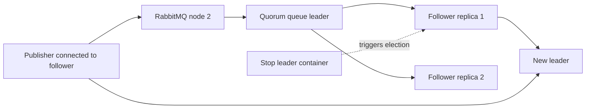

# RabbitMQ quorum queue failover

## Mục tiêu

Profile này kiểm tra một failure window cụ thể: publisher đang gửi persistent messages và chờ confirm thì node giữ quorum queue leader bị dừng. Hai replicas còn lại phải bầu leader mới, tiếp tục nhận message và giữ nguyên mọi message đã được broker confirm.

Đây là bài kiểm tra cluster ba node trên một Docker host. Nó kiểm tra cơ chế leader election và replication, nhưng không đại diện cho network latency hoặc failure domain của ba máy production độc lập.

## Topology



Cluster sử dụng RabbitMQ `4.1.8`, ba disk nodes và một quorum queue có initial group size bằng ba. Publisher bật confirmation tracking; messages persistent; consumer đọc thủ công sau khi failover hoàn tất.

## Failure sequence

1. Publisher gửi và nhận confirm cho 1.000 messages đầu.
2. Publisher thứ hai kết nối tới một node không giữ leader và bắt đầu gửi 1.000 messages còn lại.
3. Sau 50 messages của phase hai, test dừng container đang giữ leader.
4. Management API của node sống được polling cho đến khi báo leader mới.
5. Publisher tiếp tục tới khi mọi logical message ID đã được confirm.
6. Consumer đọc toàn bộ queue và đối chiếu tập 2.000 message IDs.
7. Node bị dừng được khởi động lại trong `finally`; `cluster_status` phải trở về ba running nodes.

## Kết quả quan sát

Thời điểm chạy: 2026-08-30, múi giờ Asia/Saigon.

| Chỉ số | Giá trị |
|---|---:|
| Messages | 2.000 |
| Leader trước failure | `rabbit@rabbit1` |
| Leader sau failure | `rabbit@rabbit3` |
| Thời gian quan sát tới leader mới | 1,40 giây |
| Publish failures | 0 |
| Deliveries | 2.000 |
| Duplicate deliveries | 0 |
| Missing logical IDs | 0 |

`publishFailures = 0` không có nghĩa publisher confirm không thể thất bại. Trong lần chạy này, client kết nối qua node còn sống và publish call bị giữ trong cửa sổ election rồi hoàn tất khi leader mới sẵn sàng. Với network partition, connection loss hoặc timeout khác, outcome có thể không xác định; publisher phải retry cùng `MessageId`, còn consumer phải dùng Inbox để loại duplicate logical effect.

Sau test, cluster có đủ `rabbit1`, `rabbit2`, `rabbit3` trong danh sách running nodes, không có alarm và không có network partition.

## Chạy lại

```powershell
backend\scripts\run-rabbitmq-cluster-failover.ps1
```

Test có thay đổi trạng thái Docker vì dừng node giữ leader, nhưng luôn khởi động lại node trong `finally`. Không chạy profile này đồng thời với test hoặc môi trường khác đang dùng ba containers `food-rabbit1..3`.
