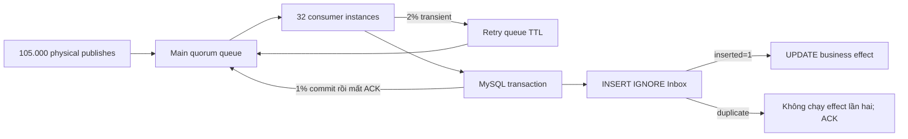

# Reliability load: duplicate, retry và post-commit crash

## Mục tiêu

Profile này không chỉ đo message throughput. Nó kiểm tra logical correctness khi physical delivery bị lặp, consumer thất bại tạm thời và database đã commit nhưng ACK chưa tới broker.

Mỗi logical message đại diện cho một thay đổi tồn kho thuộc một `tenant + shop + inventory bucket`. Inbox insert và business effect update nằm trong cùng MySQL transaction. Chỉ transaction thắng unique Inbox key mới được tăng effect counter.

## Tham số reference run

| Tham số | Giá trị |
|---|---:|
| Logical messages | 100.000 |
| Shops | 100 |
| Physical duplicate injection | 5% = 5.000 |
| Transient failure injection | 2% = 2.000 |
| Post-commit crash injection | 1% = 1.000 |
| Publisher instances | 3 |
| Consumer instances | 32 |
| Prefetch/consumer | 32 |
| Maximum Unacked theo cấu hình | 1.024 |
| Retry delay | 50 ms |

Nửa số logical messages thuộc shop nóng nhất. Effect rows được phân tán tiếp theo 100 inventory buckets/shop; cách này giữ hot-shop workload nhưng tránh biến bài test thành benchmark của một counter row duy nhất.

## Luồng xử lý



## Kết quả chạy thật

Môi trường: RabbitMQ `4.1.8-management-alpine`, RabbitMQ.Client `7.2.2`, MySQL 8, Docker Desktop trên Windows. Thời điểm chạy: 2026-08-30, múi giờ Asia/Saigon.

| Chỉ số | Kết quả |
|---|---:|
| Physical publishes | 105.000 |
| Inbox rows | 100.000 |
| Business effects | 100.000 |
| Duplicate business effects | 0 |
| Missing logical messages | 0 |
| Transient failures | 2.000 |
| Post-commit crashes | 1.000 |
| Redeliveries quan sát | 3.000 |
| `x-death rejected` | 2.000 |
| `x-death expired` | 2.000 |
| MySQL lock/deadlock retries | 0 |
| Main Ready/Unacked cuối run | 0 / 0 |
| Retry Ready cuối run | 0 |
| DLQ Ready cuối run | 0 |
| Publish-confirm time | 242,40 giây |
| Consume + MySQL time | 113,19 giây |
| Tổng test time | 5 phút 57 giây |

Snapshot giữa consumer phase ghi nhận `32 consumers`, `1.024 Unacked`, main queue còn `46.855 Ready`, retry queue có 2 messages và DLQ bằng 0. Unacked đạt đúng ceiling `consumerCount × prefetch`.

`Redeliveries = 3.000` gồm 2.000 messages quay lại main queue sau retry TTL và 1.000 messages bị requeue vì mô phỏng mất ACK sau database commit. Inbox hấp thụ cả 5.000 duplicates được publish chủ động lẫn các deliveries phát sinh từ failure windows.

## Kết quả smoke và điều chỉnh workload

Thiết kế đầu tiên chỉ có một effect counter/shop. Với 50% traffic vào shop 0, 1.000 events mất 33,4 giây vì mọi transaction tranh cùng một row lock. Đây là bottleneck do mô hình test tạo ra, không phải RabbitMQ.

Sau khi effect key được đưa về `shop + inventory bucket`, smoke 1.000 events còn khoảng 10,1 giây với 8 consumers. Profile 10.000 events và 32 consumers hoàn thành consume/MySQL trong 20,94 giây, sau đó profile 100.000 được chạy chính thức.

Điều này không có nghĩa nên luôn dùng 32 consumers. Global concurrency phải nhỏ hơn đồng thời cả MySQL pool, downstream capacity và broker/channel capacity. Reference run chỉ cho thấy 32 consumers khả thi trên môi trường này và đạt `maximumUnacked = 1.024`.

## Chạy lại

```powershell
powershell -ExecutionPolicy Bypass -File backend\scripts\run-rabbitmq-reliability-load.ps1
```

Có thể override các biến `RABBIT_RELIABILITY_*` trước khi chạy. Transient và post-commit percentages phải là ước của 100 để deterministic selector tạo đúng số failure như cấu hình.

Profile vẫn là test-only executable reference. Production consumer chỉ nên được tạo khi business handler tồn tại; khi đó Inbox key, transaction boundary và tenant/shop predicates phải được đưa vào schema production, không copy nguyên bảng test.
