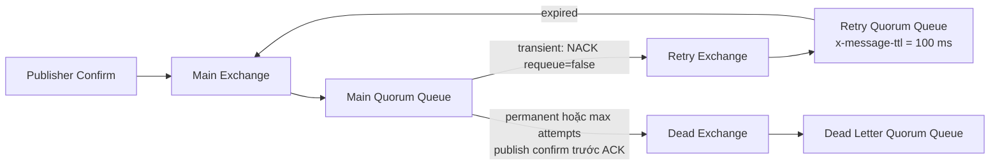

# RabbitMQ Retry, DLQ và poison message

## Topology được kiểm chứng

Retry delay thuộc về broker. Consumer không giữ message trong RAM và không dùng `Task.Delay` để chờ retry. Khi xử lý thất bại tạm thời, consumer gửi `BasicNack` với `requeue = false`; main queue dead-letter message sang retry queue. Message hết TTL tại retry queue được dead-letter trở lại main exchange.

Lỗi vĩnh viễn và poison message không tiếp tục đi quanh vòng retry. Consumer publish message sang dead exchange, chờ publisher confirm, sau đó mới ACK delivery gốc. Thứ tự này giữ message ở main queue nếu lần publish sang DLQ thất bại.

## Kết quả chạy thật

Môi trường: RabbitMQ `4.1.8-management-alpine`, RabbitMQ.Client `7.2.2`, quorum queues trên single-node development broker. Thời điểm chạy: 2026-08-30, múi giờ Asia/Saigon.

| Scenario | Attempts | `x-death: rejected` | `x-death: expired` | Kết quả |
|---|---:|---:|---:|---|
| Transient hai lần, lần ba thành công | 3 | 2 | 2 | ACK, không vào DLQ |
| Permanent failure | 1 | 0 | 0 | DLQ, `x-failure-reason=permanent` |
| Poison message | 3 | 2 | 2 | DLQ, `x-failure-reason=max-attempts` |

Sau mỗi scenario, `Ready(main/retry/dead) = 0/0/0` vì test đã consume terminal result và ACK đầy đủ. `MessageId` tại DLQ bằng `MessageId` ban đầu.

Một test riêng đóng consumer channel trước ACK. RabbitMQ giao lại cùng `MessageId` cho channel khác với `Redelivered = true`. Đây là lý do ACK không thể thay thế Inbox: nếu database đã commit nhưng ACK chưa tới broker, logical effect có thể được yêu cầu thực hiện lần nữa.

## Ý nghĩa của `x-death`

RabbitMQ thêm `x-death` khi message bị dead-letter. Trong topology này, mỗi vòng retry tạo hai death events:

1. `rejected` tại main queue do consumer NACK và không requeue;
2. `expired` tại retry queue do message vượt quá queue TTL.

RabbitMQ nén các event có cùng queue và reason bằng trường `count`; consumer phải đọc tổng `count`, không được giả định số phần tử trong mảng `x-death` bằng số lần retry.

## Giới hạn của reference topology

Test dùng queue arguments vì mỗi topology có tên ngẫu nhiên và bị xóa sau test. Trong production, TTL và dead-letter routing nên được quản lý bằng RabbitMQ policies để có thể thay đổi mà không xóa rồi declare lại queue.

Quorum queue hỗ trợ cơ chế dead-letter at-least-once, nhưng đây không phải default. Khi yêu cầu không mất message trong đường chuyển nội bộ từ source queue sang DLQ, cần đánh giá `dead-letter-strategy=at-least-once`, overflow phù hợp và capacity của source queue. Dù dùng cơ chế này, Inbox vẫn cần thiết vì at-least-once cho phép duplicate.

## Test source

- `RetryAndDeadLetterTests`: transient, permanent và poison message.
- `ConsumerRedeliveryTests`: consumer đóng channel trước ACK.
- `RabbitMqRetryHarness`: reference topology và ACK ordering; không phải production business consumer framework.
