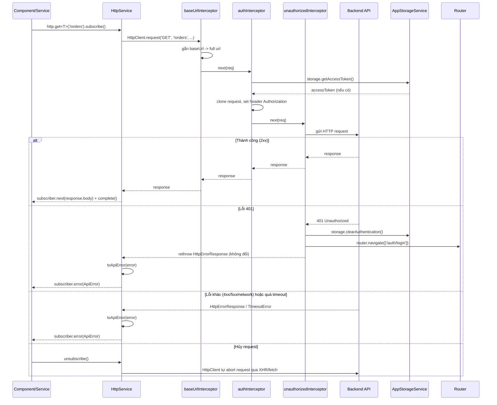

# API Core Flow

Tài liệu mô tả luồng hoạt động của lớp gọi API (`src/app/core/api/`), xây dựng trên `HttpClient` của Angular (RxJS thuần) — không dùng thư viện HTTP ngoài.

## Thành phần

| File | Vai trò |
|---|---|
| [`api.tokens.ts`](../frontend/src/app/core/api/api.tokens.ts) | `API_CONFIG` — injection token cấu hình `baseUrl`, `timeout`, lấy từ `environment`. |
| [`http.service.ts`](../frontend/src/app/core/api/http.service.ts) | `HttpService` — service `providedIn: 'root'`, bọc `HttpClient`, expose `get/post/put/patch/delete<T>()` trả về `Observable<T>`, tự áp `timeout()` và chuẩn hóa lỗi thành `ApiError`. |
| [`interceptors/base-url.interceptor.ts`](../frontend/src/app/core/api/interceptors/base-url.interceptor.ts) | Gắn `API_CONFIG.baseUrl` vào trước các url tương đối. |
| [`interceptors/auth.interceptor.ts`](../frontend/src/app/core/api/interceptors/auth.interceptor.ts) | Gắn header `Authorization: Bearer <token>` từ `AppStorageService`. |
| [`interceptors/unauthorized.interceptor.ts`](../frontend/src/app/core/api/interceptors/unauthorized.interceptor.ts) | Bắt lỗi `401` → xóa auth trong storage + điều hướng `/auth/login`, rồi rethrow lỗi gốc. |
| [`api.error.ts`](../frontend/src/app/core/api/api.error.ts) | `ApiError` — error đã chuẩn hóa (`status`, `code`, `errors`) thay cho `HttpErrorResponse`/`TimeoutError` thô. |
| [`api.types.ts`](../frontend/src/app/core/api/api.types.ts) | `ApiRequestOptions`, `ApiErrorPayload` — kiểu dữ liệu dùng chung. |
| `environments/environment*.ts` | Khai báo `apiBaseUrl` theo từng môi trường (dev/prod), map qua `fileReplacements` trong `angular.json`. |
| [`app.config.ts`](../frontend/src/app/app.config.ts) | Đăng ký `provideHttpClient(withInterceptors([baseUrlInterceptor, authInterceptor, unauthorizedInterceptor]))`. |

## Sơ đồ luồng



## Chi tiết từng bước

### 1. Gọi API từ component/service

```ts
private readonly http = inject(HttpService);

this.http.get<Order[]>('/orders', { params: { status: 'pending' } })
    .subscribe({
        next: (orders) => (this.orders = orders),
        error: (err: ApiError) => this.toast.error(err.message),
    });
```

Mỗi method (`get/post/put/patch/delete`) chỉ gọi `request<T>()` với method + url + body + options tương ứng, không có logic riêng.

### 2. `request<T>()` trong `HttpService`

```ts
private request<T>(method: string, url: string, body: unknown, options?: ApiRequestOptions): Observable<T> {
    return this.http
        .request<T>(method, url, { body, params: options?.params, headers: options?.headers })
        .pipe(
            timeout(this.config.timeout),
            catchError((error) => throwError(() => this.toApiError(error))),
        );
}
```

- `HttpClient.request()` trả `Observable<T>` sẵn — không cần tự bọc `new Observable` hay quản `AbortController` như trước, vì `unsubscribe()` trên Observable của `HttpClient` đã tự hủy request thật ở tầng XHR/fetch.
- `timeout(this.config.timeout)`: nếu quá thời gian cấu hình mà chưa có response, tự phát sinh `TimeoutError` (RxJS hủy subscription tới request gốc).
- `catchError`: mọi lỗi (từ interceptor chain hoặc timeout) đều đi qua `toApiError()` trước khi tới subscriber.

### 3. `baseUrlInterceptor` — gắn base URL

Nếu `req.url` chưa phải url tuyệt đối (`http://` / `https://`), interceptor clone request và gắn `API_CONFIG.baseUrl` vào trước — cho phép gọi `http.get('/orders')` thay vì phải viết full URL mỗi lần, đồng thời vẫn gọi được url tuyệt đối (vd. API bên thứ ba) khi cần.

### 4. `authInterceptor` — gắn access token

Đọc token từ `AppStorageService.getAccessToken()` (session storage), có thì clone request và set header `Authorization`. Không có token thì bỏ qua, không throw lỗi ở bước này.

### 5. `unauthorizedInterceptor` — xử lý 401 tập trung

Khi backend trả `401`:
1. Xóa toàn bộ dữ liệu auth trong storage (`clearAuthentication()`).
2. Điều hướng về `/auth/login`.
3. `rethrow` lại đúng lỗi gốc (không đổi) để `HttpService.toApiError()` chuẩn hóa — interceptor này chỉ lo side-effect, không lo format lỗi.

Đây là nơi duy nhất xử lý 401, các service nghiệp vụ không cần tự check status code.

### 6. Chuẩn hóa lỗi — `toApiError()`

Mọi lỗi (network, timeout, 4xx, 5xx) đều được quy về `ApiError` trước khi tới subscriber:

- **`TimeoutError`** (từ `timeout()` operator): message cố định "Request quá thời gian chờ", `code: 'ERR_TIMEOUT'`.
- **`HttpErrorResponse` có `error.status`**: ưu tiên `message/code/errors` trong `error.error` (payload lỗi chuẩn hóa từ backend), fallback về message mặc định của Angular nếu backend không trả đúng format. `status === 0` (lỗi network/CORS) được coi là `status: null`.
- **Lỗi khác**: fallback "Đã có lỗi không xác định xảy ra", `status: null`.

Nhờ vậy component chỉ cần `catch (err: ApiError)` và luôn có `.message` để hiển thị, không cần biết đó là lỗi mạng, timeout hay lỗi validate.

### 7. Hủy request

Không còn `AbortController` thủ công — `unsubscribe()` trên Observable trả về từ `HttpService` (component destroy, `switchMap` hủy request cũ, `takeUntil`...) khiến `HttpClient` tự hủy request thật ở tầng trình duyệt. Đây là hành vi mặc định của `HttpClient`, không cần code thêm.

## Cấu hình môi trường

`API_CONFIG` lấy `baseUrl` từ `environment.apiBaseUrl`:

- `environment.development.ts` → `http://localhost:3000/api` (dùng khi `ng serve` / build `development`).
- `environment.ts` → `https://api.example.com` (build `production`, **cần sửa lại URL thật** trước khi deploy).

## Mở rộng trong tương lai (chưa làm)

- Refresh token tự động khi gặp 401 (hiện tại chỉ logout).
- Retry cho lỗi network/5xx.
- Loading interceptor toàn cục.

Những phần trên chưa được implement — cân nhắc khi có yêu cầu thực tế, tránh over-engineer.
